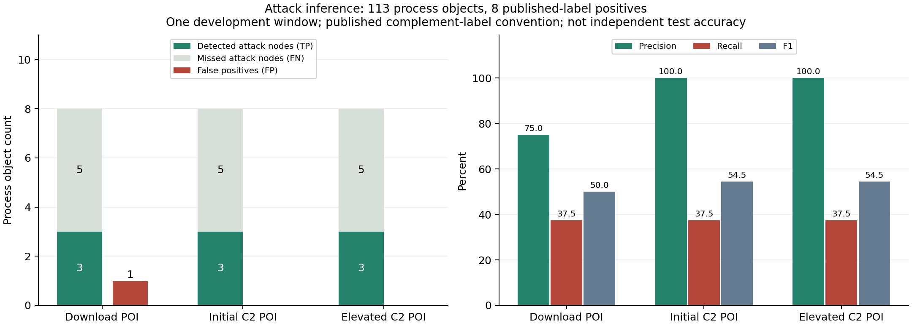

# 攻击节点与路径：实测结果

当前默认提权 C2 POI 推断出 **3 个攻击进程**：PID 5452、4632、2952。两个用户 PDF 中的代理均被找回；与公开研究标注比较，3 个预测均命中，但其 8 个攻击进程中漏检 5 个。**高精确率不等于高召回，更不能只拿整体 Accuracy 表示效果好。**

## 数据与独立标注口径

- TAPAS OPTC，SysClient0201，2019-09-23 11:20–11:30（UTC−04:00），27,011 条候选事件，113 个进程对象 UUID。保持原有 POI 前全部历史频率规则。
- 用户 PDF 只明确绑定两个代理进程；其它预测在这套口径下未标注。
- 新引入 [AT03380/optc-labels](https://github.com/AT03380/optc-labels/tree/64c9f9b2e1a15bf3c2789d89d93dc0724cb0d4fa) 的公开标注。固定提交、归档 SHA-256，逐事件 UUID/时间/主客体/操作核验，与本地匹配 735 条恶意事件。process 粒度标签有 8 个恶意对象，其余 105 个按作者的**补集约定**计正常。
- 该约定不代表所有负例均经过独立人工确认；作者披露父子关联和 conhost 标注问题。保留原基准，不按本次结果删除困难对象。节点标签不由恶意事件两端扩散产生。
- 阈值和规则没有用这份标注选择；实验仍是**同一个开发窗口**，不构成独立测试。手动 POI 来自已知攻击，属于条件调查任务。

## 节点识别

| POI | TP | FP | FN | TN | Precision | Recall | F1 | Accuracy |
|---|---:|---:|---:|---:|---:|---:|---:|---:|
| 下载 runme.bat | 3 | 1 | 5 | 104 | 75.00% | 37.50% | 50.00% | 94.69% |
| 初始 C2 | 3 | 0 | 5 | 105 | 100.00% | 37.50% | 54.55% | 95.58% |
| 提权 C2（默认） | 3 | 0 | 5 | 105 | 100.00% | 37.50% | 54.55% | 95.58% |

这里的 100% 只是这个基准中的 **3/3**，没有统计泛化保证。若全部预测为正常，Accuracy 也有 105/113 = 92.92%，因此不能脱离召回率宣传 95.58%。



[可导出 PDF](figures/attack-node-evaluation.pdf)

默认输出：

| PID | 进程 | 输出依据 | 参考核验 |
|---|---|---|---|
| 2952 | powershell.exe | 编码命令、隐藏窗口、后续出站连接；同时通过异常高尾判定 | PDF 提权代理；公开标注命中 |
| 5452 | powershell.exe | 编码命令、隐藏窗口、后续出站连接 | PDF 初始代理；公开标注命中 |
| 4632 | powershell.exe | 编码命令、隐藏窗口、后续创建子进程 | PDF 未独立列出；公开标注命中 |

漏掉的公开标注对象为 PID 1284（cmd.exe）、532/4776（whoami.exe）、3536/6024（conhost.exe）。当前规则没有足够的独立行为证据将它们分类为攻击，不靠无条件父子标签传播来提高召回。PID 1284 可作为路径连接进程出现，但不计为成功的攻击节点预测。

排除人工 POI 的进程端点后，两个 C2 场景的公开基准均为 **TP=2、FP=0、FN=5、TN=105，Precision=100%，Recall=28.57%，F1=44.44%**。用户 PDF 口径则仍找回另一个代理（1/1）。这避免把已知种子计成新发现。

## 路径效果

默认输出 **4 条进程启动/通信轨迹 + 2 条待确认的共享文件依赖关联**，合计 8 条不同事件。路径会按真实时间排序，可点击查看原始日志，也可下载离线验证。

能直接观察到的两段启动/通信轨迹包括：

```text
Explorer → cmd (1284) → PowerShell (5452) → 132.197.158.98:80
svchost → PowerShell (4632) → PowerShell (2952) → 132.197.158.98:80
```

Explorer、svchost 等祖先只作为连接上下文，不自动判恶意。两个 PDF 代理的 C2 通信片段均找回（2/2）。六条输出的时间、方向、事件身份都能通过一致性校验，**这不代表攻击路径准确率 100%**。

初始代理和后续代理之间存在 `ModuleAnalysisCache` 写入/读取路径。这种共享缓存关联不能证明实际的攻击载荷传递或 UAC 绕过，因此单独标为“待确认依赖”。`runme.bat → 初始代理` 在本窗口没有可观测的连续有向路径，页面保留断点，不补造执行边。

公开事件标注下，输出的 8 条事件都在恶意清单内，事件 Precision=8/8，但事件 Recall 仅为 **8/735 = 1.09%**：当前输出的是简短路径摘要，不能声称恢复全部攻击事件。若把路径上所有 6 个进程都当作攻击，得到 TP=4、FP=2、FN=4，说明路径上下文与攻击分类必须分开。

完整攻击路径 Precision/Recall 暂不报告：现有公开材料没有与当前窗口对应的完整时序路径真值。目录中的可达路径检查是结构证据，不能替代攻击机制或完整链条真值。

## 消融与敏感性

默认提权 C2：

| 判定方式 | TP / FP / FN | Precision | Recall |
|---|---:|---:|---:|
| 仅联合命令行为 | 3 / 0 / 5 | 100.00% | 37.50% |
| 仅历史异常高尾 | 1 / 0 / 7 | 100.00% | 12.50% |
| 当前混合方式 | 3 / 0 / 5 | 100.00% | 37.50% |
| 把全部剪枝保留进程当攻击（朴素对照） | 8 / 74 / 0 | 9.76% | 100.00% |

**本窗口的检测收益主要来自可解释行为证据；历史异常通道没有增加已知攻击进程找回。** 下载 POI 场景中异常通道还增加了一个公开标注下的误报，保留此负结果，不事后改成最优规则。

80/90/95/99% 分位线固定扫描：两个 C2 场景均为 TP=3、FP=0；下载 POI 在 80% 时 TP=3、FP=2，其余 TP=3、FP=1。分位线不是统计置信度。

每个 POI 分别比较 20% 旧剪枝、1% 旧剪枝、20% 新证据剪枝：**攻击节点、路径和报告（除耗时）完全一致**。倒置输入事件顺序后结果也完全一致。

## 耗时、验证与复现

在已加载候选图与现有历史索引上，攻击推断三次运行中位数约 **0.36–0.41 秒**，包含当前实现的输入摘要计算；整体重评分与推断约 **4.09–4.57 秒**。不包含最初原始数据导入，不是大数据吞吐率或内存峰值测量。

结果 JSON 含三 POI × 四档分位线、消融、预算不变性、路径校验、三次耗时、源文件哈希与漏检 UUID。没有声称完整复现其他 SOTA 模型或获得更高准确率。

```bash
python webapp/scripts/evaluate_attack_inference.py
python webapp/scripts/verify_attack_report.py /path/to/optc-attack-report.json
python webapp/scripts/verify_optc_view.py
```

[全部实验数据](attack-inference-evaluation.json) · [方法、论文与源码依据](attack-inference-method.md)
