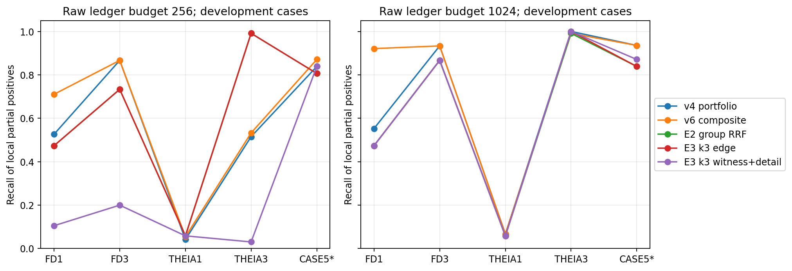

# NODOZE 频率—扩散证据保全：第一阶段实验报告

**轮次：** `budget-evidence-v7-r2`；**执行源码：** `4432328`；**范围：** P0/E0、P1/E2、P2/E3，五个已用于开发的 TC E3 案例，`poi_only`，原始账本事件预算 256/1024。本文结论只针对本地部分正例参照。案例五在当前冻结账本和参照中命名为 **Theia Case 5**；此前文档的 `TRACE5*`/论文中的名称尚不能证明与它完全等价。初始 v7 决策保留在独立目录，本报告只引用修正版 r2。

## 1. 方法、输入和隔离

输入为冻结的事件账本、已有历史缓存和报告派生的 oracle POI。事件按唯一账本 ID 计费，`LINEAGE:` 合成边与 CDM 事件都占用预算，结果同时列出各自数量。图节点由 `(host, UUID)` 隔离；方向、等时刻的固定顺序和时间路径使用现有 `rasp.py` 语义。所有候选锚点都要生成可执行时间证书，最终输出为证书事件并集与强制 POI 集的并集。时间可达只保证实现级路径合法，不证明真实因果。历史快照的时间安全性仍是 `unverified`。

主评分继续以**频率统计与图扩散传播**为中心。冻结的 `history_channel` 分数结合已有稀有度历史校准；候选检索另外读取稀有度视图与 POI 时间/路径视图。三视图在原始事件或计算组上使用主视图排序或 RRF (`c=60`)。计算组由实际端点、主机和最长总跨度 10 秒得到，组分数为成员最高分；人工参照组绝不参与生成。当前实现是**按组排描述符，再按成员分数逐一申请证书**，物化上限为 32,768 个不同账本 ID，扫描边界为 327,680 个成员。代表/继续/完整组作为独立选择动作尚未实现；因此本轮的“组引用”是候选排序与访问策略，不是完整的组动作系统。

审查发现旧路径规则在同时间/同深度平局时受输入行顺序影响。r2 保留 E0 的旧行序以核对冻结 ID，然后将 E2/E3 事件按唯一事件 ID 规范化顺序，再构造评分、计算组和证书。四事件平行路径反例与小图候选选择的行重排测试通过。冻结真实账本只接受原始哈希，因此这还不是对五案重新排列原始日志的完整端到端实验；旧 E0 基线也未声称具有该性质。

E3 从 E2 的组 RRF 池按无标签次序冻结前 8,192 个可执行锚点。同一个 `k` 的池哈希在三个目标与两个预算间一致。`k=1` 保留原 fork 证书；`k=3` 由现有时间路径状态最多再生成两份去重证书，不声称全局 k-shortest。选择器按**真实事件并集**支付增量成本。三个目标是：`edge_score` 对选中事件线性求和；`anchor_score` 只奖励显式调查锚点；`witness_plus_detail` 对自动组中存在至少一份完整时间证据的组求归一化覆盖，再加 `eta=1` 倍的显式锚点分数。完整支持按证书内部 AND、证书之间 OR 计算。贪心的 `witness_plus_detail` 排序使用动作直接组增益；目标值评估会计入其他动作附带完成的组。因此它是启发式，**不是**精确边际贪心或带近似保证的优化器。

选择器不读取标签文件，先原子保存 120 个决策及证书；独立评测脚本随后读取本地参照并逐项核验选中集合、强制 POI、预算、CDM/合成计数和证书闭包。E0 重新执行 v4 `witness_rerank` 与 v6 `history_channel_portfolio` 共 20 项，所有选中 ID 集均与冻结结果一致。`input_audit.json` 记录输入、哈希、POI 来源及依赖版本；`source_manifest.json` 记录实际执行源码与五个案例清单哈希。

## 2. 已运行的比较

下表为**已知正例 TP 条数**，每格五案顺序为 FD1 / FD3 / THEIA1 / THEIA3 / Case5。两预算的基线与新方法使用同一冻结账本、POI、历史及原始事件预算；E2/E3 与 v4/v6 的检索器和优化目标不同，所以只能视为完整管线对照。组 any/full 数值见 `results.csv`。

| 方法 | B=256，逐案 TP | 合计 | B=1024，逐案 TP | 合计 |
|---|---:|---:|---:|---:|
| v4 witness_rerank | 20 / 13 / 10 / 118 / 26 | 187 | 21 / 14 / 16 / 229 / 29 | 309 |
| v6 history_channel_portfolio | 27 / 13 / 13 / 122 / 27 | 202 | 35 / 14 / 16 / 227 / 29 | **321** |
| E2 事件/组 × 主视图/RRF 四格 | 18 / 11 / 14 / 227 / 25 | 295 | 18 / 13 / 14 / 227 / 26 | 298 |
| E3 k=1，edge_score | 18 / 11 / 14 / 227 / 25 | 295 | 18 / 13 / 14 / 229 / 26 | 300 |
| E3 k=3，edge_score | 18 / 11 / 14 / 227 / 25 | 295 | 18 / 13 / 14 / 229 / 26 | 300 |
| E3 k=3，anchor_score | 18 / 11 / 14 / 227 / 25 | 295 | 18 / 12 / 14 / 229 / 26 | 299 |
| E3 k=3，witness_plus_detail | 4 / 3 / 14 / 7 / 26 | **54** | 18 / 13 / 14 / 229 / 27 | 301 |

四格 E2 的**TP 数相同，不代表选中 ID 集相同**。例如 THEIA1 在 B=1024 下组 RRF 与其他三格都命中 14 条已知正例，所选 ID 集仍有差异。两预算宏平均 `R_known`：v6 复合对照为 0.6071/0.7696，E2 为 0.6127/0.6458，E3 k3 证据目标为 0.2466/0.6540。B=256 的 E2 合计增长主要来自 THEIA3；FD1、FD3、Case5 均退化。**没有跨案例、跨预算稳定超过 v6 强基线。**

另核对冻结的 `docs/history-channel-v6-results.csv`：其 `history_channel` 主方案在 B=256/1024 的合计 TP 为 296/301，`channel_only` 为 299/303，原频率扩散 `diffusion_top` 为 290/298，`channel_ppr` 为 287/294，`channel_heat` 为 286/294。它们是**历史已存结果，本轮未重新执行**；不计入 120 项新运行，也不作为 SPARSE 作者系统的复现。v6 复合对照在 B=1024 的 321 仍是本地最强对照。

**指标解释：** `R_known=|S∩L|/|L|`，其中 L 是冻结的本地**部分正例**；`precision_proxy` 与 `f1_proxy` 是带星号的代理指标，未标注事件不等于确认误报。参考组 `group_any` 只表示至少命中一条，`group_full` 只表示该组列出的正例全命中，两者都不证明攻击阶段完整。独立 `reference_witnesses` 尚未建立，故 `witness_complete=null`。与 SPARSE 论文完整逐事件真值等价的 FP、FN、Precision、Recall、F1 均为 **NA/null**；不能用代理负例填充，也不能把论文表格数值排入本地榜单。

## 3. H1：候选排序与组引用

四格 E2 在两预算上逐案 TP 完全相同，未发现分组与 RRF 的稳定增益。全部 E2 池的实际物化并集均达到 32,768 个不同事件；但组引用还带来描述符空间、扫描数和运行时间，不能以“组潜在成员数”声称相同资源下召回提高。`candidate_stage_audit.csv` 给出候选闭包和互斥的首个未命中阶段，`theia1_group_rank.json` 仅作为事后诊断。

THEIA1 是主要反例。组 RRF 访问 9,678 个描述符，覆盖了包含 239 条已知正例的 8 个计算组；这些组的**潜在成员**包含全部 239 条，但实际证书物化并集只含 14 条（5.86%），最终仍为 14 条。组主视图访问 17,866 个描述符，结论相同。最大正例计算组为 225 条；参考报告中“223 条入口 RECV”的口径与自动组的 225 条并非同一分组定义。不能由潜在引用推断真实物化覆盖，更不能推断预算内可保留 239 条。当前上限分配和逐成员证书准入是明确的工程失效点；针对其组 ID 做规则会泄漏开发标签，因此没有这样做。

FD1 的 E2 组 RRF 池在 B=1024 实际含有 38/38 条已知正例，但只选中 18 条。余下 20 条在第一阶段诊断中标为 `not_attributed`，属于评分/成本/选择竞争的待分解集合，不能只凭贪心结果写成“预算不够”。FD3 为 13/15，THEIA3 为 227/229，Case5 为 26/31；各案的时间不可达、候选损失及其他未归因数见审计 CSV。部分事件会随其他锚点证书被动进入闭包，诊断按实际物化事件而非仅按锚点判断。

## 4. H2：同池备选路径与目标

E3 在每个 k 内严格复用池哈希。`k=3` 对比 `k=1` 的 `edge_score` 在两个预算和五案 TP 均不变；`anchor_score` 在 FD3/B1024 反而少 1 条。证据目标在 B256 的 FD1、FD3、THEIA3 分别由 18→4、11→3、227→7，属于不可接受的原始细节回退。B1024 有轻微 Case5 增益 26→27，但合计仍低于 v6 的 321。目标值计量单位不同，不能横向比较其数值高低来宣称质量提高。

事后**标签 oracle**在 E3 k1/k3 × 五案 × 两预算的 20 个有限池 MILP 中均得到最优证明；两个预算的逐案最优 TP 都是 18 / 13 / 14 / 229 / 29。它只是在已冻结动作和证书内的上限，绝非全图、原始攻击召回或可部署算法。特别是 E3 为每案截取前 8,192 个无标签锚点，THEIA1 只含 14 条正例；给这个池再换目标不可能找回池外正例。E2 更大的组 RRF 池与 E3 的 oracle **不是同一个池**。分数目标求解上界没有独立 MILP，本轮结果字段为 null。

## 5. H3、H4 与外部工作对照

H3 的上下文条件频率与状态约束扩散未启动。本轮先检验检索和同池选择假设，负结果触发预先声明的停止规则；不能把新检索的退化归因于频率或扩散模块，也不能宣称两者无效。H4 未见攻击与扰动未测；五案都已参与开发，不提供泛化显著性结论。下一项有价值的研究应是**在无标签、严格相同物化预算下重新设计大组容量分配与完整成员动作**，然后冻结设计，取得未见攻击和独立证据真值后评估。这个建议来自失效分析，不是已取得的改进结果。

文献只用于**方法与实验设计借鉴**，见 `baseline_manifest.json`。安全领域的 [DEPIMPACT](https://www.usenix.org/system/files/sec22summer_fang.pdf) 强调逐案证据和入口分析；[SPARSE v1](https://arxiv.org/pdf/2405.02629v1) 区分压缩阶段，其正式 TDSC 版、作者代码与事件映射未核验；[NODLINK](https://www.ndss-symposium.org/wp-content/uploads/2024-204-paper.pdf) 和 [ORTHRUS](https://www.usenix.org/system/files/usenixsecurity25-jiang-baoxiang.pdf) 的模块消融启发分离检索/选择/系统成本；[PIDSMaker/Bilot](https://www.usenix.org/system/files/usenixsecurity25-bilot.pdf) 提醒统一组件和调参范围。[ProvX](https://www.usenix.org/system/files/usenixsecurity26-wu-weiheng.pdf) 已研究 Top-K 核心边，其反事实阻断目标与本研究证据保全不同；[KnowHow](https://www.ndss-symposium.org/wp-content/uploads/2026-s199-paper.pdf) 使用额外 CTI 先验。

跨领域方面，[G-Retriever](https://proceedings.neurips.cc/paper_files/paper/2024/file/efaf1c9726648c8ba363a5c927440529-Paper-Conference.pdf) 启发固定下游任务比较不同图检索器；[RRF](https://cormack.uwaterloo.ca/cormacksigir09-rrf.pdf) 给出无训练排名融合的初始设置；[ACL 覆盖摘要](https://aclanthology.org/P11-1052.pdf) 启发将覆盖与细节分开，但本问题的证书 AND/OR 与事件并集成本不继承其近似比。[PVLDB 图稀疏化审计](https://www.vldb.org/pvldb/vol17/p427-chen.pdf) 支持图性质和下游质量分开量；[DeepTest](https://arxiv.org/pdf/1708.08559v2) 启发蜕变正确性与压力质量分离；[Elastic Sketch](https://yangzhou1997.github.io/paper/elastic-sigcomm18.pdf) 启发相同资源下的精度—速度—内存对照。本轮仅实现了 RRF 组件适配，**没有复现这些作者的完整系统**。

## 6. 资源、审查与复现边界

五个案例各运行一次冷进程，在一个进程内复用评分/路径并完成 24 项决策；全进程耗时依次为 71.70、60.60、112.86、123.61、32.92 秒，峰值 RSS 为 451、428、713、860、280 MiB。`profiles.csv` 记录这些**描述性样本**。历史缓存已复用，不能把这些数字称为从原始日志开始的端到端冷构建，也没有五次独立进程、中位数/IQR或可信 P95。四预算曲线、候选容量敏感性、POI/丢日志曲线和质量—时间—内存 Pareto 曲线都**未测**，不绘制假图；图中只有实际测试的两个预算。

所有 120 项决策状态为 `ok`，E0 的 20 个 ID 回归通过；评测核验了 E2/E3 的时间证书与精确并集。E0 没有保存逐动作证书，因此其 `time_path_validity` 和候选证书闭包均为 null，不能借用结构可达比例填值。20 个有限池 oracle 的 `status=optimal`，详见 `oracle_bounds.csv`。`experiment_registry.json` 同时登记未执行阶段及原因。`reproduce.sh` 是已验证 CLI 的入口，默认写到新目录以防覆盖；大型池与选择文件保留在外部 `output/tc/budget-evidence-v7-r2/`，未进 Git。没有独立证据真值、正式 SPARSE 真值和未见攻击时，不宣称达到或超过顶会论文性能。

## 7. 待补材料与明确的下一步

1. 完整组动作需设计标签不可见的容量策略，分别输出代表成员、继续增加成员、完整组的合法证书，另开研究轮次重跑；本轮结果不能事后改写。
2. 为调查命题建立独立 `reference_witnesses`，双人审查并记录分歧；当前自动组完整性只能是实现级指标。
3. 获取未参加设计的新攻击与可审查逐事件参照，在解封标签前冻结算法和全部参数，再做 E1/E4/E6/E7/E8。
4. 核验 SPARSE 正式期刊 PDF、作者代码、POI、事件真值及压缩映射；仅有论文表格不足以得到公平的逐边 P/R/F1 对比。

详细缺项和阻塞原因见 `missing_artifacts.md`；历史 v6 结果可从 `docs/history-channel-v6-results.csv` 查阅，不能与本轮新运行次数混写。
