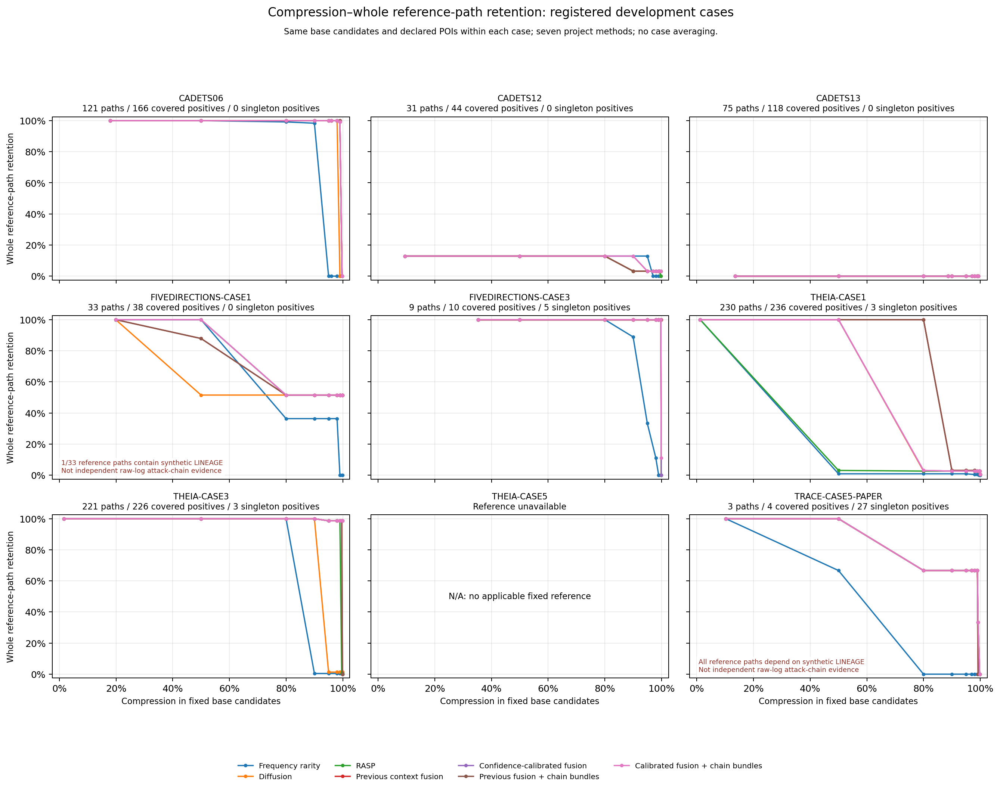
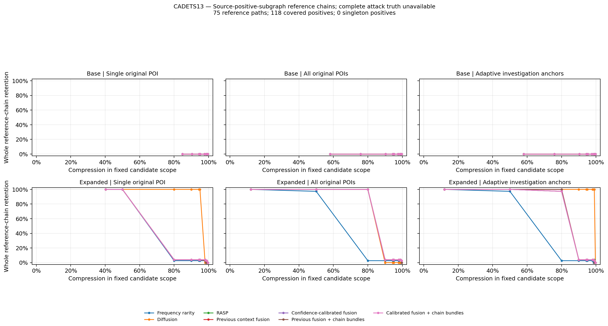

# 多起点、候选窗口与实际保留链工作台

当前统一入口：启动网页后访问 `/assets/research-workbench.html`。实际保留链与下载入口为 `/assets/retained-chains.html`；上一轮固定参考链实验保留在 `/assets/chain-study.html`。

## 2026-09-30 已完成结果

运行 `20260930-r1` 已完成 **9个E3本机案例、36个候选范围/POI变体、7种方法、每变体10个预算，共2520个冻结决策点**。全部冻结工件先通过验证，再读取离线参考。8个案例具有适用的部分参考，THEIA5无对应参考；E5仍为仅有标注，未纳入事件实验。

[聚合JSON](report.json) · [逐点CSV](report.csv) · [主图PDF](figures/overview-reference-chain.pdf) · [主图SVG](figures/overview-reference-chain.svg) · [验收说明](verification.md) · [机器可读验收](validation.json)



主图固定每个案例的 `base / declared`，避免在不同起点或不同候选范围间选取各方法最优点。CADETS13的原候选曲线始终为0，原因是候选阶段已经截断全部75条参考路径；扩窗的实际效果另见下图。



### 同候选、同起点、同1024条预算

表格单元为“完整保留固定参考路径数 / 固定参考路径总数”。路径可能重叠，不能相加作为独立攻击次数。全部数值来自 `base / declared / budget=1024`；所有方法的实际保留条目均为1024。完整4096条及其他预算结果保存在CSV和交互页中。

| 案例 | 仅频率 | 仅扩散 | RASP | 旧上下文 | 置信度融合 | 旧整链 | 新融合整链 |
|---|---:|---:|---:|---:|---:|---:|---:|
| CADETS06 | 0/121 | 0/121 | 120/121 | 121/121 | 120/121 | 121/121 | 120/121 |
| CADETS12 | 0/31 | 1/31 | 1/31 | 1/31 | 1/31 | 1/31 | 1/31 |
| CADETS13 | 0/75 | 0/75 | 0/75 | 0/75 | 0/75 | 0/75 | 0/75 |
| FIVEDIRECTIONS-CASE1 | 0/33 | 17/33 | 17/33 | 17/33 | 17/33 | 17/33 | 17/33 |
| FIVEDIRECTIONS-CASE3 | 0/9 | 9/9 | 9/9 | 9/9 | 9/9 | 9/9 | 9/9 |
| THEIA-CASE1 | 0/230 | 6/230 | 6/230 | 1/230 | 6/230 | 1/230 | 6/230 |
| THEIA-CASE3 | 0/221 | 3/221 | 1/221 | 0/221 | 218/221 | 0/221 | 218/221 |
| THEIA-CASE5 | N/A | N/A | N/A | N/A | N/A | N/A | N/A |
| TRACE-CASE5-PAPER | 0/3 | 1/3 | 1/3 | 0/3 | 1/3 | 0/3 | 1/3 |

THEIA3在相同1024条预算下，RASP保留1/221条参考路径、7/229个参考正例，置信度融合保留218/221条路径、224/229个正例，候选压缩率为99.9096%。这是本轮明显收益；参考路径存在重叠，且全部案例为开发数据，不能解释成发现218次独立完整攻击或外部泛化结论。

独立比较新整链选择与相同评分的 `reliability`：330个有参考的范围/起点/预算点中，链保留8升、1降、321平，另30点无参考；正例保留32升、2降、296平。唯一链退步发生在FIVEDIRECTIONS1的 `base / adaptive / 1024`，17/33降为14/33。360个点的整链选择耗时均更长，选择器累计时间从85.46秒增至1593.41秒（18.64倍），因此当前证据不足以认为新增整链步骤的成本普遍值得；耗时只覆盖选择器，不能当作端到端性能。这些点共享案例和候选，不能当作330个独立统计样本。

本轮也存在明确失败。CADETS12即使增大预算，31条源参考中仍有27条首先在时序可用阶段丢失；增加稀有度权重不能补回不可用依赖。CADETS13扩窗后，`adaptive / 1024`下仅扩散保留75/75条参考路径，新融合整链仅保留3/75；`single / 4096`也分别为75/75与3/75。因此当前融合并非普遍优于扩散，不能将7种方法中事后最优者拼成一个无代价的自适应算法。

### 候选范围、起点与完整性

CADETS13旧候选有35967条事件，只包含118个已知正例中的79个。活动边界扩展到74323条后，118个全部进入候选；缺失的39个均在旧窗口之后，单独增加POI不能改变固定窗口的候选覆盖。

以下对照固定 `declared / reliability_chain`，所有行均使用相同最大候选范围74323作为压缩率分母：

| 范围 | 实际保留条目 | 固定范围压缩率 | 保留参考正例 | 完整参考路径 |
|---|---:|---:|---:|---:|
| 原候选 | 1024 | 98.6222% | 79/118 | 0/75 |
| 活动扩窗 | 1024 | 98.6222% | 114/118 | 3/75 |
| 活动扩窗 | 14864 | 80.0008% | 118/118 | 75/75 |

参考覆盖补齐与预算内完整保留是两件事：1024条下仍有4个参考正例被舍弃，却会同时打断72条相互重叠路径。网页分别展示这些事件与路径的首次损失阶段。

多POI比较同时保留 `single / declared / adaptive`，不强制每个案例使用相同数量。自适应实际选择1至8个起点，但不保证比已有多告警更好：固定 `base / reliability_chain / 1024`，CADETS06依次保留118、120、119条参考路径；THEIA1分别为5、6、0条。实际使用时保留已知告警和建议角色的区分，本轮不以自适应结果替换全部原始告警。

### 交付范围与可证实结论

本机页面预置15份本轮 `reliability_chain / 1024` 代表导出，另保留9份v1归档；每份都包含实际选择的全部事件及JSON、CSV、GraphML。其他已冻结点可以按精确方法和整数预算导出，不需重新评分。离线参考叠加另展示完整路径、断裂路径、缺失成员和首次损失阶段；它不参与选择。

频率不足以单独表达行为异常，本轮通过严格早于候选范围的上下文历史和支持置信度进行校准，并保留频率、扩散、旧融合与新融合消融。实验支持其在部分案例有收益，也显示扩散优于融合和自动增点退步的反例。现有证据尚不足以声称达到顶会成果或全面超过已有系统；缺少的独立完整攻击标注、未见外部测试、作者原版基线和调查效用验证不能用开发集曲线替代。

## 输出是什么

导出包含实际剪枝掩码选择的**全部事件**，JSON、CSV、GraphML三种格式一致。每个文件有SHA-256，路径分解的事件并集精确等于保留子图，孤立边也保留。路径严格按时间和因果方向连续；EXECUTE同时显示原始进程→文件方向和文件→进程的信息流方向。分支作为独立路径或多臂观测见证呈现，不能把两臂拼成虚假的单条攻击链。

实际保留路径数、完整保留的观测见证数、离线完整参考链数是三个不同指标。真实攻击链的全局完整性仍需要独立范围审核，当前不把自动路径数称为攻击次数。

## 本轮固定开发协议

- 初始案例为CADETS06/12/13、THEIA1/3/5、TRACE5工件、FIVEDIRECTIONS1/3，共9个本机调查案例。THEIA5与E5无关，也不借用TRACE5标注。
- CADETS比较原候选与边界活动触发的扩窗。活动主体从输入POI进程端点和已观测进程交互形成；边界60秒内仍有活动才分步扩300秒，每侧最多900秒，总候选不超过300000。限额与边界未知都记录，不根据正例补边。
- 每个候选范围比较最早单POI、已有声明多POI、从单起点自适应增加建议POI。建议按证据与程序/行为/时间片的新增覆盖停止，最多8个；重复事件不免费制造多个独立告警。这仍是报告辅助调查，不宣称独立攻击检测。
- 固定候选事件条目预算256/1024/4096，同时绘制1%/2%/5%/10%/20%/50%/100%候选上限曲线。同范围/同预算比较方法；跨范围另报固定最大候选范围的压缩率，不能以扩大分母伪造收益。
- 七方法：仅频率、仅扩散、原RASP评分与时序见证、上一版上下文融合、置信度校准融合、上一版整链选择、新融合整链选择。整链扩展每种评分最多512个锚点、64步，资源限制如实记录。本轮与旧4096锚点实验分开，不把两轮数值误称唯一变量消融。
- 新融合 `Rnew=(1−0.75C)R+0.75CS`。其中C为历史支持置信度、S为上下文偏离；C=0时精确回退R。少见、新颖、偏离与恶意不是同一概念。
- 新增上下文模型的历史截止固定为允许的最早候选时间，扩窗案例在初始起点前900秒。优先用完整UTC日缓存；无缓存时只读之前24小时内最近最多250000个事件，再按主机/程序语义筛选。缺失历史明确冷启动。现有实体元数据快照的发生时可知性未证明，历史也未被认证全良性。
- 每一方法/预算选择先冻结，全部变体验证后才读取参考。非POI增量保留排除该案例固定的原始输入POI，防止变动分母。未知事件不计作真负例，没有完整真值时不输出正式Precision/F1。

`rarity_only`与`diffusion_only`是在相同POI、事件预算和时序见证选择器约束下的**评分消融**，并非不受图约束的全局Top-K。`rasp`、`context_v1`、`reliability`也沿用该时序见证选择器；`adaptive_v1`与`reliability_chain`另启完整候选见证优先及已有时序见证回退选择。这里比较的是本项目实现，不是作者原版NoDoze或NODLINK的复现结果。

自适应POI的新增收益是“当前扩散证据 × 尚未覆盖的同程序行为份额”。每个主机/程序族的总份额为1：程序族占0.45，进程身份共分0.25，关系类型共分0.20，进程/关系/60秒时间片共分0.10；已选择POI覆盖的份额不重复计入。默认收益低于0.05停止，所以数量可以小于8。每个行为片只保留最高分代表，并最多考虑4096个代表、每程序族最多8个；截断会记录。这里的0.05是单个程序族份额的阈值，不是整个图事件总量的5%。

有缓存时，历史仅来自截止时间之前已经结束的UTC日；当前UTC日中更早的事件也不进入该缓存基线。没有缓存时，先通过时间索引读取全库最近最多250000个严格早于截止时间的事件，再按当前候选中的明确主机和进程语义筛选；其他程序的大量活动可能挤占这部分历史上限。缓存失效或不可验证时直接报错，不静默切换历史来源。扩窗新增事件的频率稀有度仍使用原节点类型/关系/类型模式模型补全，已有冻结稀有度保持原值。

**严格早于整个候选窗口的保证仅针对本轮新增上下文历史，不覆盖所有既有输入分数。** THEIA1/3、TRACE5、FIVEDIRECTIONS1的原始稀有度记录采用首个POI附近的 `exact_timestamp` 截止，候选前缀可能参与过这些原始频次统计。本机逐文件前1000行抽样中，早于旧频次截止的候选分别为728、474、969、88条；这是抽样诊断，不能外推为全图比例。本轮保留这套既有告警前基准以便比较，不将其描述成所有评分证据都严格来自完整候选窗口之前。

## 指标与标注边界

设当前候选事件集合为 `C`，精确选择掩码保留的事件为 `S`，同案例原图与扩展图的固定候选并集为 `U`，参考正例集合为 `P`，原始声明POI集合为 `D`。

| 指标 | 分母与含义 |
|---|---|
| 候选范围压缩率 | `1 − |S| / |C|`；使用实际保留数，而非预算上限 |
| 固定范围压缩率 | `1 − |S| / |U|`；`U`是登记实验中最大的候选范围，不是整台主机或整个数据库 |
| 完整参考链保留率 | 在原始数据库可解析的参考正例子图上，每案例只派生一次固定时序路径见证；其全部必需成员都在`S`中才计入分子 |
| 参考正例保留率 | `|S ∩ P| / |P|`；只是已知参考集合的保留情况，不估计未知事件的良恶性 |
| 增量参考正例保留率 | `|S ∩ (P \ D)| / |P \ D|`；所有方法、范围和POI策略共用原始`D`，新增建议不会缩小分母 |
| 选择耗时 | 冻结文件中的选择器执行时间；不包含候选读取、历史读取、评分/扩散、见证构建或导出，不能直接作为端到端加速比 |

资源字段另区分案例 `elapsed_seconds`、进程历史峰值 `peak_rss_mib` 与变体 `online_seconds`。变体耗时包含该变体内部的POI、扩散、见证与预算选择，仍不包含在进入变体前完成的候选读取及上下文证据准备；案例耗时包含运行和冻结验证，不包含之后的离线评估、绘图和详细导出。`unused_budget`、`anchor_limit_reached`、`truncated_bundles`、`retained_complete_bundles`、`fallback_witnesses`只转录存在的数值/布尔诊断，缺失即为N/A。候选见证截断数不是丢失攻击链数量，完整观测见证也可能相互重叠。

参考链是源正例子图的固定路径覆盖，不是所有可能路径的枚举；未标注的中间依赖可能使参考链本身被拆开。源数据库缺失的正例不会凭空组成可验证参考链，其数量另报为 `source_missing_positive_events`。任何分母为0时，比例为 `null`，网页显示N/A；没有参考标注的案例，正例与参考链计数也为 `null`。独立核验的完整攻击链保留率在本轮始终为N/A。

分阶段诊断固定为 `source → candidate → temporal_eligible → retained`。这些集合逐步缩小，且与源数据库可解析事件相交；`temporal_eligible`使用对应方法的可用见证集合，包含该方法认可的完整候选见证。`first_loss_counts`统计参考链首次损失阶段，`event_first_loss_counts`统计参考正例首次损失阶段，二者不能相加成一个“丢链数”。

本轮事件预算的计数单位是冻结候选账本中的事件条目。账本已有的`LINEAGE`合成关系同样占用预算，因此这些案例的保留条目数不能直接称为原始系统调用日志数量。

部分既有工件包含合成的`LINEAGE`关系事件。报告单列此类参考正例数量及实际保留数量；若原始数据库没有该事件，它仍会进入“源缺失”项。直接按保留ID计算的参考正例数可能因此大于源可核验保留正例数，两者均保留，不将合成关系提升为原始攻击证据。

每案例的 `fixed_reference_summary` 另外给出路径数、覆盖的不同正例数、未进入多事件路径的单例数、最短/最长路径长度及含合成`LINEAGE`的路径数。路径并非穷举，也不代表独立攻击次数。当前源参考审计中，TRACE5的31个正例仅产生3条两步路径，覆盖4个正例，另有27个单例；**3条路径全部含合成`LINEAGE`，其链曲线完全依赖合成关系，不能作为原始日志独立完整攻击链证据**。FIVEDIRECTIONS1的33条路径中有1条含`LINEAGE`；FIVEDIRECTIONS3有9条路径覆盖10个正例，另5个为单例，其`LINEAGE`正例位于单例中。CADETS06的121条路径覆盖166个不同正例，却有5457次路径内事件出现，说明路径强重叠。以上是源参考覆盖审计；各预算点的实际剪枝保留结果见本页结果与聚合报告。

| 案例 | 离线参考与限制 |
|---|---|
| CADETS06/12/13 | CAPTAIN主机实体与时间窗口模式派生的正事件；校验来源家族与场景编号，不能视为独立逐事件人工完整链标注 |
| THEIA1/3、FIVEDIRECTIONS1/3 | 本机关键事件部分参考；按登记的原候选文件哈希核对来源，不把未标注事件当负例 |
| TRACE5工件 | 使用与TRACE候选哈希匹配的本机部分参考；历史参考文件中的案例名曾写作“Theia Case 5”，提供方以实际TRACE工件和哈希为准 |
| THEIA5 | 无可用的对应离线参考；可展示压缩、POI与实际保留子图，不能填入参考链或正例保留率 |

## 数据就绪状态

E3有可用但覆盖不一的日志/数据库。部分THEIA库只有当天片段；TRACE部分记录的时间为0，源覆盖需结合盘点解释。当前已检查的本机目录、挂载点、PostgreSQL目录及TAPAS归档中，E5仅找到标注CSV副本和官方报告，没有匹配事件日志或数据库。E5保留待接入登记，不生成虚构保留率。

这些案例已经参与过开发，不能改名为未见测试。外部测试、独立完整链标注、作者原版系统基线、盲评调查效用是论文强结论仍需补足的证据。

本机盘点的聚合说明见 [data-readiness.json](data-readiness.json)，已有候选损失诊断见 [candidate-diagnosis.json](candidate-diagnosis.json)。盘点范围不包括远程存储或尚未挂载的介质，因此“本机未发现”不等于数据集不存在。

## 文件组织与复现

- [research/README.md](../../research/README.md)：统一目录索引。
- `research/local/datasets`：既有数据入口。
- `research/local/current`：本轮冻结实验入口。
- `research/local/exports`：实际保留链三格式导出。
- `output/research/archive/`：上一轮探索与最终实验，旧路径保留兼容链接。
- [configs/chain_workbench_v2.json](../../configs/chain_workbench_v2.json)：固定参数、案例和待接入数据登记。

以下命令从代码仓库根目录运行。`--data-root`定位既有日志数据库与候选文件；参考文件路径相对于本代码仓库解析。运行目录、报告与导出目录应使用新路径，已有冻结结果不覆盖。

```bash
python -m scripts.run_chain_workbench --case cadets13 --data-root /path/to/data-repo --output output/research/chain-workbench-v2/new-run/cadets13
python -m scripts.evaluate_chain_workbench --input output/research/chain-workbench-v2/new-run --output output/research/chain-workbench-v2/new-run/report.json
python -m scripts.plot_chain_workbench --input output/research/chain-workbench-v2/new-run/report.json --output output/research/chain-workbench-v2/new-run/figures
python -m scripts.export_chain_workbench --frozen output/research/chain-workbench-v2/new-run/cadets13/expanded/adaptive --method reliability_chain --budget 1024 --output webapp/frontend/retained-chain-data/cadets13-expanded-adaptive-1024
```

运行其他案例时，用配置中的案例ID替换`--case`和末级输出目录。同一运行根目录下，每个完成的案例均有 `registration.json`、`case.json` 以及按候选范围/POI策略划分的冻结目录。评估器会验证输入目录中全部案例的登记、工件哈希、选择契约、跨POI候选结构、基础图包含关系与共享历史，之后才打开参考文件。登记案例的目录一旦存在却缺少`case.json`，即视为尚未完成；即使还没写出`registration.json`也会阻止评估，不能被静默略过。普通的`figures`、`exports`辅助目录不属于案例。

默认必须完成配置登记的全部9个案例，所以上面的单案例示例应在其他案例也运行完之后执行正式评估。若明确只检查一个独立的已完成子集，可给评估命令添加 `--allow-partial`；此选项仍拒绝已经启动但未完成的案例。报告始终记录 `registered_cases`、`completed_cases`、`missing_case_ids` 和 `partial_evaluation`，部分运行不能冒充完整矩阵。

每案例保留参考文件SHA-256、登记文件SHA-256以及固定源正例图的规范化快照SHA-256；参考内容解析和哈希来自同一次读取。源图哈希覆盖事件ID、端点、关系、时间及主机等参考派生实际使用的字段，不是全数据库文件哈希。报告也记录评估器、链校验及参考派生代码的哈希，因此更换参考或源正例结构不会悄悄改变同一报告的分母来源。这些哈希不包含可展示的事件明细。

评估同时生成同名CSV。绘图主图 `overview-reference-chain.*` 将9个案例放在3×3面板中；每个面板固定`base`候选和`declared`起点比较7种项目方法，案例之间不取平均。五种评分消融与两种完整见证选择方法的区别仍按上述协议解释。THEIA5保持N/A，TRACE面板注明全部参考路径依赖合成`LINEAGE`。主图与每案例图均输出PDF、PNG、SVG。每案例另保留三组：

- `案例-reference-chain.*`：当前候选分母的压缩率—完整参考链保留率。
- `案例-reference-chain-fixed-scope.*`：固定候选范围分母的同一曲线。
- `案例-equal-budget.*`：所有范围/POI变体共有的候选事件条目预算下，固定增量正例保留率对照。

导出命令只接受该冻结目录中已有的整数预算，预算是上限，实际保留数可以更少。文件为 `retained-graph.json`、`retained-events.csv`、`retained-graph.graphml` 和含哈希的 `manifest.json`，从同一个冻结掩码读取，不重新选图，也不读取参考标注。

需要在本机逐条审查固定参考路径、断点及单事件时，另生成离线参考叠加文件；该文件会读取参考标注，但不修改选择：

```bash
python -m scripts.export_chain_reference_audit --input output/research/chain-workbench-v2/new-run --case cadets13 --track expanded --poi-policy adaptive --method reliability_chain --budget 1024 --output output/research/chain-workbench-v2/new-run/reference-audit-cadets13.json
```

该详细参考叠加文件与实际保留事件导出都只保留本机，不作为公开聚合报告上传。

## 在HTML中查看

把**聚合报告**复制到页面固定读取的位置，再启动项目服务：

```bash
cp output/research/chain-workbench-v2/new-run/report.json webapp/frontend/chain-workbench-summary.json
python webapp/backend/app.py
```

访问 `http://127.0.0.1:8000/assets/research-workbench.html`。若已有项目服务在运行，直接刷新页面即可；页面汇总不存在时会显示未就绪，不使用演示数据代替结果。

实际保留链页面另外读取本机 `webapp/frontend/retained-chain-catalog.json`。例如为上述导出登记：

```json
{
  "entries": [{
    "label": "CADETS13 / expanded / adaptive / reliability_chain / 1024",
    "artifact_url": "/assets/retained-chain-data/cadets13-expanded-adaptive-1024/retained-graph.json",
    "downloads": {
      "json": "/assets/retained-chain-data/cadets13-expanded-adaptive-1024/retained-graph.json",
      "csv": "/assets/retained-chain-data/cadets13-expanded-adaptive-1024/retained-events.csv",
      "graphml": "/assets/retained-chain-data/cadets13-expanded-adaptive-1024/retained-graph.graphml"
    }
  }]
}
```

之后访问 `/assets/retained-chains.html`；若已有目录，应追加条目并保留其他导出。原始事件与详细导出仅保留本机；公开页面汇总由离线评估器构造固定聚合字段，不包含事件ID、实体语义、POI清单、逐边分数或本机来源路径。
