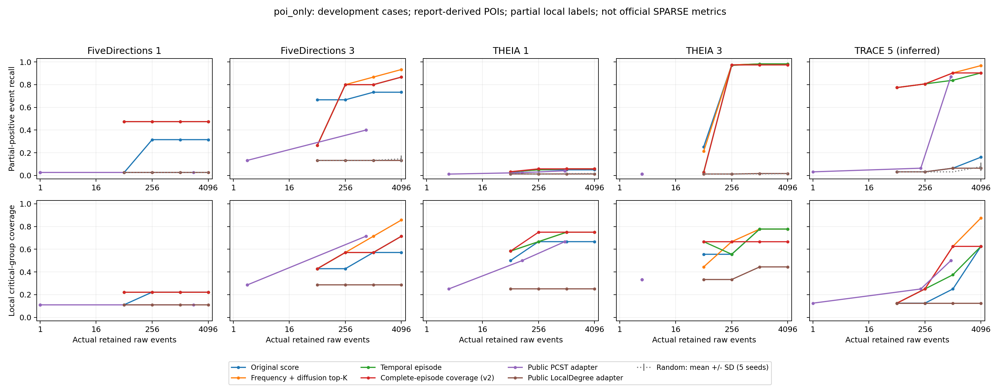
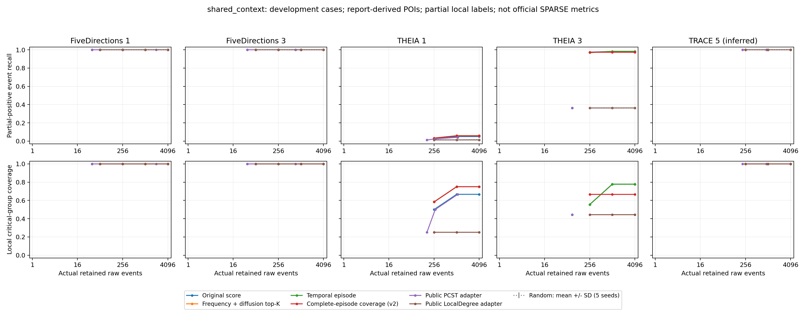

# 跨领域方法、复现来源与五案性能对比

## 这次回答的核心问题

基线不应一律自己重写，也不能只从论文抄数字。实际可行的顺序是：**优先运行作者公开实现；其次运行论文明确采用的成熟开源内核；没有可用实现时，按论文重写并验证；仅有论文结果时，单独列为参考。** 每项说明版本、参数、适配和与原任务的差异。

本轮把研究扩展到图问答、图稀疏化、文本摘要、局部聚类和系统生物学。保持原有频率统计和图扩散，增加饱和覆盖选边。实际运行了公开 PCST 和 LocalDegree 内核，与我们的方法在同一候选图、POI、原始事件预算下比较。

这里是**五案跨任务算法组件的受控比较**。没有训练 G-Retriever 的问答模型，没有复现整个 VLDB 的所有数据集，也没有声称完整复现 SPARSE/KAIROS 等安全系统。

## 其他领域的人怎样做实验

| 工作 | 与我们相似的部分 | 原文/代码能确认的实验做法 | 应借鉴什么 |
|---|---|---|---|
| [G-Retriever，NeurIPS 2024](https://proceedings.neurips.cc/paper_files/paper/2024/file/efaf1c9726648c8ba363a5c927440529-Paper-Conference.pdf) | 从大图检索与问题有关的简洁证据子图 | 附录 B：4 个随机种子；附录 D：PCST 对照 top-k 三元组、节点邻居、最短路径；检索 k 敏感性。作者公开统一代码，检索调用 pcst_fast | 把“相关性评分”和“子图构造”拆开对照；共享检索输入和预算 |
| [Demystifying Graph Sparsification，PVLDB 17 / VLDB 2024](https://www.vldb.org/pvldb/vol17/p427-chen.pdf) | 图剪枝与性质保留 | §3.4 明确混合使用 NetworKit、Laplacians.jl 和自写实现；自写 K-Neighbor、Rank Degree、L-Spar、t-Spanner；评估多种图性质及下游任务 | 开源和自实现都可以，但来源必须透明；图小不代表保留了所需性质 |
| [Lin & Bilmes，ACL 2011](https://aclanthology.org/P11-1052.pdf) | 在长度预算内选择相关且不重复的证据 | DUC03 开发、DUC04 测试；分开评估覆盖、多样性和组合；表中还引用既有系统成绩，不能据此认定逐一运行了原作者实现 | 在预算曲线上评测，做模块消融，开发集与测试集分开 |
| [Omics Integrator，PLOS Computational Biology 2016](https://journals.plos.org/ploscompbiol/article?id=10.1371/journal.pcbi.1004879) | 由观测证据在交互网络中恢复相关通路 | 使用 PCSF 构建网络，提供随机化、噪声及节点 knockout 分析 | 测试证据缺失时是否还能恢复路径；本轮移除 POI 是相近的压力测试，不等同于其生物实验 |
| [SimpleLocal，ICML 2016](https://proceedings.mlr.press/v48/veldt16.html) | 从给定种子寻找局部子图 | 提出局部流式割改进；作者相关 [LocalGraphClustering 软件](https://github.com/kfoynt/LocalGraphClustering) 包含多种局部聚类方法 | 可作为后续局部扩展方向；低 conductance 不等于时间攻击链正确。本轮阅读但未运行此方法 |

上表借鉴的是问题结构与实验方法；不同任务的 QA、ROUGE、生物通路或 conductance 数字不能移植成我们的攻击检测指标。

## 本轮真正运行了哪些代码

| 方法 | 来源类别 | 实际运行与适配 |
|---|---|---|
| 原评分 top-K、历史稀有度 top-K | 本仓库已有评分＋透明简单基线 | 读取冻结 ledger 的已有分数，再统一选择原始事件；不冒充原始 NODOZE 论文整套复现 |
| 随机 top-K | 自行实现的基础对照 | NumPy，5 个固定种子 0..4；保留相同强制证据 |
| 当前扩散 top-K、episode | 本仓库已实现方法 | 同一频率／扩散评分；比较是否补时间路径、是否展开事件组 |
| LocalDegree | 论文使用的开源库内核 | **NetworKit 11.2.2** 的 LocalDegreeSparsifier.scores；无向简单实体图分数映射回原始事件，再做共享 top-K。不是逐字复现 VLDB 全实验 |
| PCST | 原作者公开求解器内核 | **pcst_fast 1.0.10**；参考 G-Retriever 的边奖励转虚拟节点；奖励来自我们共同的扩散分数，成本采用原始事件数，POI 端点连接临时超根 |
| 饱和覆盖 exact / semantic | 本轮实现 | 借鉴摘要中的覆盖思想，保留频率与扩散；exact 仅实体对关系，semantic 再加入语义实体对关系 |
| 饱和覆盖无频率 | 本轮消融 | 移除历史稀有度和候选语义频率校正，其他流程一致 |

PCST 的超根只用于求解，移除后真实输出允许多个分量。它没有时间有向路径保证，因此另测时间可达性。PCST 扫描预先固定的成本系数，用**不读取标签的总 episode 奖励**选预算可行解，允许不填满预算，不向原生解补高分边。所有方法实际保留数量均显示，不能把“上限相同”写成“输出数量完全相同”。

[代码来源、仓库 commit 与依赖二进制哈希](cross-domain-source-manifest.json)。G-Retriever inspected commit `315b0ff8a206536067602fb97e77c10f4d646d5d`；VLDB benchmark inspected commit `598e580152329c729f031a3f66e082702aff9320`。这两个仓库用于核对实现来源；实际调用的是注明版本的公共内核和本地适配层。

## 算法改进是什么

原来的频率统计和 POI／背景对照扩散继续产生重要度。新选择器对重复证据施加“已覆盖后收益饱和”：

`C(S) = {g: 事件组 g 的全部原始事件均在 S 中}`；

`F(S) = average_over_views sum_feature max(weight(g): g in C(S) with this feature)`。

exact 视图是有向实体对＋关系；semantic 视图是主机隔离的语义实体对＋关系。每次按**锚点的边际覆盖增益**排序，再尝试加入整个 10 秒事件组和原始时间路径见证；连接边及强制证据消耗原始事件预算，但只有补成完整事件组时才更新已覆盖特征。POI 的平行组在预算可容纳时先补全。

这是“锚点覆盖优先级＋路径束准入”的启发式，不是整束边际增益的精确贪心，也没有继承经典次模 knapsack 的近似比；完整事件组的准入会形成互补关系，该目标在原始事件集合上并非次模函数。尤其不能将增益除以不断变化的连接成本后仍套用旧 lazy-heap 上界。

目标是防止同一高分交互反复占预算，让其他低分但不同的传播分支获得机会。实现不使用攻击文件名、IP 列表、参考边 ID 或新增 oracle POI。

## 固定实验条件

- 原五案；相同候选图、报告 POI、冻结局部参考。Case5 仍是推断的 TRACE 映射。
- 原始事件预算 64/256/1024/4096，主预算 1024，主方法预先指定 coverage_semantic。
- 两条轨道：`poi_only`；`shared_context`，后者把**同一套既有语义延续证据交给每个方法**。该证据超过预算时记 infeasible。
- 仍是报告导出的 oracle POI，无外部告警；不声称自动发现能力。
- 多 POI 案例逐个移除一个 POI，重新评分和生成语义上下文；旧的缓存评分没有混入这项测试。
- 随机对照 5 种子报均值／标准差；确定性选边在主预算重复 3 次计时。PCST 全网格只计算一次，单独计时，不把预算扫描时间冒充求解时间。
- 再对五种确定性方法、五案分别用新进程测主预算的加载至选边时间与峰值 RSS。每个单独管线仅一个耗时样本；不同案例进程并行运行，非独占机器，时间为描述性测量，不支持严格加速比结论。
- 所有选择先冻结落盘，再读取参考标注。五案已被开发观察，随机种子不能把它们变成独立未见攻击。
- 所有 FP/FN/P/R/F1/FPR/FNR 为显式闭世界局部 **proxy**；关键组／阶段覆盖只是冻结参考命中。官方 SPARSE 等价指标仍为 NA。

## 实际结果：v2 主比较

共记录 **664** 个配置决策：600 个全 POI 预算／轨道／方法组合，加 64 个逐 POI 删除配置。其中 **45** 个因共同强制证据已超过预算而不可行，剩余 **619** 个完成选边与评价。不可行配置不当作零准确率样本。五案候选原始事件数依次为 466257、424245、898253、1132218、137762。

### 仅共享报告 POI：原始事件上限 1024

每格为 **命中局部正例 TP / 实际原始事件数 E**。正例总数见列头。

| 方法 | FD1 (38) | FD3 (15) | THEIA1 (239) | THEIA3 (229) | TRACE5* (31) |
| --- | --- | --- | --- | --- | --- |
| 原评分 top-K | 12 / 1024 | 11 / 1024 | 12 / 1024 | 225 / 1024 | 2 / 1024 |
| 仅历史稀有度 | 3 / 1024 | 2 / 1024 | 3 / 1024 | 3 / 1024 | 2 / 1024 |
| 频率＋扩散 top-K | 18 / 1024 | 13 / 1024 | 14 / 1024 | 225 / 1024 | 28 / 1024 |
| 频率＋扩散＋事件组/路径 | 18 / 1024 | 12 / 1024 | 14 / 1024 | 225 / 1024 | 26 / 1024 |
| v2 exact 覆盖 | 18 / 1024 | 12 / 1024 | 14 / 1024 | 223 / 1024 | 28 / 1024 |
| v2 semantic 覆盖 | 18 / 1024 | 12 / 1024 | 14 / 1024 | 223 / 1024 | 28 / 1024 |
| v1 部分事件即可饱和（消融） | 18 / 1024 | 12 / 1024 | 14 / 1024 | 6 / 1024 | 28 / 1024 |
| v2 覆盖去频率 | 18 / 1024 | 13 / 1024 | 14 / 1024 | 223 / 1024 | 26 / 1024 |
| 公开 LocalDegree 适配 | 1 / 1024 | 2 / 1024 | 3 / 1024 | 4 / 1024 | 2 / 1024 |
| 公开 PCST 适配 | 1 / 1 | 6 / 708 | 10 / 940 | 3 / 3 | 27 / 925 |

随机对照，5 种子均值 ± 样本标准差（百分数）：

| 案例 | 局部 proxy Recall | 局部 proxy F1 |
| --- | --- | --- |
| FD1 | 2.63 ± 0.00 | 0.19 ± 0.00 |
| FD3 | 13.33 ± 0.00 | 0.38 ± 0.00 |
| THEIA1 | 1.59 ± 0.35 | 0.60 ± 0.13 |
| THEIA3 | 1.40 ± 0.20 | 0.51 ± 0.07 |
| TRACE5* | 3.23 ± 0.00 | 0.19 ± 0.00 |

### 共享 POI 与既有语义延续证据：原始事件上限 1024

每格为 **命中局部正例 TP / 实际原始事件数 E**。正例总数见列头。

| 方法 | FD1 (38) | FD3 (15) | THEIA1 (239) | THEIA3 (229) | TRACE5* (31) |
| --- | --- | --- | --- | --- | --- |
| 原评分 top-K | 38 / 1024 | 15 / 1024 | 12 / 1024 | 225 / 1024 | 31 / 1024 |
| 仅历史稀有度 | 38 / 1024 | 15 / 1024 | 3 / 1024 | 83 / 1024 | 31 / 1024 |
| 频率＋扩散 top-K | 38 / 1024 | 15 / 1024 | 14 / 1024 | 225 / 1024 | 31 / 1024 |
| 频率＋扩散＋事件组/路径 | 38 / 1024 | 15 / 1024 | 14 / 1024 | 225 / 1024 | 31 / 1024 |
| v2 exact 覆盖 | 38 / 1024 | 15 / 1024 | 14 / 1024 | 223 / 1024 | 31 / 1024 |
| v2 semantic 覆盖 | 38 / 1024 | 15 / 1024 | 14 / 1024 | 223 / 1024 | 31 / 1024 |
| v1 部分事件即可饱和（消融） | 38 / 1024 | 15 / 1024 | 14 / 1024 | 85 / 1024 | 31 / 1024 |
| v2 覆盖去频率 | 38 / 1024 | 15 / 1024 | 14 / 1024 | 223 / 1024 | 31 / 1024 |
| 公开 LocalDegree 适配 | 38 / 1024 | 15 / 1024 | 3 / 1024 | 83 / 1024 | 31 / 1024 |
| 公开 PCST 适配 | 38 / 39 | 15 / 738 | 6 / 275 | 83 / 87 | 31 / 929 |

随机对照，5 种子均值 ± 样本标准差（百分数）：

| 案例 | 局部 proxy Recall | 局部 proxy F1 |
| --- | --- | --- |
| FD1 | 100.00 ± 0.00 | 7.16 ± 0.00 |
| FD3 | 100.00 ± 0.00 | 2.89 ± 0.00 |
| THEIA1 | 1.42 ± 0.23 | 0.54 ± 0.09 |
| THEIA3 | 36.24 ± 0.00 | 13.25 ± 0.00 |
| TRACE5* | 100.00 ± 0.00 | 5.88 ± 0.00 |

### FP/FN/Precision/Recall/F1 明细

以下为 `poi_only`、预算 1024；数值全部是**局部闭世界 proxy**。未标注事件在该代理定义下计为负例，不代表它们经官方验证为正常。`TP+FN` 由本地参考决定，不能用 SPARSE 论文表里的总数反推我们的逐事件标签。完整 619 项评价及 45 项不可行配置见 CSV。CSV 中比率为 0–1，报告表转换为百分数。

| 案例 | 方法 | E | TP | FP* | FN* | P* % | R* % | F1* % | 关键组 | 阶段 |
| --- | --- | --- | --- | --- | --- | --- | --- | --- | --- | --- |
| FD1 | 频率＋扩散 top-K | 1024 | 18 | 1006 | 20 | 1.76 | 47.37 | 3.39 | 2/9 | 1/3 |
| FD1 | v2 semantic 覆盖 | 1024 | 18 | 1006 | 20 | 1.76 | 47.37 | 3.39 | 2/9 | 1/3 |
| FD1 | 公开 PCST 适配 | 1 | 1 | 0 | 37 | 100.00 | 2.63 | 5.13 | 1/9 | 1/3 |
| FD3 | 频率＋扩散 top-K | 1024 | 13 | 1011 | 2 | 1.27 | 86.67 | 2.50 | 5/7 | 3/3 |
| FD3 | v2 semantic 覆盖 | 1024 | 12 | 1012 | 3 | 1.17 | 80.00 | 2.31 | 4/7 | 2/3 |
| FD3 | 公开 PCST 适配 | 708 | 6 | 702 | 9 | 0.85 | 40.00 | 1.66 | 5/7 | 3/3 |
| THEIA1 | 频率＋扩散 top-K | 1024 | 14 | 1010 | 225 | 1.37 | 5.86 | 2.22 | 9/12 | 5/6 |
| THEIA1 | v2 semantic 覆盖 | 1024 | 14 | 1010 | 225 | 1.37 | 5.86 | 2.22 | 9/12 | 5/6 |
| THEIA1 | 公开 PCST 适配 | 940 | 10 | 930 | 229 | 1.06 | 4.18 | 1.70 | 8/12 | 5/6 |
| THEIA3 | 频率＋扩散 top-K | 1024 | 225 | 799 | 4 | 21.97 | 98.25 | 35.91 | 7/9 | 5/5 |
| THEIA3 | v2 semantic 覆盖 | 1024 | 223 | 801 | 6 | 21.78 | 97.38 | 35.59 | 6/9 | 5/5 |
| THEIA3 | 公开 PCST 适配 | 3 | 3 | 0 | 226 | 100.00 | 1.31 | 2.59 | 3/9 | 3/5 |
| TRACE5* | 频率＋扩散 top-K | 1024 | 28 | 996 | 3 | 2.73 | 90.32 | 5.31 | 5/8 | 4/6 |
| TRACE5* | v2 semantic 覆盖 | 1024 | 28 | 996 | 3 | 2.73 | 90.32 | 5.31 | 5/8 | 3/6 |
| TRACE5* | 公开 PCST 适配 | 925 | 27 | 898 | 4 | 2.92 | 87.10 | 5.65 | 4/8 | 3/6 |

### 路径与连通性

`temporal_fork_fraction` 是所选事件中，相对于当前 POI 能满足实现中时间 fork 路径检查的比例；它不验证攻击因果。连通分量数按无向实体图计算。主预算、`poi_only`：

| 案例 | 方法 | 无向分量 | 时间 fork 比例 % | 完整事件组 | 部分事件组 |
| --- | --- | --- | --- | --- | --- |
| FD1 | 频率＋扩散 top-K | 1 | 95.80 | 739 | 6 |
| FD1 | 频率＋扩散＋事件组/路径 | 1 | 100.00 | 736 | 7 |
| FD1 | v2 semantic 覆盖 | 1 | 100.00 | 736 | 7 |
| FD1 | 公开 PCST 适配 | 1 | 100.00 | 0 | 1 |
| FD1 | 公开 LocalDegree 适配 | 152 | 1.17 | 247 | 645 |
| FD3 | 频率＋扩散 top-K | 5 | 66.31 | 281 | 1 |
| FD3 | 频率＋扩散＋事件组/路径 | 1 | 100.00 | 284 | 9 |
| FD3 | v2 semantic 覆盖 | 1 | 100.00 | 284 | 9 |
| FD3 | 公开 PCST 适配 | 1 | 42.09 | 696 | 0 |
| FD3 | 公开 LocalDegree 适配 | 69 | 0.20 | 159 | 656 |
| THEIA1 | 频率＋扩散 top-K | 1 | 81.54 | 484 | 51 |
| THEIA1 | 频率＋扩散＋事件组/路径 | 1 | 100.00 | 517 | 6 |
| THEIA1 | v2 semantic 覆盖 | 1 | 100.00 | 597 | 7 |
| THEIA1 | 公开 PCST 适配 | 1 | 96.38 | 873 | 0 |
| THEIA1 | 公开 LocalDegree 适配 | 67 | 0.29 | 80 | 597 |
| THEIA3 | 频率＋扩散 top-K | 3 | 99.80 | 598 | 180 |
| THEIA3 | 频率＋扩散＋事件组/路径 | 3 | 100.00 | 625 | 0 |
| THEIA3 | v2 semantic 覆盖 | 3 | 100.00 | 635 | 0 |
| THEIA3 | 公开 PCST 适配 | 3 | 100.00 | 3 | 0 |
| THEIA3 | 公开 LocalDegree 适配 | 40 | 22.95 | 129 | 666 |
| TRACE5* | 频率＋扩散 top-K | 1 | 96.78 | 289 | 3 |
| TRACE5* | 频率＋扩散＋事件组/路径 | 1 | 99.80 | 264 | 1 |
| TRACE5* | v2 semantic 覆盖 | 1 | 99.51 | 395 | 3 |
| TRACE5* | 公开 PCST 适配 | 1 | 96.22 | 271 | 0 |
| TRACE5* | 公开 LocalDegree 适配 | 11 | 0.39 | 964 | 39 |

### POI 缺失压力测试

每次移除一个报告 POI，仍对原来的全部局部正例计数，重新构建分数和上下文；删除顺序及具体 ID 在 JSON 中。表中是各次删除后的 **TP 列表**，不是独立测试集的统计置信区间。单 POI 案例未做零种子实验。

| 案例 | 轨道 | 扩散 top-K | 事件组/路径 | v2 覆盖 | v2 去频率 |
| --- | --- | --- | --- | --- | --- |
| FD3 | poi_only | 3, 10 | 2, 10 | 2, 10 | 3, 10 |
| FD3 | shared_context | 5, 10 | 5, 10 | 5, 10 | 5, 10 |
| THEIA1 | poi_only | 14, 14, 14 | 12, 14, 14 | 8, 14, 14 | 8, 14, 14 |
| THEIA1 | shared_context | 12, 14, 14 | 12, 14, 14 | 8, 14, 14 | 7, 14, 14 |
| THEIA3 | poi_only | 6, 224, 222 | 6, 224, 222 | 4, 222, 222 | 4, 222, 222 |
| THEIA3 | shared_context | 6, 224, 222 | 6, 224, 222 | 4, 222, 222 | 4, 222, 222 |

### 两轮优化与消融的结论

1. **修复有效，整体优势未成立。** v1 在 THEIA3 将部分连接边误当成整组覆盖；v2 将完整事件组作为覆盖资格。1024 预算下，`poi_only` TP 从 6 → 223，`shared_context` 从 85 → 223。扩散 top-K 仍为 225，不能把修复退化写成超越已有方法。v1 全部结果保留。
2. **存在小预算的结构收益。** THEIA1 在 256 预算、`poi_only` 中，v2 命中 14，扩散 top-K 为 12；但总正例有 239。THEIA3 在 64 预算，v2 覆盖 6/9 关键组、5/5 阶段，扩散 top-K 为 4/9、3/5；同时 TP 为 6 对 49，说明压缩阶段摘要与恢复所有重复事件存在冲突。阶段命中只需至少一个已标注样例，不能解读为整阶段完整恢复。
3. **语义视图贡献尚未证实。** 主预算 exact 与 semantic 的 TP 一致；不能把后者列成已验证的独立创新。去频率在 FD3 反而从 12 到 13，在 TRACE5 从 28 降至 26，效果依赖案例。
4. **共有上下文影响很大。** FD1/FD3/TRACE5 在 shared_context 的所有方法均命中 38/15/31，包括随机方法。这部分收益来自既有语义规则。共同强制事件数为 39/38/165/87/114。
5. **PCST 的小图不一定证据完整。** THEIA3 shared_context 仅 87 个事件、83 TP，proxy F1 较高，但只覆盖 4/9 组、3/5 阶段。FD1 则 39 个事件命中全部 38 正例，但这些命中已包含于共同强制证据。PCST 的结果反映本轮奖赏/原始成本/14 点系数网格适配，不能据此断言 PCST 在其他任务不如我们。
6. **缺失 POI 是明显弱点。** THEIA3 删除一个 POI 后，扩散 top-K 最差 TP 6，v2 覆盖最差 4；当前系统依赖报告给定的起点。THEIA1 增大预算到 4096 仍仅命中 14/239，是应优先诊断的瓶颈。

预算曲线以**实际输出原始事件数**为横轴，避免将 PCST 的空余预算当成已使用：





## 运行开销

以下为 `poi_only`、1024 上限的新进程测量。每格 **加载至选边秒数 / 峰值 RSS MiB**。包括该方法必须的分组、评分和路径处理；PCST 包含全部 14 个系数求解和扩散奖赏计算。每个管线只测一次，案例进程并行、机器非独占，不据此宣称统计显著的速度优势。

环境：Xeon Gold 6258R @ 2.70GHz，112 个逻辑 CPU，约 125 GiB 内存；每方法内核限制为单线程。NumPy 1.26.4、SciPy 1.14.1、NetworKit 11.2.2、pcst_fast 1.0.10。

| 方法 | FD1 | FD3 | THEIA1 | THEIA3 | TRACE5* |
| --- | --- | --- | --- | --- | --- |
| diffusion_top | 11.88 / 234.2 | 11.42 / 214.6 | 24.80 / 442.3 | 29.63 / 497.3 | 4.41 / 143.9 |
| episode | 14.86 / 250.3 | 14.08 / 219.3 | 33.96 / 443.1 | 40.66 / 515.4 | 5.41 / 144.6 |
| coverage_semantic | 15.30 / 256.9 | 14.19 / 226.2 | 34.90 / 443.3 | 40.63 / 533.6 | 5.89 / 142.8 |
| localdegree_top | 12.79 / 326.9 | 12.25 / 302.4 | 24.19 / 480.3 | 30.69 / 570.2 | 5.67 / 250.9 |
| pcst_native | 16.10 / 321.4 | 14.39 / 257.1 | 28.50 / 447.6 | 35.85 / 563.3 | 6.81 / 180.3 |

25 次重新计算的选择集合均与主实验精确一致。计时从冻结候选 ledger 加载开始，**不包含原始 CDM 导入和历史频率模型构建**，也不包含评价/导出；不能称为原始日志到最终告警的端到端时间。

主实验另保存确定性选择器的 3 次耗时中位数/最小/最大值；共享评分只计算一次。CSV 中 `kernel_plus_selection_seconds` 只含评分内核与选择，不含输入加载、通用分组和全部路径预处理，不能与上表的完整候选管线时间混用。PCST 此字段已补计扩散评分和全系数网格成本；其预算扫描仅一次。旧评分是缓存输入，未拿缓存读取时间冒充重新训练成本。

## 我建议正式论文实验怎样做

### 复现策略：按证据来源分四类

1. **原作者系统实现**：SPARSE、NODOZE 或其他安全基线，能获得可运行版本就固定 commit、依赖和原参数跑同一份原始日志。保留作者默认设置，再给共同的调参预算。当前没有完成这些系统的原生逐案复现，因此不放入本轮实测排名。
2. **作者／论文采用的公开内核**：本轮 PCST、NetworKit 属于此类。适合回答“我们的选择机制是否比通用图算法更合适”，不能回答“完整系统是否战胜 G-Retriever”。必须列出方向、时间、平行事件、成本和 POI 的适配。
3. **根据论文重新实现**：只在无可用代码或关键组件不可运行时采用。先做小图行为校验，核对作者报告的至少一项原任务趋势；无法核对则标作未验证复现。简单 top-K、随机等基础算法直接实现即可。
4. **论文报告值**：可以像用户提供的表格一样作为目标和历史背景，另列 `paper-reported`；不可与当前不同标签、种子和事件定义的实测值混算平均排名或提升百分比。

### 实验矩阵与准入条件

| 要回答的问题 | 推荐设计 | 本轮状态 |
| --- | --- | --- |
| 同样阅读成本下能恢复多少证据 | 相同原始事件预算，绘制实际 E 与事件/关键组/阶段覆盖的曲线，同时给 FP/FN/P/R/F1 | 已完成 64/256/1024/4096；标签仅局部 proxy |
| 核心评分还是既有规则起作用 | 同候选图、同 POI；无规则和所有方法共用规则两条轨道 | 已完成 |
| 频率、扩散、选边各自贡献 | 旧评分、频率单独、扩散 top-K、事件组、覆盖、去频率；共享超参数搜索资源 | 已完成主要消融；尚缺完全去扩散的新统一重跑 |
| 事件质量和图结构是否都保留 | 原始事件指标、关键组、阶段、时间路径、组件数量；不以图小单独判优 | 已完成；路径检查不是真实因果验证 |
| 能否自动启动 | 报告 POI 上界与仅由历史频率/当前事件生成的自动 POI 分轨，报告启动召回及误报 | 本轮仍为报告 POI，自动起点未验证 |
| 起点有错或不完整时是否稳健 | 删真 POI、加入良性干扰 POI、时间截断，固定扰动生成规则 | 已完成逐个删 POI；其余未运行 |
| 泛化和统计可信度 | 时间/主机/攻击家族隔离，冻结开发集；独立案例作统计单位，多个种子只刻画随机性 | 当前五案已被开发使用，不是未见测试集 |
| 模型开销是否可接受 | 独占机器重复运行，分开历史建模、导入、评分、选边、RSS；GNN 另报训练和推理 | 已完成候选管线单样本测量和选择器重复；未完成独占端到端开销 |
| 是否比 SPARSE 强 | 相同原始事件级完整真值、POI设定、案例映射和作者系统输入，原生复现或明确标注重实现 | 条件未满足，不能下优劣结论 |

若始终限定这五案，应把“跨案例开发验证”和“最终未见测试”区分开。可以做按案例留一的嵌套调参来评估流程，但由于人工已经查看五案，不能把重新划分包装成未触碰测试集。最终确认应留待后续未参与设计的时间段/主机/攻击样本；不能把五个随机种子当成五个新攻击。频率基准必须仅来自预测时可用的历史，任何候选内归一化应明确为当前图上的无监督计算。

### 下一步算法方向：围绕当前两个核心模块

本轮结果支持的判断是：**先解决证据单位和路径分支覆盖，再考虑增加 GNN。** 当前新覆盖选择器不替换默认实现，保留为实验分支。

- **频率统计模块**：分别建模“这种交互是否罕见”和“同一交互内出现了多少事件”，将事件组频率与原始事件占用分开。完整 episode 解决了提前饱和问题，但“重复次数多”仍会主导逐事件 Recall。下一步应验证按主机/进程角色条件化的历史频率是否改善 THEIA1，而不是对已知攻击文件/IP 调权。
- **扩散传播引擎**：优先诊断 THEIA1 缺失正例在候选图上的可达性、方向、时间距离和排名。它们已在候选 ledger 中，但目前不能直接断言是剪枝、评分还是路径约束造成损失。引入独立的残余分支扩散之前，先把这几类损失量化。
- **预算选择层**：将“恢复整组事件”与“覆盖不同传播阶段/分支”作为分别可验证的目标，测试双预算或 Pareto 曲线。低预算阶段收益有初步证据，但不能用阶段命中替代用户要求的 FP/FN。下一版应与扩散 top-K 在整个预算曲线上比较，并显式记录退化案例。
- **GNN 的位置**：若补充足够独立数据，可用共享历史图自监督学习关系/边权，再替换扩散的边权函数；保留相同 POI、候选图和选择器，以隔离学习模块收益。本轮没有训练 GNN，五个已反复观察的案例不足以支撑“学习模型泛化更好”的结论。

与其继续把参考表上的某个 F1 数字当作调参终点，当前更有价值的准入标准是：在预先冻结的独立数据上，关键组和阶段不退化、同等原始事件预算的逐事件召回提高、时间有效性保持，同时报告置信范围和失败案例。达到该标准后才讨论超越某个完整系统。

## 审计、复现与交付

- 算法冻结：v1 commit `0dd4ac8`；v2 commit `5525feb`。v2 是观察 v1 退化后的开发修订，非预注册确认性实验。v1 与 v2 均保存输入/代码哈希；v1 重跑须使用其历史代码版本。
- [审计摘要](cross-domain-v2-audit.json)。独立评价核对候选 hash、跨案源码/配置一致、候选 ID 唯一、参考正例在候选内、选择 ID 唯一且有效、原始事件预算和当前 POI 保留。共享上下文由 runner 断言保留；评价器没有独立重新生成其完整 ID 集合。
- 25 个新进程主方法重算与主实验选择集合完全相同。所有扩散收敛状态保存在 JSON；确定性选择器 3 次重复一致。
- 最终审查自动核对报告 404 个表格单元格，与结果／profile JSON 一致，无阻塞问题。
- 全套测试：**605 passed**。审查发现并修复了 PCST 汇总时间漏计扩散评分的问题；新增计时回归测试先失败后通过。完整事件组的计数和饱和更新经独立代码审查，无新增阻塞问题。
- 完整表：[v2 CSV](cross-domain-v2-results.csv)、[v2 JSON](cross-domain-v2-results.json)；第一轮：[v1 CSV](cross-domain-v1-results.csv)、[v1 JSON](cross-domain-v1-results.json)。
- 开销：[25 个新进程的 CSV](cross-domain-v2-profiles.csv)、[JSON 与机器说明](cross-domain-v2-profiles.json)。来源：[依赖与源码 manifest](cross-domain-source-manifest.json)。
- 决策原件（含所选事件 ID）：`/root/NODOZE-pruning-release/output/tc/cross-domain-v2/case{0..4}.json.gz`；大数据不加入 Git。
- 图：[POI-only PDF](figures/cross-domain-v2-poi_only.pdf)、[shared-context PDF](figures/cross-domain-v2-shared_context.pdf)。

在本 worktree 根目录，用独立输出目录复现：

```bash
python -m venv --system-site-packages /tmp/nodoze-cross-domain-env
/tmp/nodoze-cross-domain-env/bin/pip install --no-deps -r configs/cross_domain_requirements.txt
for i in 0 1 2 3 4; do
  PYTHONPATH=. OPENBLAS_NUM_THREADS=1 OMP_NUM_THREADS=1 \
    /tmp/nodoze-cross-domain-env/bin/python scripts/run_cross_domain_comparison.py \
    --case "$i" --config configs/cross_domain_v2.json \
    --output "/tmp/nodoze-cross-domain-rerun/case$i.json.gz"
done
PYTHONPATH=. /tmp/nodoze-cross-domain-env/bin/python scripts/evaluate_cross_domain.py \
  --input /tmp/nodoze-cross-domain-rerun --output /tmp/cross-domain-results.json
python scripts/plot_cross_domain.py --results /tmp/cross-domain-results.json \
  --output-dir /tmp/cross-domain-figures
PYTHONPATH=. /tmp/nodoze-cross-domain-env/bin/python scripts/profile_cross_domain.py \
  --case 0 --method pcst_native --reference-dir /tmp/nodoze-cross-domain-rerun \
  --output /tmp/cross-domain-case0-pcst-profile.json
```

需已有本仓库冻结 ledger 和对应配置路径；上述命令复现的是候选图到选边及评价，不包含原始数据下载和历史模型重建。Case5 的 TRACE 对应关系仍是推断。**本轮完整交付的是已定义协议下的组件性能对比；尚无证据证明整体超过 SPARSE，也没有证据证明新覆盖模块应全面取代原算法。**
