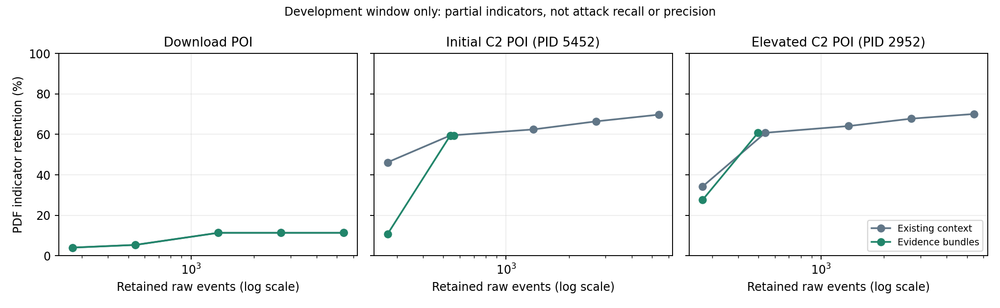

# 证据子图的预算与敏感性实验

结论：新模式增加了显式证据门控、完整路径总收益选择与可复核审计，但 **未证明在同边数下提高参考保留**。小预算存在明显负结果，因此默认保留旧扩展上下文；精简证据子图作为可选项。

## 固定协议

- 候选窗口固定为 SysClient0201 的 27,011 条事件，历史仍严格截止各自 POI。
- 全部三个 Ground Truth POI、两种模式、1%/2%/5%/10%/20% 五档上限，共 30 组固定网格；另做相同实际边数控制。
- 历史稀有度、RASP 传播配置不调参；新目标 q=0.05；不使用参考标签选边。
- 参考标签仅为 PDF IP/文件名指标，不能计算完整攻击 precision、F1 或 FPR；未匹配不能当作正常。
- 基线是本项目已有 RASP-D，以及简单评分排序控制；没有伪称完整复现其他系统的运行结果。

## 20% 上限下的实际输出

| POI | 旧上下文边数 / 参考保留 | 新证据子图边数 / 参考保留 | 旧策略在相同实际边数下的参考保留 |
|---|---:|---:|---:|
| 下载 runme.bat | 5,402 / 34 | 5,402 / 34 | 5,402 边 / 34 |
| PowerShell 初始代理 C2 · PID 5452 | 5,402 / 210 | 561 / 179 | 561 边 / 179 |
| PowerShell 提权代理 C2 · PID 2952 | 5,402 / 211 | 498 / 183 | 498 边 / 183 |

分母均为 301 条参考匹配事件。默认提权后 C2 的旧模式保留 211/301（70.10%）；精简模式为 183/301（60.80%）。
精简模式移除更多无正背景证据的上下文，但也少保留 28 条参考事件；相同 498 条边时旧策略也保留 183 条，不能说新模式提高了召回。

[可导出 PDF 图](figures/evidence-budget-comparison.pdf)

## 必须保留的小预算负结果

| POI | 1% 上限（270 条边）旧参考保留 | 新参考保留 |
|---|---:|---:|
| 下载 runme.bat | 12 | 12 |
| PowerShell 初始代理 C2 · PID 5452 | 139 | 32 |
| PowerShell 提权代理 C2 · PID 2952 | 103 | 83 |

初始 C2 POI 下新方法 32 条对旧方法 139 条，是明显回退。说明“路径目标更明确”不能替代攻击相关性验证；目标值上界接近也不意味着参考保留更高。

## 评分排序控制与连接约束

| POI | 相同边数的纯评分排序参考保留 | 没有任何预计算时序见证 | 规范见证不在该排序子图内 |
|---|---:|---:|---:|
| 下载 runme.bat | 34 | 353 | 309 |
| PowerShell 初始代理 C2 · PID 5452 | 267 | 153 | 138 |
| PowerShell 提权代理 C2 · PID 2952 | 214 | 108 | 27 |

纯评分排序可保留更多参考事件，但不满足相同的路径束约束。这里的“规范见证缺失”仅指预先固定的见证，不证明不存在其他可行路径；不能据此宣称排序基线完全无法调查。

## 同分与可复现性

在 1% 预算下固定分数，只改变精确同优先级的次序（五个固定种子）。

| POI | 五次参考保留 | 相对第一次的最小事件集合 Jaccard |
|---|---|---:|
| 下载 runme.bat | [12, 12, 12, 12, 12] | 0.9636 |
| PowerShell 初始代理 C2 · PID 5452 | [32, 32, 32, 32, 32] | 0.8685 |
| PowerShell 提权代理 C2 · PID 2952 | [83, 83, 83, 83, 83] | 0.8685 |

参考保留计数稳定不等于选中事件身份完全稳定。当前默认使用公开的确定性次序，并把真实同分组显式显示；不能把同分后分配的差别解释为异常置信度差别。
倒置输入事件顺序后，三个 POI 的选中事件集合均保持一致。参考标签不参与选择由独立回归测试验证。

## 审计与实验边界

- 两种模式都检查预算、POI、严格时序方向、完整路径束并重放实际选择记录。
- 新模式有明确定义的目标及松弛上界；小图用独立穷举目标验证，未声称一般近似比。
- 这些是单主机单窗口开发结果，三种 POI 不是三个独立攻击测试集，不能给出泛化置信区间。
- 所提供 POI 前日志可能已经含攻击，不是已知正常的独立校准集；不承诺统计误报率。
- 全网格、运行时间、同分次序和实现摘要见 [JSON 报告](evidence-selection-evaluation.json)。

复现：`python webapp/scripts/evaluate_evidence_selection.py`。
