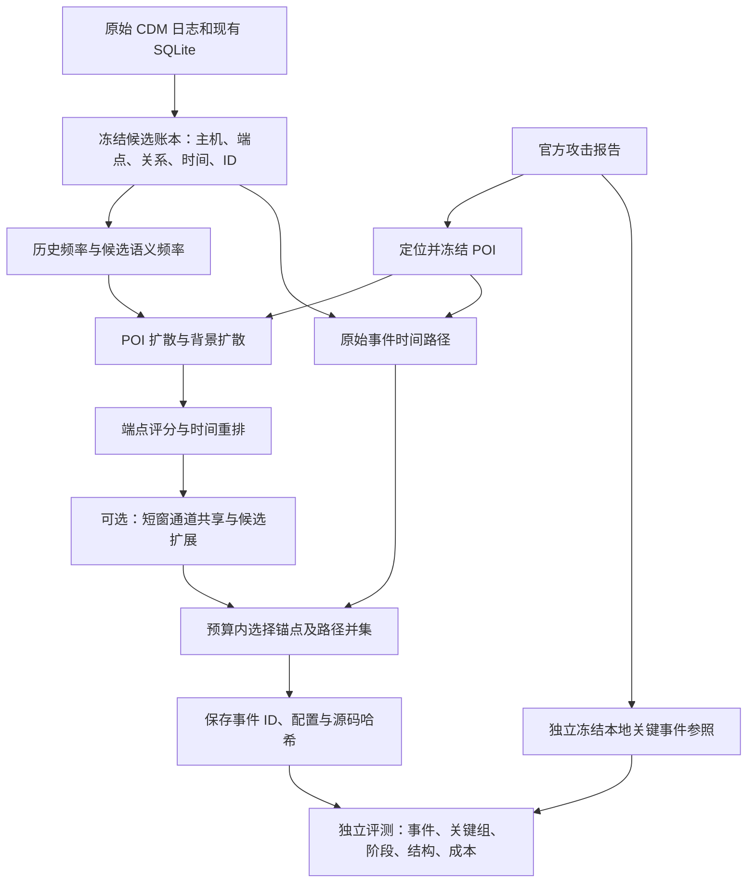
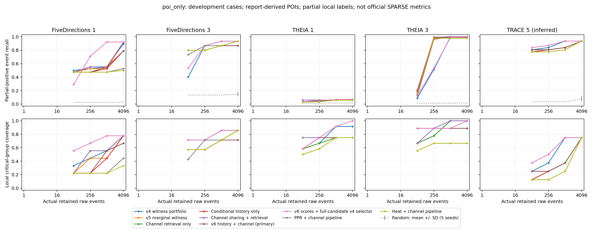

# NODOZE 五案例研究：算法、实验流程、借鉴方法与结果总说明

> 整理日期：2026-09-24。汇总至第六轮历史频率与通道实验；实验归档提交 `9de7fae`。
> 本文集中说明已经实现和实际运行的内容，供组内交流、复现及论文方法/实验部分整理使用。

## 1. 研究目标与当前结论

我们研究的是：给定系统溯源候选图和调查起点 POI，在有限的原始事件预算内保留有用的攻击调查证据及其连接路径。算法始终以**频率统计模块和图扩散传播引擎**为中心，先评分，再检索候选并选择带路径的子图。

当前仍是我们在已有 NODOZE 衍生代码上搭建的算法。新增模块包括语义频率、背景对比扩散、时间重排、路径成本选择、历史条件频率校准和通道共享。没有直接换成 SPARSE，也没有训练 GNN。

最新的有收益组合是“新评分＋原 v4 全候选选择器”：仅使用报告 POI、每案例 1024 条事件预算时，总命中由 309 提升到 321，宏平均 Recall 从 69.77% 提升到 76.96%，宏平均 F1 从 10.25% 提升到 10.71%。但预定 v6 主方案未超过 v4，THEIA1 仍有严重漏选，THEIA3 的该复合组合比 v4 少命中 2 条。因此结果支持局部改进，尚不支持全面超过 SPARSE 或达到顶会水平。

全文的分类指标采用**本地部分正例的闭世界代理评测（proxy）**。第五案例使用 TRACE 工件推断映射，尚未确认等同于论文的 THEIA Case 5。五个案例都已用于开发；配置数量不是独立攻击样本数量。

## 2. 数据、POI 与评测参照

### 2.1 五案例范围

| 本文简称 | 用户要求的案例 | 本次实际数据 | 报告定位依据及 POI | 候选账本事件数 | 本地正例 | 关键组 | 阶段 |
|---|---|---|---|---:|---:|---:|---:|
| FD1 | Five Dir Case 1 | FiveDirections，4 月 9 日 | 官方报告 §4.4，写入 `update.ps1` | 466257 | 38 | 9 | 3 |
| FD3 | Five Dir Case 3 | FiveDirections，4 月 12 日 | §3.10，写入 `hJauWl01` 与报告 C2 CONNECT，共 2 个 POI | 424245 | 15 | 7 | 3 |
| THEIA1 | Theia Case 1 | THEIA，4 月 10 日 | §3.3，`/home/admin/clean` 及同阶段锚点，共 3 个 POI | 898253 | 239 | 12 | 6 |
| THEIA3 | Theia Case 3 | THEIA，4 月 12 日 | §3.11，`/tmp/memtrace.so` 及同阶段锚点，共 3 个 POI | 1132218 | 229 | 9 | 5 |
| TRACE5* | 图中 Theia Case 5 | TRACE，4 月 13 日，推断映射 | §4.9，写入 `/tmp/tcexec` | 137762 | 31 | 8 | 6 |

来源为 [DARPA TC E3 发布清单](https://github.com/darpa-i2o/Transparent-Computing/blob/master/README-E3.md)、本地官方 `TC_Ground_Truth_Report_E3_Update.pdf`、[DEPIMPACT 工件](https://zenodo.org/records/5559214)和仓库内已有原始日志/数据库。官方报告 SHA-256：`eccf295b566b8e981fe90e0f1aea61116bd5a5694441396af63f22a914cbc39c`。

数据路径、时间窗口和 POI 见 [案例清单](../configs/sparse_five_cases.json)；名称冲突及实体对映射见[早期五案例审计](sparse-five-case-study.md)和[工件映射记录](depimpact-artifact-case-map.json)。本轮汇总没有重新下载或重新导入原始数据。

### 2.2 POI 如何得到

1. 从官方攻击报告提取明确的文件路径、通信目标和攻击时间。
2. 在对应主机和时间窗口中定位到 CDM 事件。
3. 冻结事件 ID，作为所有方法共同使用的调查起点。
4. 各方法从相同起点计算，不依赖外部检测器告警。

这里的“自己选 POI”是**依据报告独立定位**，仍属于使用真值信息的 oracle POI。它验证的是给定起点后的调查能力，不能写成系统自动发现攻击起点。后续所有 POI 删除实验都重新评分，不偷偷补充新 POI。

### 2.3 三类图单位必须分开

| 单位 | 含义 | 在实验中的用途 |
|---|---|---|
| 原始事件级账本条目 | 具有事件 ID、主机、时间、关系和端点的条目 | 选择结果和预算计数单位；重复发生的事件分别计费 |
| 计算用事件组/通道组 | 按端点、关系或短时间跨度归组 | 降低重复交互影响、共享分数或检索候选；不减少最终原始事件费用 |
| 参考关键组 | 人工选定的报告代表事件及其平行事件集合 | 检查是否保留某类关键交互，与算法动态分组不同 |

账本中还可能存在 `LINEAGE:` 前缀的合成进程派生边；它们需要单独辨识，不能当作真实原始 CDM 日志。因此“原始事件预算”指回到未压缩的账本条目计数，而非用压缩组数冒充事件数。

### 2.4 本地关键事件如何标注

先按官方报告步骤选出 45 条代表事件，保存主机、时间、关系、端点、PDF 页码及理由；再扩展到同主机、同方向端点、同类型、相差不超过 10 秒的平行事件。得到 38/15/239/229/31 条本地正例、45 个关键组和 23 个阶段。

先冻结[代表事件选择清单](../configs/sparse_five_local_critical_choices.json)，再生成[逐事件参照](sparse-five-local-critical-reference.json)，最后计算成绩。选边运行器不读取这份参照，评测器在选择结果落盘后才读取标签。

早期 DEPIMPACT 实体对展开、检测器节点标签和当前关键事件参照是不同集合，不能混合分母。PDF 可以核验具体攻击步骤是否遗漏，但不能仅凭步骤描述判定候选图内所有未标注事件都是正常活动。

## 3. 整体实验流程



流程图表示实验框架；各消融会关闭或替换其中的模块。最终复合对照使用 v4 全候选选择器，不经过 v5/v6 的有限锚点池。标签不进入评分、通道共享或选择器。

## 4. 算法详解

### 4.1 输入、输出与约束

每条候选事件记作 `e=(id,h,u,v,r,t)`，分别表示 ID、主机、源节点、目标节点、关系和时间。输入还包括历史稀有度 `r0(e)`、POI 集合、预算 `B` 和可选共同上下文。

输出是选中事件 ID 集合 `S`。强制事件集合 `M` 必须满足 `M ⊆ S`，且 `|S| ≤ B`。若 `|M| > B`，记录不可行，不增加预算，也不把该配置伪装成零准确率结果。

加载账本时节点按 `(host, UUID)` 隔离，避免跨主机误连；执行关系按已有信息流约定调整方向。评分扩散使用去重无向交互，路径验证使用原始事件方向与时间，两者含义不同。

### 4.2 原有频率统计与语义频率校正

旧历史稀有度 `r0(e)` 从冻结账本读取，其来源保留在原账本中，不能解释为本轮重新训练得到。

在候选图中，统计与同一主机、对象语义和关系交互的不同进程实例数 `c(e)`：

```text
u(e) = 1 / log2(1 + c(e))
r(e) = sqrt(r0(e) × u(e))
w(e) = 0.2 + 0.8 × r(e)
```

进程处于源端和目标端的情况联合去重；两端均可形成语义视图时取较低唯一性。这个统计来自当前候选图，不是经过认证的正常训练集。`0.2` 的权重下限让常见交互仍可用于传播和连接。

### 4.3 v6 历史条件频率校准

令 `t0` 为原始最早 POI 时间。删除 POI 的对照仍固定该 `t0`，避免同时改变训练历史：

- 拟合时段：`[t0−24h, t0−60min)`。
- 校准时段：`[t0−60min, t0−30min)`。
- 最近 30 分钟不进入历史校准。

按 `(host, relation, source type/semantic, destination type/semantic)` 建立通道。一分钟内同通道重复日志只算一个占用单位。下面的 `s/o` 均包含实体类型及语义：

```text
q(o | h,r)   = [C(h,r,o) + 1] / [N(h,r) + V(h,r) + 1]
p(o | h,r,s) = [C(h,r,s,o) + 10 × q(o | h,r)] / [C(h,r,s) + 10]
z(e)        = −log p(o | h,r,s)
```

`V` 为拟合期观察到的目标类别数，额外保留一个未知目标类别。对校准窗口的 `z` 计算加权中秩经验分布值：

```text
a(e) = [低于 z(e) 的权重 + 0.5 × 等于 z(e) 的权重 + 1]
       / [校准总权重 + 2]
r_hist(e) = 0.5 × r0(e) + 0.5 × a(e)
```

拟合、校准中相应 host/关系的支持各至少为 32 个通道占用分钟单位，否则保留 `r0(e)`。这是各通道累计的单位，不等于 32 个不同分钟。随后用 `r_hist` 替换上一节的 `r0`，继续经过原有语义校正和扩散。

ECDF 思路参考 [ECOD](https://arxiv.org/abs/2201.00382)，本模块是条件频率的本地校准实现，并未复现 ECOD 的完整多维异常检测器。`a(e)` 和最终评分都不是恶意概率。

历史窗口中的事件不保证良性；数据库节点语义使用当前快照，可能包含后续更新，故还不能声称严格在线且无未来元数据影响。

### 4.4 关系均衡的 POI/背景对比扩散

1. 对同一无向端点对和关系去重，重复交互采用最大权重，避免单纯复制日志放大转移概率。
2. 每个节点先在关系内部按权重归一化，再在不同关系之间均分转移质量，构成转移矩阵 `P`。
3. 以所有进程节点均匀分配背景种子，求背景分布 `q`。这些进程并非全部经标注为正常，背景只是一种结构对照。
4. 每个 POI 的两个端点各放入一半种子质量，求个性化分布 `v_p`。

列向量记法下：

```text
v_next = α × seed + (1−α) × Pᵀ v
α = 0.15；最多 200 次；L1 残差阈值 1e−10
```

悬空节点质量回到对应种子。正向对数提升为：

```text
lift_p(x) = log(1 + max(v_p(x) / max(q(x), 1e−300) − 1, 0))
a_p(e) = w(e) × [0.5 × sqrt(lift_p(u) lift_p(v))
                 + 0.25 × (lift_p(u) + lift_p(v))]
```

每个 POI 内将 `a_p` 按最大值归一化，再加入系数 `1e−6` 的弱通道，其值来自 `w(e) × sqrt(v_p(u)v_p(v))` 的归一化结果。不同 POI 取最大分数；评分函数内 POI 分数设为 1，最终选择还显式强制保留 POI。

背景对照用于降低普遍高扩散质量节点的影响。扩散本身不证明时间因果，必须配合下一节的原始事件路径。

### 4.5 时间重排和时间条件扩散

时间亲近度使用：

```text
h(e) = 1 / [1 + min_p |t(e)−t(p)| / τ]，τ = 300 秒
```

已运行两类方法：

- **时间重排**：原扩散分数乘 `h(e)`；v4 `witness_rerank` 与 v6 使用这一流程。
- **时间条件扩散**：每个 POI 用时间亲近度改变转移权重，再重新求扩散；它是单独实验变体，不能与时间重排混称。

对照包含纯时间排序、30/3000 秒尺度敏感性，用于检查收益是否仅来自靠近 POI。

### 4.6 事件组、通道共享与检索

早期事件组按同主机、同有向端点、同关系归组，组总跨度不超过 10 秒。v6 的交互通道按同一实际端点对归组，允许不同方向和关系，但总跨度仍不超过 10 秒；不是任意相邻间隔均小于 10 秒的无限链式连接。

组内共享最高分：`s_channel(e)=max{s(e'): e' 与 e 同组}`。这样低分接收事件可以从相关发送/连接事件获得调查优先级。

v5 基础锚点池为全局前 `max(4096,2B)` 与每关系前 `ceil(max(4096,2B)/R)` 的并集。v6 保留基础锚点，再加入同通道、时间可达且正分的兄弟事件，锚点总上限为：

```text
max(32768, 8B, 基础锚点数)
```

额外候选按分数排序截断，平分时使用固定 ID 派生的顺序。共享分数不产生新 POI；路径和新增事件均占原始预算。候选池有限，因此后续优化仅针对该池。

### 4.7 原始时间路径与三类选择器

每个可达锚点 `a` 对应一个事件集合 `W(a)`，包含锚点、原有反向路径与时间 fork 路径。加入时支付 `|W(a) \ S|`，共享路径只计一次。时间 fork 可达率是实现级结构检查，不等于经人工确认的攻击因果正确率。

**A. v4 全候选固定配额选择器**

- 在全部可达正分候选中，按总分加入路径束，先保留到 `max(|M|, floor(B/2))`。
- 剩余预算优先分给当前已选事件数较少的关系类型，类型内按分数选择。
- 锚点和路径必须整体满足预算，路径关系类型也计入已用配额。
- 主比例为 1/2，另测 1/4 和 3/4。

**B. v5/v6 边际收益选择器**

令归一化事件分数为 `s(e)`，关系类型 `r` 的已选分数质量为 `m_r(S)`：

```text
m_r(S) = Σ[e∈S 且 relation(e)=r] s(e)
U(S)   = Σ_r m_r(S) + λ Σ_r sqrt(m_r(S))
选择 a 使 [U(S ∪ W(a)) − U(S)] / |W(a) \ S| 最大
```

主方法 `λ=1`；`λ=0` 为线性贪心，`λ=4` 为敏感性。每次按真实新增原始事件数更新成本和收益。借鉴预算覆盖的边际收益思想，但路径并集成本与经典可加集合成本不同，未声称继承理论近似比。

**C. 同池线性 MILP**

为锚点设二元变量 `y_a`，为池内原始事件设 `x_e`。最大化 `Σ s(e)x_e`，约束包括：

- `y_a ≤ x_e`，对所有 `e∈W(a)`，确保锚点路径完整。
- 非强制事件满足 `x_e ≤ Σ[a:e∈W(a)] y_a`。
- 强制事件 `x_e=1`，总数 `Σx_e≤B`。

通过 SciPy 1.14.1 调用 HiGHS，时间限制 20 秒，相对 gap 1%。v6 只在主预算 1024 运行该变体。求解器上界是**有限池内线性分数目标的上界**，不是攻击召回上界，也不是 `λ=1` 目标的最优值。`ok` 表示存在通过校验的可行解，不保证已证明最优。

### 4.8 最新两种组合必须分开报告

| 配置名 | 评分 | 检索/选择 | 实验地位 |
|---|---|---|---|
| `history_channel` | 新历史频率＋原扩散＋时间重排＋通道共享 | v6 扩展有限池＋λ=1 边际收益 | 预先指定的主方案；整体未胜出 |
| `history_channel_portfolio` | 相同的新评分 | v4 全候选搜索＋50/50 配额＋路径 | 预先列入的复合对照；主预算有局部收益 |
| `channel_only` | 原频率扩散＋时间重排＋通道共享 | 扩展有限池＋λ=1 | 不含新历史校准；256 预算有收益 |

复合对照同时改变候选搜索范围和选择器，不是同池选择器消融。没有事后将它改名为预定主方案，也没有按案例分别挑选赢家拼出统一方法。

### 4.9 v6 主方案伪代码

```text
输入：冻结事件账本 E，POI P，预算 B，历史窗口 H，固定配置 θ
M ← P，或 P ∪ 所有方法共用的语义上下文
若 |M| > B：保存不可行状态并返回
r_hist ← 按固定历史时段校准；支持不足则回退原稀有度
s ← FrequencyContrastDiffusion(E, P, r_hist, θ)
s ← s × TemporalAffinity(E, P, 300秒)
groups ← 同端点对、跨关系、总跨度≤10秒的通道组
s ← 组内最大值共享
routes ← 根据原始事件构建时间路径
pool ← 基础全局/类型候选 ∪ 同通道兄弟事件，并按固定上限截断
S ← M
循环：选取可容纳、边际收益/新增原始成本最大的路径束
      将其原始事件并入 S；更新重叠成本；无可行正收益时停止
保存 S 的 ID、实际预算、配置和源码/输入哈希
独立评测器随后加载本地参照，计算指标
```

## 5. 借鉴了哪些论文，哪些方法真正复现了

### 5.1 跨领域来源与实际用法

| 来源 | 领域与借鉴点 | 本项目实际落实 | 复现边界 |
|---|---|---|---|
| [G-Retriever，NeurIPS 2024](https://proceedings.neurips.cc/paper_files/paper/2024/hash/efaf1c9726648c8ba363a5c927440529-Abstract-Conference.html) | 图问答中的紧凑证据子图检索 | 运行 `pcst_fast 1.0.10`，把事件奖赏适配为 PCST 图输入 | 未训练问答模型；是公开求解内核＋本地任务适配 |
| [Demystifying Graph Sparsification，PVLDB 17](https://www.vldb.org/pvldb/vol17/p427-chen.pdf) | 图剪枝后应评估保留的性质和下游效果 | 运行 `NetworKit 11.2.2` LocalDegree，映射回事件 | 未复现论文全部稀疏化算法/数据集 |
| [Lin & Bilmes，ACL 2011](https://aclanthology.org/P11-1052/) | 摘要的覆盖与多样性、预算约束 | 实现 exact/semantic 饱和覆盖选择，做覆盖与频率消融 | 本地路径准入产生互补关系，不能直接继承原次模理论保证 |
| [Budgeted Maximum Coverage，1999](https://thibaut.horel.org/submodularity/papers/khuller1999.pdf) | 预算内的边际收益/成本 | v5/v6 真实路径并集成本贪心 | 借鉴优化思想，未复现原近似算法及保证 |
| [Connected Maximum Coverage，AAMAS 2025](https://www.ifaamas.org/Proceedings/aamas2025/pdfs/p538.pdf) | 将覆盖与连接约束共同建模 | 路径束选边的问题建模参考 | 未运行其理论算法 |
| [Heat Kernel Based Community Detection，KDD 2014](https://www.cs.purdue.edu/homes/dgleich/publications/Kloster%202014%20-%20hkrelax.pdf) | 从种子扩散与度归一化 | 自行实现 PPR、Poisson 级数热核、度归一化适配 | 全图稀疏乘法；未实现作者局部松弛与 conductance sweep |
| [Diffusion Improves Graph Learning，NeurIPS 2019](https://proceedings.neurips.cc/paper/2019/hash/23c894276a2c5a16470e6a31f4618d73-Abstract.html) | 扩散核与图稀疏化 | 为核函数对照提供方法背景 | 未复现整个 GDC 学习系统 |
| [ECOD，TKDE](https://arxiv.org/abs/2201.00382) | 用经验分布刻画异常程度 | v6 条件历史分数的加权中秩校准 | 未运行完整 ECOD 检测器 |
| [Omics Integrator，PLOS Computational Biology 2016](https://journals.plos.org/ploscompbiol/article?id=10.1371/journal.pcbi.1004879) | 交互网络的通路恢复、扰动和 knockout | 借鉴缺失证据压力测试，执行逐 POI 删除 | 并非其生物数据/模型复现 |
| [SimpleLocal，ICML 2016](https://proceedings.mlr.press/v48/veldt16.html) | 种子局部图扩展与流式割优化 | 阅读并列为候选方向 | 尚未实现或运行 |

论文实验方式也被借鉴：G-Retriever 将检索与下游模型拆开分析；图稀疏化评测透明区分公共库与自写实现；摘要工作分离开发/测试和覆盖消融；通路恢复工作通过扰动检查稳定性。我们已落实共享输入、预算曲线、消融与删 POI 测试；独立未见攻击测试仍未完成。具体原文核对见[跨领域实验报告](cross-domain-study.md)。

### 5.2 安全领域来源与定位

| 来源 | 在本项目中的作用 | 当前状态 |
|---|---|---|
| NODOZE | 历史频率与图调查的起点；仓库已有衍生评分/路径代码 | 当前缓存评分基线不冒充原论文全系统复现 |
| [SPARSE](https://arxiv.org/html/2405.02629v1) | 参考关键事件审查、平行边压缩及路径上下文思路 | 独立建立本地事件参照；未复现其完整系统 |
| [DEPIMPACT，USENIX Security 2022](https://people.cs.vt.edu/penggao/papers/depimpact-security22.pdf) | 案例、POI 与公开 DOT 工件映射 | 用于来源核对；实体对标注不等于完整事件真值 |
| [NODLINK，NDSS 2024](https://www.ndss-symposium.org/wp-content/uploads/2024-204-paper.pdf) | 异常证据与紧凑连接图的成本意识 | 设计参考，未复现整套在线系统 |
| [ORTHRUS，USENIX Security 2025](https://www.usenix.org/conference/usenixsecurity25/presentation/jiang-baoxiang) | 时序归因质量的研究参考 | 本地同时报告事件、组和阶段；未训练其模型 |
| [KAIROS，IEEE S&P 2024](https://spg.cs.ubc.ca/publication/2024-sp/)；[MAGIC，USENIX Security 2024](https://www.usenix.org/conference/usenixsecurity24/presentation/jia-zian) | 时间图与图表示学习方向 | 仅研究对照方向；没有可汇报的完整模型复现结果 |

SPARSE 的调查对象是事件依赖图中的边；其压缩边与本地原始事件条目仍可能粒度不同。DEPIMPACT 工件的实体对标签也不能直接等同于 SPARSE 逐事件标签。论文表可以帮助检查规模与遗漏，却不能用其聚合 FP/FN 反推出本地每个事件的真值。

### 5.3 基线实施原则

优先使用可用作者代码或作者采用的公开内核；需要适配时明确说明；自行实现公式时做数值校验；只有论文数字时列为文献参考。当前实际可比的是**同候选图上的组件适配实验**，不代表对各论文完整系统的胜负判断。

PCST 使用共同扩散奖赏、原始事件成本和临时超根；在 14 个预设成本系数中按不读取标签的目标选预算可行解，不强行补满预算。LocalDegree 在无向简单实体图上计算分数后映射回事件。两者没有与本地时间路径选择器完全相同的结构保证，因此另报可达性与实际事件数。

## 6. 实验设计与指标

### 6.1 统一条件

- 候选账本、POI、本地参照固定，并保留哈希。
- 原始事件预算为 64、256、1024、4096；主预算 1024，256 专门检查低预算退化。
- `poi_only`：仅共同报告 POI；主结论使用该轨道。
- `shared_context`：所有方法共用已有语义延续证据，其事件也占预算；这部分先验收益单独报告。
- 多 POI 案例逐个移除一个 POI，重新评分；不将单 POI 案例变成未定义的零种子实验。
- 随机基线使用种子 0–4；随机均值/方差不能当作攻击泛化置信区间。
- 旧基线可以复用冻结决策，但先核验输入、源码和共享参数；旧耗时不视为本轮重新运行耗时。
- 选边结果先落盘，再读取评测标签。每轮全案共享参数，但历轮确实在同五案上开发，不宣称测试集隔离。

### 6.2 指标公式与使用边界

设候选集合为 `E`，冻结本地正例为 `L`，所选集合为 `S`：

```text
TP = |S ∩ L|                FN* = |L \ S|
FP* = |S \ L|               TN* = |E \ (S ∪ L)|
Precision* = TP/(TP+FP*)     Recall* = TP/(TP+FN*)
F1* = 2TP/(2TP+FP*+FN*)
FPR* = FP*/(FP*+TN*)         FNR* = FN*/(FN*+TP)
```

星号表示暂将未进入本地正例集的事件按负例处理的代理口径。未标注不等于良性，故 `FP*` 不是真正已确认误报数；`Recall*` 只是已知部分正例覆盖率。SPARSE 官方等价 FP/FN/P/R/F1 继续保留 `NA/null`。

宏平均先对每个案例分别计算指标，再对五案求均值；不能用总 TP 和总事件数代替宏平均 Recall/F1。另报总 TP、实际 `#E`、关键组/阶段至少命中一个参考事件的数量、时间 fork 可达率、无向连通分量、完整/部分事件组、时间和峰值 RSS。

### 6.3 消融要回答的问题

| 对照 | 检验的问题 |
|---|---|
| 原分数、稀有度、随机、纯时间 top-K | 新方案是否胜过简单排序；是否只依赖 POI 时间邻近 |
| 去频率、去语义频率、去关系均衡 | 频率统计各组成部分是否有独立收益 |
| 时间重排与时间条件扩散 | 是否有必要重建扩散核 |
| PPR/热核＋相同选择规则 | 改善来自扩散评分还是后续选边流程 |
| 仅历史校准、仅候选扩展、仅通道共享＋扩展、完整 v6 | 历史统计和通道检索分别贡献多少 |
| λ=0/1/4，线性贪心与同池 MILP | 多样性和优化器是否有效；分数高是否等于正例命中高 |
| 同评分＋v4 全候选选择器 | 有限池及选择流程的复合影响，不是严格同池单因素消融 |
| 双轨道、删 POI、四预算 | 先验证据依赖、起点缺失及预算敏感性 |

## 7. 已完成的迭代及实际结果

### 7.1 迭代过程

| 阶段 | 已完成工作 | 实验发现 |
|---|---|---|
| 本地关键事件参照 | 报告代表事件与短窗平行事件映射 | 可核验明确遗漏；仍是部分正例 |
| 频率扩散阶段 v1–v3 | 语义频率、关系均衡、事件组/路径和短窗频率探索 | THEIA3 可大幅缩图，但简单 top-K 也保留大量正例；频率无普遍独立收益 |
| 跨领域阶段 v1–v2 | PCST、LocalDegree、饱和覆盖 | 完整组资格修复了退化；压缩、事件召回与阶段覆盖可能冲突 |
| 时间阶段 v1–v4 | 时间条件、类型预算、50/50 配额和原始路径 | v4 主预算改善，但 THEIA3@256 从原扩散 223 降至 118 |
| 边际收益阶段 v5 | 重叠路径计费、软多样性、MILP、匹配核对照 | THEIA3@256 恢复到 225；主预算总 TP 309→302、组覆盖 37→30 |
| 历史/通道阶段 v6 | 条件频率校准、跨关系共享、候选扩展和组合对照 | 预定主方案总 TP 301；复合对照 321；THEIA1 截断问题未解决 |

不同阶段存在各自的 v1/v2 命名，不能只按版本数字混合读取结果；应以报告名、配置文件与冻结提交识别。

### 7.2 主预算 1024：逐案本地正例命中

轨道为 `poi_only`。分母依次为 38、15、239、229、31。PCST 允许输出少于预算，实际 `#E` 以完整 CSV 为准；其他表内方法在这一配置下保留 1024 条。

| 方法 | FD1 | FD3 | THEIA1 | THEIA3 | TRACE5* |
|---|---|---|---|---|---|
| 原频率扩散 top-K | 18 | 13 | 14 | 225 | 28 |
| v4：时间重排＋全候选配额＋路径 | 21 | 14 | 16 | 229 | 29 |
| v5：边际收益＋路径 | 20 | 13 | 14 | 229 | 26 |
| v6：仅扩展候选池 | 21 | 13 | 14 | 229 | 26 |
| v6：仅历史校准 | 20 | 13 | 14 | 227 | 26 |
| v6：通道共享＋扩展 | 21 | 13 | 14 | 229 | 26 |
| v6：历史校准＋通道＋边际收益（预定主方案） | 21 | 13 | 14 | 227 | 26 |
| v6：同池线性贪心 | 18 | 13 | 14 | 227 | 26 |
| v6：同池线性 MILP | 18 | 13 | 14 | 227 | 27 |
| v6：新评分＋v4 全候选选择器（复合对照） | 35 | 14 | 16 | 227 | 29 |
| v6：去频率消融 | 18 | 14 | 14 | 229 | 26 |
| PPR 适配＋通道流程 | 18 | 13 | 14 | 224 | 25 |
| 热核适配＋通道流程 | 18 | 13 | 14 | 224 | 25 |
| 公开 PCST＋时间条件奖赏 | 1 | 6 | 10 | 3 | 26 |
| NetworKit LocalDegree | 1 | 2 | 3 | 4 | 2 |

### 7.3 两个预算的汇总比较

全部为本地 proxy，P/R/F1 为五案例宏平均。不可将预算不同的 F1 直接当作评分质量变化。

| 预算 | 方法 | 总 TP | 宏 P % | 宏 R % | 宏 F1 % | 关键组 | 阶段 |
|---|---|---|---|---|---|---|---|
| 256 | 原频率扩散 top-K | 290 | 22.66 | 62.08 | 27.07 | 22/45 | 14/23 |
| 256 | v4：时间重排＋全候选配额＋路径 | 187 | 14.61 | 55.78 | 18.80 | 27/45 | 17/23 |
| 256 | v5：边际收益＋路径 | 294 | 22.97 | 63.31 | 27.50 | 25/45 | 16/23 |
| 256 | v6：通道共享＋扩展 | 299 | 23.36 | 64.18 | 27.97 | 28/45 | 16/23 |
| 256 | v6：历史校准＋通道＋边际收益（预定主方案） | 296 | 23.12 | 62.60 | 27.56 | 25/45 | 15/23 |
| 256 | v6：新评分＋v4 全候选选择器（复合对照） | 202 | 15.78 | 60.71 | 20.47 | 32/45 | 18/23 |
| 256 | PPR 适配＋通道流程 | 287 | 22.42 | 62.52 | 26.83 | 21/45 | 13/23 |
| 256 | 热核适配＋通道流程 | 286 | 22.34 | 61.19 | 26.69 | 20/45 | 13/23 |
| 1024 | 原频率扩散 top-K | 298 | 5.82 | 65.69 | 9.87 | 28/45 | 18/23 |
| 1024 | v4：时间重排＋全候选配额＋路径 | 309 | 6.04 | 69.77 | 10.25 | 37/45 | 21/23 |
| 1024 | v5：边际收益＋路径 | 302 | 5.90 | 65.81 | 9.99 | 30/45 | 16/23 |
| 1024 | v6：通道共享＋扩展 | 303 | 5.92 | 66.33 | 10.03 | 31/45 | 16/23 |
| 1024 | v6：历史校准＋通道＋边际收益（预定主方案） | 301 | 5.88 | 66.16 | 9.97 | 30/45 | 16/23 |
| 1024 | v6：新评分＋v4 全候选选择器（复合对照） | 321 | 6.27 | 76.96 | 10.71 | 38/45 | 21/23 |
| 1024 | PPR 适配＋通道流程 | 294 | 5.74 | 63.67 | 9.72 | 24/45 | 14/23 |
| 1024 | 热核适配＋通道流程 | 294 | 5.74 | 63.67 | 9.72 | 24/45 | 14/23 |

### 7.4 最新主方案与复合对照的 FP/FN/P/R/F1

`poi_only`、预算 1024；星号沿用第 6.2 节的部分标注代理口径。

| 案例 | 方法 | #E | TP | FP* | FN* | P* % | R* % | F1* % | 关键组 | 阶段 |
|---|---|---|---|---|---|---|---|---|---|---|
| FD1 | v6 预定主方案 | 1024 | 21 | 1003 | 17 | 2.05 | 55.26 | 3.95 | 5/9 | 2/3 |
| FD3 | v6 预定主方案 | 1024 | 13 | 1011 | 2 | 1.27 | 86.67 | 2.50 | 5/7 | 2/3 |
| THEIA1 | v6 预定主方案 | 1024 | 14 | 1010 | 225 | 1.37 | 5.86 | 2.22 | 9/12 | 5/6 |
| THEIA3 | v6 预定主方案 | 1024 | 227 | 797 | 2 | 22.17 | 99.13 | 36.23 | 8/9 | 5/5 |
| TRACE5* | v6 预定主方案 | 1024 | 26 | 998 | 5 | 2.54 | 83.87 | 4.93 | 3/8 | 2/6 |
| FD1 | 新评分＋原全候选选择器 | 1024 | 35 | 989 | 3 | 3.42 | 92.11 | 6.59 | 7/9 | 3/3 |
| FD3 | 新评分＋原全候选选择器 | 1024 | 14 | 1010 | 1 | 1.37 | 93.33 | 2.69 | 6/7 | 3/3 |
| THEIA1 | 新评分＋原全候选选择器 | 1024 | 16 | 1008 | 223 | 1.56 | 6.69 | 2.53 | 11/12 | 6/6 |
| THEIA3 | 新评分＋原全候选选择器 | 1024 | 227 | 797 | 2 | 22.17 | 99.13 | 36.23 | 8/9 | 5/5 |
| TRACE5* | 新评分＋原全候选选择器 | 1024 | 29 | 995 | 2 | 2.83 | 93.55 | 5.50 | 6/8 | 4/6 |

### 7.5 结果解释

1. **主预算有收益的组合**：新评分＋v4 全候选选择器比 v4 多命中 12 条，主要来自 FD1 的 21→35；THEIA3 则为 229→227，其他案例不变。宏 F1 增加 0.46 个百分点，不能称全面胜出。
2. **预定主方案为负结果**：v6 主方案总 TP 301、关键组 30/45，均未超过 v4 的 309、37/45。最终报告保留这一结论。
3. **256 预算的收益来自通道版本**：不加新历史校准的 `channel_only` 宏 F1 27.97%，高于 v5 27.50% 和原扩散 27.07%；完整校准为 27.56%。不能把这些收益全部归因于校准。
4. **全候选配额不是统一预算解**：复合对照在 256 预算宏 F1 20.47%，说明主预算的改进不能外推到较小预算。
5. **共享上下文贡献需剥离**：早期实验中 FD1/FD3/TRACE5 的共同上下文已覆盖全部本地正例，连随机方法也可保留它们。该轨道满召回不能证明扩散算法有效。
6. **图结构与攻击解释不同**：新增有效 `poi_only` 配置的实现级时间可达率最低为 100%，仍可能漏掉攻击入口；有路径不等于恢复了全部攻击。

### 7.6 THEIA1 的失败定位

THEIA1 的 239 条本地正例中，223 条集中在一个入口 RECV 组。v6 通道扩展在截断前生成 161450 个候选，包含全部 239 条正例；32768 锚点截断后连同路径仅剩 17 条正例，最终主方案选中 14 条。

历史校准使该 RECV 组混合稀有度从约 0.0518 提高到 0.4285，但最终共享扩散分数约 0.01573，仍不足以通过候选截断。这说明本轮扩展检索找到了事件，却在评分和容量截断处再次丢失；不能写成问题已解决，也没有测出新的精确全图排名。

诊断在选边结束后读取标签，仅用于解释结果；没有依据这些 ID 为本轮选择器添加特例。[逐组诊断](history-channel-v6-theia1-diagnosis.json)和[候选池审计](history-channel-v6-pool-audit.json)可检查。

### 7.7 历史支持与成本

| 案例 | 成功校准事件/候选事件 | 冷历史构建秒 | v6 主方案暖缓存流程秒 | 峰值 RSS MiB |
|---|---:|---:|---:|---:|
| FD1 | 68162/466257 | 12.15 | 19.61 | 291.1 |
| FD3 | 0/424245 | 9.85 | 17.98 | 264.7 |
| THEIA1 | 893105/898253 | 30.60 | 38.60 | 487.5 |
| THEIA3 | 1130232/1132218 | 44.73 | 45.47 | 545.4 |
| TRACE5* | 0/137762 | 30.38 | 6.26 | 176.7 |

FD3 和 TRACE5 完全回退原稀有度；其结果不能归于新历史校准。19 项有效冷启动配置已验证与 `channel_only` 选择集合一致。

暖缓存流程包含候选加载、历史缓存核验、分组、评分、路径、候选池和选择，排除原始 CDM 导入、评测和导出；冷构建另列。每方法/案例只测一个新进程样本，案例共享机器并行，不能据此声称精确加速比。上表是 **v6 主方案** 的成本，不是收益最好的全候选复合对照成本。

### 7.8 实验规模与验证记录

- v6 新增 514 项配置：487 项有效、27 项必需事件超预算而不可行，共 10 个新方法/变体。
- 最新累计结果含 2998 项配置：2815 项有效、183 项不可行，包含历史决策复用。
- 新增 159 项扩散诊断全部收敛。
- 15 次独立进程性能测量全部复现主实验选择集合。
- 实现阶段全套 662 项测试通过；独立审查另做 500 个随机小图候选池/路径并集/预算检查。
- 独立结果审查核对报告表格、2998 行 CSV/JSON、历史支持、profile、诊断与源码哈希。

本次文档整理使用上述已有验证记录，没有重新运行全部算法实验。配置数、迭代数和随机小图数都不能替代独立真实攻击样本数。

## 8. 固定参数与实现文件

### 8.1 关键参数

| 参数 | 固定值 |
|---|---|
| 原始事件预算 | 64 / 256 / 1024 / 4096，主预算 1024 |
| PPR restart / 最大迭代 / L1 阈值 | 0.15 / 200 / 1e−10 |
| 频率传播权重下限 / 弱通道 | 0.2 / 1e−6 |
| 事件组和通道总跨度 | 10 秒 |
| 时间重排尺度 | 300 秒；敏感性 30 / 3000 秒 |
| 热核时间 | 3 |
| v4 高分预算比例 | 0.5；敏感性 0.25 / 0.75 |
| v5/v6 λ | 1；对照 0，v5 敏感性 4 |
| 历史桶 / 平滑强度 / 最低支持 / 混合比例 | 60 秒 / 10 / 32 通道分钟单位 / 0.5 |
| 基础候选规模 | 全局 max(4096,2B) 加各类型配额 |
| v6 扩展锚点上限 | max(32768,8B,基础锚点数) |
| v6 MILP | 预算 1024；20 秒；相对 gap 0.01 |

具体参数以[冻结 v6 配置](../configs/history_channel_v6.json)为准；该文件继承前轮参数，有些字段只用于历史对照，不能据字段存在就断言 v6 重新运行了所有组合。

### 8.2 代码导航

| 文件 | 职责 |
|---|---|
| [frequency_diffusion.py](../tc_pruning/frequency_diffusion.py) | 账本加载、语义频率、关系均衡和对比扩散 |
| [temporal_diffusion.py](../tc_pruning/temporal_diffusion.py) | 时间亲近度、时间条件扩散、热核 |
| [degree_diffusion.py](../tc_pruning/degree_diffusion.py) | 度归一化核对照 |
| [rasp.py](../tc_pruning/rasp.py) | 原有时间路径与 fork 路径工具 |
| [witness_portfolio.py](../tc_pruning/witness_portfolio.py) | 全候选固定配额＋原始路径 |
| [marginal_witness.py](../tc_pruning/marginal_witness.py) | 候选池、路径并集边际收益、线性 MILP |
| [history_channel.py](../tc_pruning/history_channel.py) | 历史条件频率、通道分组/共享/扩展 |
| [cross_domain_pruning.py](../tc_pruning/cross_domain_pruning.py) | 跨领域组件适配与覆盖选择 |
| [prepare_conditional_history.py](../scripts/prepare_conditional_history.py) | 只读历史统计、校准与缓存 |
| [history_channel_common.py](../scripts/history_channel_common.py) | 缓存校验与 v6 评分组合 |
| [run_history_channel.py](../scripts/run_history_channel.py) | v6 全案/预算/轨道选择实验 |
| [evaluate_marginal_witness.py](../scripts/evaluate_marginal_witness.py) | 冻结选择后的独立评测 |
| [profile_history_channel.py](../scripts/profile_history_channel.py) | 独立进程耗时与 RSS |
| [diagnose_history_pool.py](../scripts/diagnose_history_pool.py) | 选边后候选池诊断 |
| [diagnose_history_theia1.py](../scripts/diagnose_history_theia1.py) | THEIA1 截断前后的事后诊断 |
| [summarize_history_channel.py](../scripts/summarize_history_channel.py) | 表格、审计与报告生成 |
| [plot_history_channel.py](../scripts/plot_history_channel.py) | 可导出 PNG/PDF 预算曲线 |

源码冻结提交：历史模块 `4dabc14`，实验运行器 `1fb9e98`，性能/诊断/汇总工具 `a9c22f0`，最终实验归档 `9de7fae`。原有冻结模块未被本次文档整理修改。

## 9. 复现操作与产物

### 9.1 环境和输入准备

工作树为 `/root/NODOZE-pruning-release/.worktrees/sparse-five-case-study`，分支为 `research/sparse-five-case-study`。实际 Python 环境为 `/root/NODOZE-pruning-release/.venv-cross-domain/bin/python`，主要版本为 NumPy 1.26.4、SciPy 1.14.1、pcst_fast 1.0.10、NetworKit 11.2.2。

需具备案例清单中的原始账本/SQLite、父轮次 `marginal-witness-v5-matched` 冻结决策和本地参照。Git 保存代码、配置和结果摘要；大型日志、候选账本、历史缓存及完整决策位于 `/root/NODOZE-pruning-release/output/tc/`。依赖来源与二进制哈希见[跨领域来源清单](cross-domain-source-manifest.json)。

### 9.2 v6 执行顺序

下列命令记录从头生成的顺序，适用于输入齐备且输出位置尚未生成的复现环境。**当前环境已有完整产物，运行器会拒绝覆盖。** 部分脚本固定读取本机路径，迁移时须统一修改并重新冻结配置/源码哈希；仅替换命令中的输出目录不足以迁移。

```bash
cd /root/NODOZE-pruning-release/.worktrees/sparse-five-case-study
PYTHON_BIN=/root/NODOZE-pruning-release/.venv-cross-domain/bin/python
V6_DIR=/root/NODOZE-pruning-release/output/tc/history-channel-v6
export PYTHONPATH=. OPENBLAS_NUM_THREADS=1 OMP_NUM_THREADS=1

# 每个案例先完成历史缓存，再运行选择；manifest 最后原子发布。
for CASE_ID in 0 1 2 3 4; do
  "$PYTHON_BIN" scripts/prepare_conditional_history.py \
    --case "$CASE_ID" --output-dir "$V6_DIR/history"
  "$PYTHON_BIN" scripts/run_history_channel.py \
    --case "$CASE_ID" --output "$V6_DIR/case$CASE_ID.json.gz"
done

# 全部选择输出完成后才独立评测。
"$PYTHON_BIN" scripts/evaluate_marginal_witness.py \
  --input "$V6_DIR" --output docs/history-channel-v6-results.json

for CASE_ID in 0 1 2 3 4; do
  for METHOD in history_channel channel_only channel_heat; do
    "$PYTHON_BIN" scripts/profile_history_channel.py \
      --case "$CASE_ID" --method "$METHOD" \
      --output "$V6_DIR/profile-$CASE_ID-$METHOD.json"
  done
  "$PYTHON_BIN" scripts/diagnose_history_pool.py \
    --case "$CASE_ID" --output "$V6_DIR/pool-$CASE_ID.json"
done

"$PYTHON_BIN" scripts/diagnose_history_theia1.py
"$PYTHON_BIN" scripts/summarize_history_channel.py
"$PYTHON_BIN" scripts/plot_history_channel.py \
  --results docs/history-channel-v6-results.json --output-dir docs/figures
```

选择与缓存用临时文件写完后原子发布，避免并发读取半成品。加载时核对配置、源码、候选账本、缓存内容及事件 ID 顺序；历史数据库保留路径、大小与 mtime，实际使用的历史聚合内容另存并哈希，不声称已计算整个数据库的 SHA-256。

### 9.3 已有产物入口

- [v6 完整实验报告](history-channel-study.md)，包含四预算、双轨道、删 POI 和 MILP 明细。
- [累计结果 CSV](history-channel-v6-results.csv)与[JSON](history-channel-v6-results.json)。
- [审计摘要](history-channel-v6-audit.json)、[历史统计](history-channel-v6-history.json)、[运行时间](history-channel-v6-profiles.json)。
- [POI-only 曲线 PDF](figures/history-channel-v6-poi_only.pdf)与[共享上下文曲线 PDF](figures/history-channel-v6-shared_context.pdf)。
- 历轮报告：[本地关键事件](sparse-five-local-critical-study.md)、[频率扩散](frequency-diffusion-study.md)、[跨领域对比](cross-domain-study.md)、[时间与路径](temporal-diffusion-study.md)、[边际收益](marginal-witness-study.md)。



## 10. 可形成的研究贡献及尚需完成的验证

可以继续研究的贡献组合是：**条件历史频率驱动的背景对比扩散，加上按原始路径并集成本收费的证据子图选择**。有价值的问题在于频率如何帮助保留预算内的关键路径，而不是把已有 PPR、ECDF 或 PCST 单独称为创新。

当前证据支持：组件已实现、同条件对照已运行、主预算和部分低预算存在可量化的局部改善。当前证据不支持：频率在所有案例都有独立正收益、完整攻击自动发现、独立测试泛化、SPARSE 等价逐事件胜出或完整论文系统复现。

下一阶段的实验建议，以下**尚未完成**：

1. 针对 THEIA1，检验按通道/组分层保留候选是否能减轻分数截断，同时控制组展开与路径费用；固定跨案参数，避免针对已知事件 ID 写规则。
2. 对比“评分目标提高”和“关键事件/组覆盖提高”是否一致，不用 MILP 分数最优冒充调查最优。
3. 冻结版本后取得未参与开发的攻击/时间段，分开调参与最终测试；不能继续把五案反复优化的结果当作独立验证。
4. 对同一候选图补充独立逐事件审查及标注者一致性，解决部分正例评测的不足；同时确认第五案例映射。
5. 完整系统对比需分别统一检测单位、POI 来源、时间窗口、预算和标注范围。若加入 GNN，额外冻结训练/验证/测试时间划分、正常历史来源及训练成本。
6. 对最终固定方法做多次独立性能测量和更充分的基线参数验证，再讨论速度、内存和统计稳定性。

目前这些算法保留在研究分支；没有自动替换网页或 CLI 默认算法。本文是一份已完成工作的可追溯汇总，并保留下一阶段尚待验证的研究问题。
