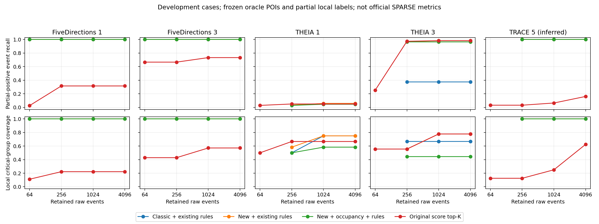

# 频率统计与图扩散：五案迭代实验

## 结论与定位

本轮保留原算法的频率统计、POI 个性化扩散、背景对照和时间路径选择，新增语义频率校正、关系均衡转移、可展开的短窗事件合并，以及短窗出现次数证据。没有移植 SPARSE 的完整算法，没有训练 GNN，也没有接入外部告警。

这些是已有算法上的研究原型。单独使用 PPR、关系均衡或合并事件都不能作为新颖性主张：本仓库已有 RCVP 时间传播与关系混合，文献也已有相关设计。更有价值的候选贡献是“频率证据如何驱动预算内的、可核验的攻击路径保留”，但是否有效必须由消融决定。

## 阅读的工作与实际借鉴

| 工作 | 可以借鉴的内容 | 本轮处理 |
|---|---|---|
| [SPARSE](https://arxiv.org/html/2405.02629v1) | 可疑图、路径上下文、平行事件合并 | 实现 10 秒有界事件组；原始事件全部保留映射并收费 |
| [NODLINK，NDSS 2024](https://www.ndss-symposium.org/wp-content/uploads/2024-204-paper.pdf) | 在线 Steiner 树、IDF 异常证据、简洁攻击图 | 借鉴路径成本意识；本算法没有继承其近似保证 |
| [ORTHRUS，USENIX Security 2025](https://www.usenix.org/conference/usenixsecurity25/presentation/jiang-baoxiang) | 时序图学习和归因质量 | 同时报事件正例、关键交互组、攻击阶段覆盖 |
| [KAIROS，IEEE S&P 2024](https://spg.cs.ubc.ca/publication/2024-sp/) | 时间图异常检测与重建 | 作为后续学习方法的对照方向；本轮未复现训练 |
| [MAGIC，USENIX Security 2024](https://www.usenix.org/conference/usenixsecurity24/presentation/jia-zian) | 掩码图表示学习 | 暂不叠加需要额外训练协议的 GNN |
| [FLASH，IEEE S&P 2024](https://ieeexplore.ieee.org/document/10646725/) | 语义、时间表示与图上下文 | 支持改进频率表征的方向；未复现其模型 |
| [Sometimes Simpler is Better，USENIX Security 2025](https://www.usenix.org/conference/usenixsecurity25/presentation/bilot) | 统一评测、简单基线、评测陷阱 | 加入原评分 top-K 与无频率对照，保留失败结果 |
| [Learned Provenance-based System Behavior Baseline，ICML 2025](https://proceedings.mlr.press/v267/zhu25k.html) | 行为基线的适应与泛化 | 下一步应校准历史条件频率，而非仅增加传播层数 |
| [Diffusion Improves Graph Learning，NeurIPS 2019](https://proceedings.neurips.cc/paper/2019/hash/23c894276a2c5a16470e6a31f4618d73-Abstract.html) | 图扩散与稀疏化 | 已有 RASP 的相关工作；不能重新包装成创新 |

这些方法的检测单位、POI 条件和真值范围不同。本轮实际运行的是本仓库的新旧算法及消融，没有把论文报告数字冒充同条件复现实验。

## 实现

1. **频率模块。** 冻结原历史稀有度 `r_e`。计算候选图中与同一 `(host, object semantic, relation)` 交互的不同进程实例数 `c_e`，使用 `u_e=1/log2(1+c_e)`，与历史稀有度组合为 `sqrt(r_e*u_e)`。这是候选图内的无标签统计，不是独立正常训练集。进程作为源、目的两种情况联合去重。
2. **扩散模块。** 节点先均分各关系的转移质量，关系内部按频率权重归一化。维持每 POI 的 PPR 和正常进程背景 PPR，对正向对数提升计算端点证据。它仍是无向调查扩散，严格时间约束由后续原始事件路径处理。
3. **事件组与预算。** 同主机、同有向实体对和关系，以首事件为起点形成跨度不超过 10 秒的组。一个入选组携带一条可验证时间因果分叉路径，全部组成员及连接事件共同计入原始事件硬预算。其他组成员是平行佐证，不声称每个成员均有独立时间路径。
4. **原有语义延续。** 将已有文件写入/执行、网络上下文和进程延续规则统一用于五案；按主机隔离运行。它们是原有开发集规则。强制保留的证据占预算，但不升级为新 POI。预算不足的组合明确缺席，不偷偷放宽。
5. **短窗频率探索。** 另测 `score * sqrt(组内不同时间戳数)`，对同时间戳复制不增加权重。该值仅为选边优先级，没有异常概率或统计检验含义。

核心实现：[frequency_diffusion.py](../tc_pruning/frequency_diffusion.py)；运行器：[run_frequency_diffusion.py](../scripts/run_frequency_diffusion.py)；独立评估：[evaluate_frequency_diffusion.py](../scripts/evaluate_frequency_diffusion.py)。

## 评测协议

- 五案、候选事件、POI、局部参考均冻结；所有方法使用相同原始事件预算 64/256/1024/4096。
- POI 来自报告，未使用外部告警；这仍是 oracle POI 条件，不能写成自动 POI 发现能力。
- 主比较预先指定 `full_hybrid@1024`。`burst` 是看到 v2 失败后提出的开发集探索，不能描述成未接触数据的确认性实验。
- 所有选择结果先写盘，再由独立评估脚本读参考标注。参考不传入评分函数。
- 局部正例总数依次为 38/15/239/229/31，关键组为 9/7/12/9/8，阶段为 3/3/6/5/6。
- 下文 P/R/F1/FP/FN 采用显式闭世界 **proxy**：未列入局部正例的候选事件暂计非关键。它们不是 SPARSE 作者的完整真值指标；官方等价指标继续为 NA。
- Case 5 仍是从材料推断的 TRACE 对应，未得到 SPARSE 作者确认。
- 五案均已被开发过程观察，不能报告为独立测试集或跨场景泛化结果。

## 三轮记录

v1 冻结于 `e1829c2`。审查发现进程两端共现计数分离，相关消融不应用作最终结论。v2 修复该问题并组合旧语义规则，冻结于 `1cb0945`。审查又用混合主机样例发现旧辅助规则不全部检查 host。v3 按主机完整隔离，加入短窗频率探索，冻结于 `a42c835`。全部历史结果保留，最终结论使用 v3。

## 最终主比较：统一 1024 条原始事件预算

关键组指冻结参考的交互组，不等于输出的 10 秒压缩组。以下所有指标均为局部闭世界 proxy。

| 案例 | 原始事件 | 压缩组 | TP / 正例 | FP | FN | Precision | Recall | F1 | 关键组 | 阶段 |
|---|---:|---:|---:|---:|---:|---:|---:|---:|---:|---:|
| Five Dir Case 1 | 1024 | 733 | 38/38 | 986 | 0 | 3.71% | 100.00% | 7.16% | 9/9 | 3/3 |
| Five Dir Case 3 | 1024 | 298 | 15/15 | 1009 | 0 | 1.46% | 100.00% | 2.89% | 7/7 | 3/3 |
| Theia Case 1 | 1024 | 474 | 14/239 | 1010 | 225 | 1.37% | 5.86% | 2.22% | 9/12 | 5/6 |
| Theia Case 3 | 1024 | 625 | 225/229 | 799 | 4 | 21.97% | 98.25% | 35.91% | 7/9 | 5/5 |
| Theia Case 5 | 1024 | 268 | 31/31 | 993 | 0 | 3.03% | 100.00% | 5.88% | 8/8 | 6/6 |

## 与已有结果和必要对照比较

| 案例 | 此前优化：事件数 / TP | 新主比较：事件数 / TP | 同预算 classic+旧规则 TP | 同预算原评分 top-K TP |
|---|---:|---:|---:|---:|
| Five Dir Case 1 | 51 / 38 | 1024 / 38 | 38 | 12 |
| Five Dir Case 3 | 49 / 15 | 1024 / 15 | 15 | 11 |
| Theia Case 1 | 179650 / 49 | 1024 / 14 | 14 | 12 |
| Theia Case 3 | 226443 / 229 | 1024 / 225 | 86 | 225 |
| Theia Case 5 | 144 / 31 | 1024 / 31 | 31 | 2 |

**结果解释：**

- THEIA Case 3 从此前 226,443 条事件、229 个局部正例，变成 1024 条事件、225 个局部正例：输出减少 99.55%，保留 98.25% 正例和 5/5 阶段。但原评分 top-K 也能在 1024 条命中 225 个，因此该收益不能全部归因于新扩散。
- FiveDirections 两案在统一 64 条预算也分别命中 38/38、15/15；TRACE 在 256 条预算命中 31/31。但此前 51/49/144 条的专门优化更紧凑，本轮通用方案没有超越它们。
- THEIA Case 1 主比较只命中 14/239、9/12 组、5/6 阶段，不能宣称完整重建。此前大图命中 49/239，缩图存在明确召回损失。
- 相同 1024 预算下，THEIA Case 3 的无频率版本命中 227/229，而 full 为 225/229。频率模块目前没有得到全案稳定正收益的证据。这是下一步必须解决的问题，不能隐去这项消融。
- 组数很少不等于保留完整攻击。burst 在一些案例把几百个压缩组降到几十个，但 THEIA 的关键组和阶段变少，说明压缩指标可以掩盖内容损失。

## 完整消融（1024 原始事件预算）

数值为局部正例 TP；hybrid 与非 hybrid 的区别必须保留，不能混为同一个方法。

| 方法 | FD1 | FD3 | THEIA1 | THEIA3 | TRACE5 |
|---|---:|---:|---:|---:|---:|
| classic | 18 | 12 | 14 | 7 | 27 |
| classic_hybrid | 38 | 15 | 14 | 86 | 31 |
| full | 18 | 12 | 14 | 225 | 26 |
| full_hybrid | 38 | 15 | 14 | 225 | 31 |
| no_semantic_frequency | 18 | 12 | 14 | 224 | 26 |
| no_relation_balance | 18 | 12 | 14 | 224 | 28 |
| geometric_only | 18 | 12 | 14 | 225 | 26 |
| no_frequency | 18 | 13 | 14 | 227 | 26 |
| burst | 1 | 10 | 11 | 221 | 26 |
| burst_hybrid | 38 | 15 | 11 | 221 | 31 |
| classic_burst | 7 | 11 | 11 | 223 | 26 |
| classic_burst_hybrid | 38 | 15 | 7 | 221 | 31 |
| no_episode_expansion | 18 | 12 | 14 | 225 | 26 |
| old_score_top | 12 | 11 | 12 | 225 | 2 |



[PDF 曲线](frequency-diffusion-v3-curves.pdf) · [完整 CSV](frequency-diffusion-v3-results.csv) · [完整 JSON](frequency-diffusion-v3-results.json)

## 运行成本

下表是每案一次进程内执行全部消融和预算的总成本，包含冻结 ledger 加载、语义规则和选边；不包含原始 CDM 导入和历史统计构建。五案并行运行，共享机器负载，不能用作与论文的在线吞吐对比。

| 案例 | 原始候选事件 | 候选压缩组 | 全部配置耗时秒 | 峰值 RSS MiB | PPR 收敛 |
|---|---:|---:|---:|---:|---|
| Five Dir Case 1 | 466257 | 128316 | 40.1 | 390.2 | True |
| Five Dir Case 3 | 424245 | 104252 | 36.3 | 351.0 | True |
| Theia Case 1 | 898253 | 118394 | 81.3 | 661.2 | True |
| Theia Case 3 | 1132218 | 158788 | 97.1 | 784.3 | True |
| Theia Case 5 | 137762 | 128834 | 17.2 | 159.4 | True |

## 距离超过 SPARSE，还缺什么

目前不能说超过 SPARSE，也没有充分证据说这些组合达到顶会创新要求。用户截图中 SPARSE 五案输出边数为 11/40/106/129/7；其边合并、真值及输入条件与这里尚未完全对齐，不能把本地 proxy 指标直接填到 SPARSE 表里。

下一阶段优先级由本轮失败证据确定：

1. **改进历史条件频率。** THEIA1 的入口 RECVFROM 稀有度仅约 0.0518，新评分排名约 280,310；CONNECT/SENDTO 排在约 69,503/69,535，但都有时间连接路径。因此要学习的是 `P(目标语义, 关系 | 进程语义, 主机角色, 时间上下文)`，配合样本量回退与不确定性，而不是继续把同类型 RECVFROM 一律视为常见。训练窗口必须早于攻击，候选图统计单独消融。
2. **在现有时间传播上做路径证据分配。** 保留 POI 多通道和原始时间见证，优化不同传播分支的边际覆盖与成本。已有 RCVP 的时间传播本身不是新贡献；要证明加入条件频率后在同预算、同候选、同 POI 下优于原评分 top-K、经典扩散、仅语义规则。
3. **首先证明模块有效，再增加图学习。** 如果使用机器学习，优先用小模型学习频率残差或转移校准，保持当前扩散引擎可解释。只有在独立正常训练数据、验证阈值和未见攻击测试划分落实后，才比较 GNN/图表示模型。现在直接上 GNN 无法解决真值和泄漏问题。
4. **补齐可发表评测。** 需要独立的事件级标注审核、未见攻击或未见时间段、POI 删除/噪声鲁棒性、原始吞吐与内存，以及能统一条件运行的文献基线。当前五案全部是开发集，不能反复调完再叫测试集。

**本轮保留决策：** 既有三案紧凑输出继续保留；新增实现作为独立研究分支和消融工具，不改动原生产算法默认路径。保留所有失败实验，不把 burst 版本推荐为最终方法。

## 可复现性与验证

实现与最终配置在 `a42c835` 冻结后才运行 v3；选择文件记录源代码和候选 SHA-256。最终审查没有未解决的重要问题。完整测试 `python -m pytest -q`：592 项通过。

[独立审核记录](frequency-diffusion-v3-audit.json)逐案验证候选事件唯一、参考正例在候选内、全部输出事件存在、POI 保留、原始预算、源文件与候选哈希。所有选择文件存于 `/root/NODOZE-pruning-release/output/tc/frequency-diffusion-v3/case0.json` 至 `case4.json`，包含每个方法和预算的原始事件 ID。

```bash
# 在当前研究 worktree 下运行；输出目录需为新的目录。
for i in 0 1 2 3 4; do
  PYTHONPATH=. OPENBLAS_NUM_THREADS=1 python scripts/run_frequency_diffusion.py \
    --case "$i" --config configs/frequency_diffusion_v3.json \
    --output /tmp/frequency-diffusion-reproduction/case"$i".json
done
PYTHONPATH=. python scripts/evaluate_frequency_diffusion.py \
  --input /tmp/frequency-diffusion-reproduction --output /tmp/frequency-diffusion-results.json
python scripts/plot_frequency_diffusion.py \
  --results /tmp/frequency-diffusion-results.json --output /tmp/frequency-diffusion-curves.png
```
