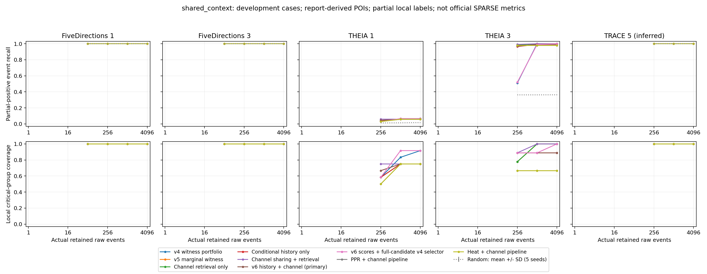

# 历史条件频率与通道检索：第六轮实现和实验

## 本轮结果判断

代码已经实现并完成五案例对照，但预先指定的v6主方案没有达到全面替换目标。主预算TP为301、宏F1为9.97%、关键组30/45；v4对应309、10.25%、37/45，主方案的负结果保留。

有收益的是预先列入对照的“新分数＋v4全候选选择器”：1024预算总TP从309增至321，宏Recall从69.77%增至76.96%，宏F1从10.25%增至10.71%，关键组37/45增至38/45，阶段仍为21/23。逐案例为35/14/16/227/29；其中FD1为21→35，THEIA3为229→227，因此不是逐案例全面胜出，也未将它事后改写为预定主方法。

256预算下，“通道共享＋扩展、不加新校准”宏F1为27.97%（v5为27.50%，原扩散27.07%），关键组28/45（v5为25/45）。完整新校准方案为27.56%、25/45，不能把这部分收益归于历史校准。带v4配额的复合版本低预算F1只有20.47%，不宜当作统一预算策略。

THEIA1入口漏选没有解决：1024预算新主方案仍为14/239，复合版本为16/239。选边后诊断发现通道检索截断前覆盖239/239，但截断后的池内仍只有17条。扩展上限32768被更高分的其他候选事件占用，历史校准提高了局部rarity，但最终分数仍不足以通过候选截断。这个具体失败点已记录，未按标签增加特例或宣称检索成功。

保留两个有用的开发候选：256预算的纯通道版本，以及主预算的新分数＋原全候选选择器；未进行按案例挑选赢家的组合，也未替换网页/CLI默认算法。下一轮需解决组级候选预算与最终评分目标的一致性，并在独立数据上验证，不能从本轮开发结果宣称超过SPARSE。

## 任务与评测范围

已实现历史条件频率校准与通道候选检索，并以相同 POI、候选账本、原始事件预算进行对照。频率统计与图扩散仍为评分中心；未接入外部告警。POI 沿用报告定位，不属于自动发现 POI 的端到端评测。

五案例均为反复查看过的开发数据。TRACE5* 是第五案例的推断映射，尚未确认对应论文 THEIA Case 5。所有事件分类指标是冻结本地部分正例的闭世界 proxy；未标注不等于良性，官方 SPARSE 等价 FP/FN/Precision/Recall/F1 仍为 NA。没有顶会水平或跨数据集泛化结论。

## 已实现的算法

1. 固定原始最早 POI，拟合窗口为前24小时至前60分钟，校准窗口为前60至前30分钟。按 host、源实体语义/类型、关系、目标语义/类型统计通道占用分钟，重复原始日志不会在同一分钟重复计数。POI 删除对照保持历史切分不变。
2. 用目标语义在同 host/关系下的频率作先验，对源语义条件频率平滑，强度10；计算负对数频率。对独立校准时段的分数作加权 midrank ECDF，含 +1/+2 平滑。拟合和校准各至少32个通道占用分钟单位：这是各通道之和，并非32个不同分钟。
3. 校准值与原频率分数各占50%，输入原有扩散引擎和300秒时间重排。历史不足则原样保留旧频率分数。历史边不保证良性，节点语义来自数据库当前快照，可能含后续更新，因此不能声称严格在线、完全无未来元数据影响。
4. 将同一实际端点对在总跨度不超过10秒内的事件分组，允许不同方向和关系；组内共享最高分。v5候选池再检索同组可达正分事件，锚点上限max(32768,8B)，原有锚点保留。共享分数不产生新POI，新增原始事件和路径全部计费。
5. 主方法仍用lambda=1边际效用。线性贪心/MILP使用同一实际候选池；PPR/热核/去频率使用相同规则但分数生成的池不同。history_channel_portfolio同时换成v4的全候选搜索与配额选择，是复合对照，不能将差异全部归于选择器。

具体公式：q(o|h,r)=(C(h,r,o)+1)/(N(h,r)+V(h,r)+1)，p(o|h,r,s)=(C(h,r,s,o)+10q)/(C(h,r,s)+10)，z=-log(p)。校准优先级=(较低分权重+0.5×同分权重+1)/(校准总权重+2)。V仅计拟合期目标类别，另保留一个未知目标类别；这些量不被解释为恶意概率。

ECDF 思路参考 [ECOD](https://arxiv.org/abs/2201.00382)，并非复现完整ECOD；PPR/热核为既有公式适配，涉及 [Diffusion Improves Graph Learning](https://proceedings.neurips.cc/paper/2019/hash/23c894276a2c5a16470e6a31f4618d73-Abstract.html) 使用的扩散核，但未复现其整个学习系统。PCST/NetworKit沿用此前公开内核实验。

## 历史可用性与冷启动

| 案例 | 拟合语义通道 | 校准语义通道 | 成功校准事件/候选事件 | 历史构建 s |
|---|---|---|---|---|
| FD1 | 51 | 69392 | 68162/466257 | 12.15 |
| FD3 | 283 | 24 | 0/424245 | 9.85 |
| THEIA1 | 59795 | 42371 | 893105/898253 | 30.60 |
| THEIA3 | 159606 | 44658 | 1130232/1132218 | 44.73 |
| TRACE5* | 0 | 599934 | 0/137762 | 30.38 |

FD3 与 TRACE5 没有足够的历史支持，频率校准完全回退，不能把这两例的新收益算成历史校准的贡献。SQLite只读；保留实际拟合/校准聚合数据及哈希。原数据库记录路径、大小和mtime，没有声称完整数据库文件SHA256。

## 主预算1024：本地正例事件命中数

本地正例总数依次38、15、239、229、31；PCST可能保留少于预算的事件，实际边数见CSV。

| 方法 | FD1 | FD3 | THEIA1 | THEIA3 | TRACE5* |
|---|---|---|---|---|---|
| 原频率扩散 top-K | 18 | 13 | 14 | 225 | 28 |
| v4 固定配额＋路径 | 21 | 14 | 16 | 229 | 29 |
| v5 边际效用 | 20 | 13 | 14 | 229 | 26 |
| 公开 PCST＋时间扩散奖赏 | 1 | 6 | 10 | 3 | 26 |
| NetworKit LocalDegree | 1 | 2 | 3 | 4 | 2 |
| 仅扩展通道候选池 | 21 | 13 | 14 | 229 | 26 |
| 仅历史条件频率校准 | 20 | 13 | 14 | 227 | 26 |
| 通道共享＋扩展（无新校准） | 21 | 13 | 14 | 229 | 26 |
| v6 校准＋通道共享＋扩展（主方法） | 21 | 13 | 14 | 227 | 26 |
| v6 同池线性贪心 | 18 | 13 | 14 | 227 | 26 |
| v6 同池线性 MILP | 18 | 13 | 14 | 227 | 27 |
| v6 分数＋v4 全候选选择器 | 35 | 14 | 16 | 227 | 29 |
| 通道流程＋去频率 | 18 | 14 | 14 | 229 | 26 |
| 通道流程＋PPR适配 | 18 | 13 | 14 | 224 | 25 |
| 通道流程＋热核适配 | 18 | 13 | 14 | 224 | 25 |

## 低预算256：本地正例事件命中数

| 方法 | FD1 | FD3 | THEIA1 | THEIA3 | TRACE5* |
|---|---|---|---|---|---|
| 原频率扩散 top-K | 18 | 12 | 12 | 223 | 25 |
| v4 固定配额＋路径 | 20 | 13 | 10 | 118 | 26 |
| v5 边际效用 | 20 | 12 | 12 | 225 | 25 |
| 公开 PCST＋时间扩散奖赏 | 1 | 2 | 6 | 3 | 2 |
| NetworKit LocalDegree | 1 | 2 | 3 | 3 | 1 |
| 仅扩展通道候选池 | 21 | 12 | 12 | 225 | 25 |
| 仅历史条件频率校准 | 18 | 12 | 14 | 221 | 25 |
| 通道共享＋扩展（无新校准） | 21 | 12 | 14 | 227 | 25 |
| v6 校准＋通道共享＋扩展（主方法） | 18 | 12 | 14 | 227 | 25 |
| v6 同池线性贪心 | 18 | 11 | 14 | 227 | 25 |
| v6 分数＋v4 全候选选择器 | 27 | 13 | 13 | 122 | 27 |
| 通道流程＋去频率 | 18 | 13 | 12 | 217 | 25 |
| 通道流程＋PPR适配 | 18 | 13 | 8 | 224 | 24 |
| 通道流程＋热核适配 | 18 | 12 | 8 | 224 | 24 |

## 宏平均与攻击过程覆盖（POI-only）

| 方法 | 预算 | 总TP | 宏Precision % | 宏Recall % | 宏F1 % | 关键组 | 阶段 |
|---|---|---|---|---|---|---|---|
| 原频率扩散 top-K | 256 | 290 | 22.66 | 62.08 | 27.07 | 22/45 | 14/23 |
| v4 固定配额＋路径 | 256 | 187 | 14.61 | 55.78 | 18.80 | 27/45 | 17/23 |
| v5 边际效用 | 256 | 294 | 22.97 | 63.31 | 27.50 | 25/45 | 16/23 |
| 仅扩展通道候选池 | 256 | 295 | 23.05 | 63.84 | 27.64 | 26/45 | 16/23 |
| 仅历史条件频率校准 | 256 | 290 | 22.66 | 62.08 | 27.06 | 25/45 | 15/23 |
| 通道共享＋扩展（无新校准） | 256 | 299 | 23.36 | 64.18 | 27.97 | 28/45 | 16/23 |
| v6 校准＋通道共享＋扩展（主方法） | 256 | 296 | 23.12 | 62.60 | 27.56 | 25/45 | 15/23 |
| v6 同池线性贪心 | 256 | 295 | 23.05 | 61.27 | 27.41 | 24/45 | 15/23 |
| v6 分数＋v4 全候选选择器 | 256 | 202 | 15.78 | 60.71 | 20.47 | 32/45 | 18/23 |
| 通道流程＋去频率 | 256 | 285 | 22.27 | 62.89 | 26.72 | 24/45 | 15/23 |
| 通道流程＋PPR适配 | 256 | 287 | 22.42 | 62.52 | 26.83 | 21/45 | 13/23 |
| 通道流程＋热核适配 | 256 | 286 | 22.34 | 61.19 | 26.69 | 20/45 | 13/23 |
| 原频率扩散 top-K | 1024 | 298 | 5.82 | 65.69 | 9.87 | 28/45 | 18/23 |
| v4 固定配额＋路径 | 1024 | 309 | 6.04 | 69.77 | 10.25 | 37/45 | 21/23 |
| v5 边际效用 | 1024 | 302 | 5.90 | 65.81 | 9.99 | 30/45 | 16/23 |
| 仅扩展通道候选池 | 1024 | 303 | 5.92 | 66.33 | 10.03 | 31/45 | 16/23 |
| 仅历史条件频率校准 | 1024 | 300 | 5.86 | 65.63 | 9.93 | 29/45 | 16/23 |
| 通道共享＋扩展（无新校准） | 1024 | 303 | 5.92 | 66.33 | 10.03 | 31/45 | 16/23 |
| v6 校准＋通道共享＋扩展（主方法） | 1024 | 301 | 5.88 | 66.16 | 9.97 | 30/45 | 16/23 |
| v6 同池线性贪心 | 1024 | 298 | 5.82 | 64.58 | 9.85 | 27/45 | 15/23 |
| v6 同池线性 MILP | 1024 | 299 | 5.84 | 65.22 | 9.89 | 28/45 | 16/23 |
| v6 分数＋v4 全候选选择器 | 1024 | 321 | 6.27 | 76.96 | 10.71 | 38/45 | 21/23 |
| 通道流程＋去频率 | 1024 | 301 | 5.88 | 66.09 | 9.96 | 29/45 | 16/23 |
| 通道流程＋PPR适配 | 1024 | 294 | 5.74 | 63.67 | 9.72 | 24/45 | 14/23 |
| 通道流程＋热核适配 | 1024 | 294 | 5.74 | 63.67 | 9.72 | 24/45 | 14/23 |

## 新主方法逐案例指标（1024，POI-only）

| 案例 | #E | TP | FP proxy | FN proxy | Precision % | Recall % | F1 % | 关键组 | 阶段 | 时间路径可达 % |
|---|---|---|---|---|---|---|---|---|---|---|
| FD1 | 1024 | 21 | 1003 | 17 | 2.05 | 55.26 | 3.95 | 5/9 | 2/3 | 100.00 |
| FD3 | 1024 | 13 | 1011 | 2 | 1.27 | 86.67 | 2.50 | 5/7 | 2/3 | 100.00 |
| THEIA1 | 1024 | 14 | 1010 | 225 | 1.37 | 5.86 | 2.22 | 9/12 | 5/6 | 100.00 |
| THEIA3 | 1024 | 227 | 797 | 2 | 22.17 | 99.13 | 36.23 | 8/9 | 5/5 | 100.00 |
| TRACE5* | 1024 | 26 | 998 | 5 | 2.54 | 83.87 | 4.93 | 3/8 | 2/6 | 100.00 |

时间路径可达率是程序约束检查，不是攻击因果正确率。

## 预算曲线：64 / 256 / 1024 / 4096 的 TP

| 方法 | FD1 | FD3 | THEIA1 | THEIA3 | TRACE5* |
|---|---|---|---|---|---|
| v4 固定配额＋路径 | 19 / 20 / 21 / 34 | 6 / 13 / 14 / 14 | 8 / 10 / 16 / 16 | 20 / 118 / 229 / 229 | 25 / 26 / 29 / 29 |
| v5 边际效用 | 18 / 20 / 20 / 35 | 12 / 12 / 13 / 14 | 8 / 12 / 14 / 14 | 44 / 225 / 229 / 229 | 24 / 25 / 26 / 29 |
| 仅扩展通道候选池 | 18 / 21 / 21 / 35 | 12 / 12 / 13 / 14 | 8 / 12 / 14 / 14 | 44 / 225 / 229 / 229 | 24 / 25 / 26 / 29 |
| 仅历史条件频率校准 | 18 / 18 / 20 / 30 | 12 / 12 / 13 / 14 | 8 / 14 / 14 / 14 | 29 / 221 / 227 / 227 | 24 / 25 / 26 / 29 |
| 通道共享＋扩展（无新校准） | 18 / 21 / 21 / 35 | 12 / 12 / 13 / 13 | 14 / 14 / 14 / 14 | 48 / 227 / 229 / 229 | 25 / 25 / 26 / 29 |
| v6 校准＋通道共享＋扩展（主方法） | 18 / 18 / 21 / 30 | 12 / 12 / 13 / 13 | 8 / 14 / 14 / 14 | 43 / 227 / 227 / 227 | 25 / 25 / 26 / 29 |
| v6 同池线性贪心 | 18 / 18 / 18 / 18 | 11 / 11 / 13 / 13 | 7 / 14 / 14 / 14 | 59 / 227 / 227 / 227 | 25 / 25 / 26 / 29 |
| v6 分数＋v4 全候选选择器 | 11 / 27 / 35 / 35 | 8 / 13 / 14 / 14 | 8 / 13 / 16 / 17 | 28 / 122 / 227 / 229 | 26 / 27 / 29 / 29 |
| 通道流程＋去频率 | 18 / 18 / 18 / 22 | 11 / 13 / 14 / 14 | 7 / 12 / 14 / 14 | 28 / 217 / 229 / 229 | 24 / 25 / 26 / 27 |
| 通道流程＋PPR适配 | 18 / 18 / 18 / 20 | 11 / 13 / 13 / 14 | 7 / 8 / 14 / 14 | 35 / 224 / 224 / 224 | 24 / 24 / 25 / 29 |
| 通道流程＋热核适配 | 18 / 18 / 18 / 19 | 12 / 12 / 13 / 14 | 7 / 8 / 14 / 14 | 37 / 224 / 224 / 224 | 24 / 24 / 25 / 29 |

## 共享语义上下文（1024）：单独列出的先验收益

| 方法 | FD1 | FD3 | THEIA1 | THEIA3 | TRACE5* |
|---|---|---|---|---|---|
| v4 固定配额＋路径 | 38 | 15 | 14 | 229 | 31 |
| v5 边际效用 | 38 | 15 | 14 | 229 | 31 |
| 仅扩展通道候选池 | 38 | 15 | 14 | 229 | 31 |
| 仅历史条件频率校准 | 38 | 15 | 14 | 227 | 31 |
| 通道共享＋扩展（无新校准） | 38 | 15 | 14 | 229 | 31 |
| v6 校准＋通道共享＋扩展（主方法） | 38 | 15 | 14 | 227 | 31 |
| v6 同池线性贪心 | 38 | 15 | 14 | 227 | 31 |
| v6 同池线性 MILP | 38 | 15 | 14 | 227 | 31 |
| v6 分数＋v4 全候选选择器 | 38 | 15 | 16 | 227 | 31 |
| 通道流程＋去频率 | 38 | 15 | 14 | 229 | 31 |
| 通道流程＋PPR适配 | 38 | 15 | 14 | 224 | 31 |
| 通道流程＋热核适配 | 38 | 15 | 14 | 224 | 31 |

## 删除一个 POI（1024，POI-only）

| 案例 | 场景 | v4 | v5 | v6主方法 | 仅通道 | 新校准＋v4选择器 | PPR | 热核 |
|---|---|---|---|---|---|---|---|---|
| FD3 | drop-0 | 5 | 3 | 3 | 3 | 5 | 3 | 3 |
| FD3 | drop-1 | 12 | 10 | 10 | 10 | 13 | 11 | 11 |
| THEIA1 | drop-0 | 8 | 7 | 10 | 11 | 8 | 6 | 5 |
| THEIA1 | drop-1 | 16 | 14 | 14 | 14 | 16 | 14 | 14 |
| THEIA1 | drop-2 | 16 | 14 | 14 | 14 | 16 | 14 | 14 |
| THEIA3 | drop-0 | 11 | 10 | 8 | 10 | 9 | 5 | 5 |
| THEIA3 | drop-1 | 226 | 226 | 226 | 226 | 226 | 221 | 221 |
| THEIA3 | drop-2 | 222 | 222 | 222 | 222 | 222 | 222 | 222 |

## 选边后候选池诊断（主预算）

| 案例 | 本地正例 | v5池内正例 | v6池内正例 | v6最终命中 | v6锚点数量 |
|---|---|---|---|---|---|
| FD1 | 38 | 34 | 35 | 21 | 23967 |
| FD3 | 15 | 14 | 14 | 13 | 22779 |
| THEIA1 | 239 | 17 | 17 | 14 | 32768 |
| THEIA3 | 229 | 229 | 229 | 227 | 32768 |
| TRACE5* | 31 | 29 | 29 | 26 | 4140 |

THEIA1进一步诊断：未截断的通道候选共161450条，含239条本地正例；32,768锚点截断后连同路径仅含17条。入口组223条RECV的混合rarity约0.4285，但最终共享扩散分数仅0.01573。详见[逐组诊断](history-channel-v6-theia1-diagnosis.json)，生成脚本为scripts/diagnose_history_theia1.py。

这是选边结束后读取参考标签得到的诊断，没有用于筛选候选或本轮调参。扩大池仍有分数门槛与容量限制，不保证覆盖所有可达事件。

## MILP 同池线性目标对照（1024）

| 案例 | 轨道 | status | gap % | 贪心/上界 % | 贪心TP | MILP TP |
|---|---|---|---|---|---|---|
| FD1 | poi_only | ok | 0.00 | 99.83 | 18 | 18 |
| FD1 | shared_context | ok | 0.00 | 99.83 | 38 | 38 |
| FD3 | poi_only | ok | 0.00 | 97.15 | 13 | 13 |
| FD3 | shared_context | ok | 0.12 | 97.10 | 15 | 15 |
| THEIA1 | poi_only | ok | 0.05 | 99.91 | 14 | 14 |
| THEIA1 | shared_context | ok | 0.00 | 100.00 | 14 | 14 |
| THEIA3 | poi_only | ok | 0.00 | 99.96 | 227 | 227 |
| THEIA3 | shared_context | ok | 0.00 | 99.96 | 227 | 227 |
| TRACE5* | poi_only | ok | 0.00 | 100.00 | 26 | 27 |
| TRACE5* | shared_context | ok | 0.00 | 100.00 | 31 | 31 |

MILP受20秒、1%相对gap限制；status=ok仅表示有通过预算、整数性和路径闭包检查的incumbent。求解器上界只适用于有限池的线性分数目标，不是攻击召回的上界，也不适用于lambda=1目标。超时/无解情况保留状态，不伪造最优结果。

## 新进程开销（主预算、POI-only）

| 方法 | 案例 | 暖缓存流程 s | 缓存加载核验 s | 分组 s | 评分 s | 路径 s | 候选池 s | 选择 s | 峰值RSS MiB |
|---|---|---|---|---|---|---|---|---|---|
| channel_heat | FD1 | 17.46 | 0.12 | 0.42 | 0.09 | 2.41 | 0.25 | 3.38 | 284.4 |
| channel_only | FD1 | 19.04 | 0.12 | 0.43 | 0.87 | 2.42 | 0.27 | 4.23 | 293.2 |
| history_channel | FD1 | 19.61 | 0.12 | 0.44 | 0.87 | 2.41 | 0.27 | 4.54 | 291.1 |
| channel_heat | FD3 | 18.37 | 0.11 | 0.40 | 0.10 | 2.08 | 0.23 | 5.01 | 265.4 |
| channel_only | FD3 | 18.43 | 0.10 | 0.40 | 0.86 | 2.10 | 0.24 | 4.30 | 265.1 |
| history_channel | FD3 | 17.98 | 0.12 | 0.39 | 0.83 | 2.03 | 0.22 | 3.86 | 264.7 |
| channel_heat | THEIA1 | 35.95 | 0.22 | 0.80 | 0.17 | 8.21 | 0.46 | 4.59 | 448.0 |
| channel_only | THEIA1 | 39.22 | 0.22 | 0.81 | 3.02 | 8.39 | 0.47 | 4.81 | 487.7 |
| history_channel | THEIA1 | 38.60 | 0.23 | 0.81 | 2.97 | 8.10 | 0.46 | 4.64 | 487.5 |
| channel_heat | THEIA3 | 42.89 | 0.35 | 1.06 | 0.21 | 9.19 | 0.54 | 4.56 | 543.4 |
| channel_only | THEIA3 | 45.73 | 0.27 | 1.03 | 2.63 | 9.37 | 0.52 | 4.84 | 546.5 |
| history_channel | THEIA3 | 45.47 | 0.28 | 1.03 | 2.61 | 9.22 | 0.59 | 4.91 | 545.4 |
| channel_heat | TRACE5* | 5.11 | 0.08 | 0.12 | 0.05 | 0.71 | 0.06 | 0.70 | 160.7 |
| channel_only | TRACE5* | 6.17 | 0.08 | 0.12 | 1.12 | 0.69 | 0.06 | 0.70 | 178.7 |
| history_channel | TRACE5* | 6.26 | 0.09 | 0.12 | 1.11 | 0.70 | 0.06 | 0.70 | 176.7 |

每个方法/案例一个新进程样本，案例并行，BLAS/OMP环境为1。全部三方法均加载核验同一历史缓存（其中原分数/热核不使用新rarity），含候选账本加载、分组、评分、路径、候选池与选择；排除原始CDM导入、评测、导出。冷历史构建耗时另列，不当作免费。旧baseline是历史测量，不能从这些单样本声称精确加速比。kernel_plus_selection_seconds为窄口径，不含路径/分组/候选池。

## 审计和复现

新增514项配置：{'ok': 487, 'infeasible_mandatory': 27}；共10个新方法/变体。累计2998项（含历史轮次复用），配置组合不是独立攻击样本。159个新增扩散诊断全部收敛=True，POI-only最低时间路径可达率100.00%。

15个profile中15个选择集合与主实验一致；冷启动回退的19个有效配置逐一验证与仅通道方案的选择集合一致。账本、源码、缓存及原始预算检查通过。

```bash
# 在研究worktree，使用 .venv-cross-domain Python，CASE=0..4
export PYTHONPATH=. OPENBLAS_NUM_THREADS=1 OMP_NUM_THREADS=1
python scripts/prepare_conditional_history.py --case "$CASE" --output-dir "$V6/history"
# 历史JSON manifest在所有缓存文件写完后才发布
python scripts/run_history_channel.py --case "$CASE" --output "$V6/case$CASE.json.gz"
# 全部案例完成后
python scripts/evaluate_marginal_witness.py --input "$V6" --output docs/history-channel-v6-results.json
python scripts/profile_history_channel.py --case "$CASE" --method history_channel --output "$V6/profile-$CASE-history_channel.json"
python scripts/diagnose_history_pool.py --case "$CASE" --output "$V6/pool-$CASE.json"
python scripts/summarize_history_channel.py
python scripts/plot_history_channel.py --results docs/history-channel-v6-results.json --output-dir docs/figures
```

V6固定为/root/NODOZE-pruning-release/output/tc/history-channel-v6；还需channel_only/channel_heat两组profile。拒绝覆盖已有输出；迁移复现需同步冻结父报告/账本与SQLite，按配置调整路径。所有新决策和缓存用临时文件写完后原子发布。

完整数据：[CSV](history-channel-v6-results.csv)、[JSON](history-channel-v6-results.json)、[历史构建](history-channel-v6-history.json)、[审计](history-channel-v6-audit.json)、[候选池](history-channel-v6-pool-audit.json)、[运行时间](history-channel-v6-profiles.json)。



