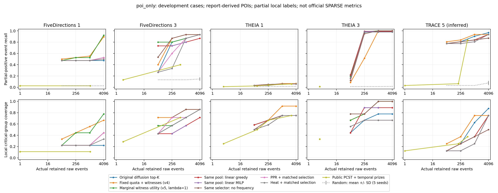
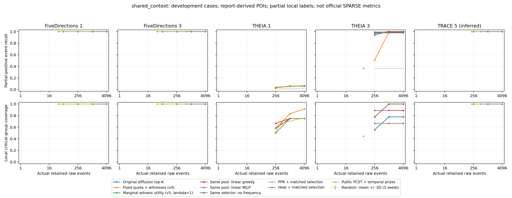

# 边际收益与路径成本：第五轮优化和对照实验

## 本轮结论

保持自建的频率统计与图扩散评分引擎，完成新的路径成本选择器及同条件对照。结果支持低预算修复，但不支持把 v5 直接替换为所有预算下的默认算法，更不支持已经超过 SPARSE 或达到顶会水平的结论。

1. THEIA3@256：原扩散 top-K 为 223，v4 为 118，新主方法为 225；线性贪心为 227。v5 修复了大部分固定配额导致的损失，但相对原扩散的提升只有 2 条，不能仅与退化的 v4 比较。
2. 主预算1024：v4 命中总数309，新主方法302；FD1/FD3/THEIA1/TRACE5分别21→20、14→13、16→14、29→26，THEIA3保持229。主预算回归明确存在，λ=4敏感性也不作为事后更换主方法的理由。
3. 线性优化基线用于隔离优化器与评分问题。即使在相同有限池内获得接近求解器上界的分数，也不意味着攻击事件召回更高；THEIA1还有严重的候选池截断问题。
4. 新主方法与同选择规则的 PPR、热核、去频率版本逐项比较如下；没有逐案例挑选赢家组成一个声称泛化的新方法。所有案例已用于开发，尚无独立测试集证据。

5. 图解释完整性没有同步改善：主预算关键组覆盖由 v4 的37/45降至30/45，阶段覆盖21/23降至16/23；256预算下也由27/45、17/23降至25/45、16/23。因此只能说密集事件召回的退化得到修复，不能说攻击链恢复全面改善。
6. 去掉频率模块后，主预算宏召回66.09%略高于完整方法65.81%；256预算完整方法63.31%略高于去频率62.89%。频率模块的普遍独立收益尚未建立，不能以本轮证据作强创新主张。

## 评测范围

仅使用原来的五个开发案例。TRACE5* 是第五案例的推断映射，并非已经证实的 THEIA Case 5。POI 来自既有报告和本地定位，不依赖外接检测告警；这也不是端到端自动发现 POI 的评测。

所有 TP/FP/FN/Precision/Recall/F1 都是冻结本地部分正例的闭世界 proxy。表中未标注的事件不一定无害；官方 SPARSE 等价指标仍为 NA。各方法先选边、保存 ID，之后评测器才读取参考标签。

主预算保持 1024 条原始事件；256 是事先声明的低预算退化检查，64 和 4096 为完整预算曲线。共享语义上下文轨道单独列出，其先验收益不能归于新算法。

## 实现与复现层级

保留频率统计、背景对比图扩散、时间重排。新选择器将每个候选事件及其固定时间路径视为一个集合，以新增证据收益除以新增原始事件数选择，重叠路径只计费一次。收益由线性证据和按关系类型求平方根的软多样性奖励组成，λ=1；λ=0/4 为固定对照。

候选池由全局前 max(4096,2B) 和各类型前 ceil(max(4096,2B)/R) 的并集组成，只看分数。它限制了搜索空间，不能声称优化了整张百万事件图的全局最优解。MILP 与线性贪心共享完全相同的候选池；PPR/热核使用相同池生成规则，各自分数形成的实际池可能不同。

| 方法来源 | 本实验真正实现的内容 |
|---|---|
| [预算最大覆盖，1999](https://thibaut.horel.org/submodularity/papers/khuller1999.pdf) | 借鉴边际收益/成本思想；原论文是集合成本相加，本实验是原始路径事件并集成本，不移植其近似保证 |
| [连接最大覆盖，AAMAS 2025](https://www.ifaamas.org/Proceedings/aamas2025/pdfs/p538.pdf) | 学习预算与连接约束联合建模；未实现其理论算法 |
| [热核社区检测，KDD 2014](https://www.cs.purdue.edu/homes/dgleich/publications/Kloster%202014%20-%20hkrelax.pdf) | 自行实现全量矩阵乘法热核/PPR和度归一化；不包含作者的局部松弛或 conductance sweep |
| [SciPy 1.14.1 milp](https://docs.scipy.org/doc/scipy-1.14.1/reference/generated/scipy.optimize.milp.html) | 自行建立二元选锚点/原始事件模型，调用公开 HiGHS 求解器，20秒限制、1%相对gap |
| [G-Retriever，NeurIPS 2024](https://proceedings.neurips.cc/paper_files/paper/2024/file/efaf1c9726648c8ba363a5c927440529-Paper-Conference.pdf) | 沿用上轮 pcst_fast 公开内核及本任务适配结果，并非整个论文系统 |
| [图稀疏化评测，VLDB 2024](https://www.vldb.org/pvldb/vol17/p427-chen.pdf) | 沿用上轮 NetworKit LocalDegree；同时报告预算与图结构指标 |

## POI-only 主预算：命中本地正例的原始事件数

分母分别为 38、15、239、229、31。大多数预算法保留 1024 条事件；PCST 实际边数见完整 CSV，不补齐到预算。

| 方法 | FD1 | FD3 | THEIA1 | THEIA3 | TRACE5* |
|---|---|---|---|---|---|
| 原缓存评分 top-K | 12 | 11 | 12 | 225 | 2 |
| 原频率扩散 top-K | 18 | 13 | 14 | 225 | 28 |
| v4 固定配额＋路径 | 21 | 14 | 16 | 229 | 29 |
| v4 全局排序＋路径 | 18 | 12 | 14 | 227 | 26 |
| v5 边际效用（λ=1，预定主方法） | 20 | 13 | 14 | 229 | 26 |
| v5 线性贪心（λ=0） | 18 | 12 | 14 | 227 | 26 |
| v5 多样性敏感性（λ=4） | 24 | 13 | 14 | 229 | 26 |
| v5 去掉时间重排 | 19 | 13 | 14 | 225 | 26 |
| v5 去掉频率统计 | 18 | 14 | 14 | 229 | 26 |
| PPR 公式适配＋相同选择规则 | 18 | 13 | 14 | 224 | 25 |
| 热核公式适配＋相同选择规则 | 18 | 13 | 14 | 224 | 25 |
| HiGHS 线性 MILP（相同候选池） | 18 | 12 | 14 | 227 | 26 |
| 热核公式适配 top-K | 18 | 14 | 14 | 224 | 25 |
| 公开 PCST＋静态频率扩散奖赏 | 1 | 6 | 10 | 3 | 27 |
| 公开 PCST＋时间扩散奖赏 | 1 | 6 | 10 | 3 | 26 |
| NetworKit LocalDegree | 1 | 2 | 3 | 4 | 2 |

## POI-only 低预算 256：全部关键对照

| 方法 | FD1 | FD3 | THEIA1 | THEIA3 | TRACE5* |
|---|---|---|---|---|---|
| 原缓存评分 top-K | 12 | 10 | 12 | 223 | 1 |
| 原频率扩散 top-K | 18 | 12 | 12 | 223 | 25 |
| v4 固定配额＋路径 | 20 | 13 | 10 | 118 | 26 |
| v4 全局排序＋路径 | 18 | 12 | 12 | 227 | 25 |
| v5 边际效用（λ=1，预定主方法） | 20 | 12 | 12 | 225 | 25 |
| v5 线性贪心（λ=0） | 18 | 11 | 12 | 227 | 25 |
| v5 多样性敏感性（λ=4） | 22 | 13 | 12 | 199 | 24 |
| v5 去掉时间重排 | 19 | 12 | 12 | 216 | 25 |
| v5 去掉频率统计 | 18 | 13 | 12 | 217 | 25 |
| PPR 公式适配＋相同选择规则 | 18 | 9 | 8 | 224 | 24 |
| 热核公式适配＋相同选择规则 | 18 | 5 | 8 | 224 | 24 |
| HiGHS 线性 MILP（相同候选池） | 18 | 11 | 12 | 226 | 25 |
| 热核公式适配 top-K | 18 | 4 | 7 | 224 | 25 |
| 公开 PCST＋静态频率扩散奖赏 | 1 | 2 | 6 | 3 | 2 |
| 公开 PCST＋时间扩散奖赏 | 1 | 2 | 6 | 3 | 2 |
| NetworKit LocalDegree | 1 | 2 | 3 | 3 | 1 |

## 新主方法：逐案例 proxy 指标（预算 1024）

| 案例 | 实际 #E | TP | FP proxy | FN proxy | Precision % | Recall % | F1 % | 关键组 | 阶段 | 时间路径可达 % |
|---|---|---|---|---|---|---|---|---|---|---|
| FD1 | 1024 | 20 | 1004 | 18 | 1.95 | 52.63 | 3.77 | 4/9 | 2/3 | 100.00 |
| FD3 | 1024 | 13 | 1011 | 2 | 1.27 | 86.67 | 2.50 | 5/7 | 2/3 | 100.00 |
| THEIA1 | 1024 | 14 | 1010 | 225 | 1.37 | 5.86 | 2.22 | 9/12 | 5/6 | 100.00 |
| THEIA3 | 1024 | 229 | 795 | 0 | 22.36 | 100.00 | 36.55 | 9/9 | 5/5 | 100.00 |
| TRACE5* | 1024 | 26 | 998 | 5 | 2.54 | 83.87 | 4.93 | 3/8 | 2/6 | 100.00 |

时间路径可达率是实现约束的检查，不是攻击因果正确率。

## 宏平均与总命中（每案例等权，POI-only）

| 预算 | 方法 | TP 总和 | 宏 Precision % | 宏 Recall % | 宏 F1 % |
|---|---|---|---|---|---|
| 256 | 原频率扩散 top-K | 290 | 22.66 | 62.08 | 27.07 |
| 256 | v4 固定配额＋路径 | 187 | 14.61 | 55.78 | 18.80 |
| 256 | v5 边际效用（λ=1，预定主方法） | 294 | 22.97 | 63.31 | 27.50 |
| 256 | v5 线性贪心（λ=0） | 293 | 22.89 | 61.10 | 27.25 |
| 256 | v5 去掉频率统计 | 285 | 22.27 | 62.89 | 26.72 |
| 256 | PPR 公式适配＋相同选择规则 | 283 | 22.11 | 57.19 | 26.24 |
| 256 | 热核公式适配＋相同选择规则 | 279 | 21.80 | 51.86 | 25.65 |
| 256 | HiGHS 线性 MILP（相同候选池） | 292 | 22.81 | 61.01 | 27.17 |
| 1024 | 原频率扩散 top-K | 298 | 5.82 | 65.69 | 9.87 |
| 1024 | v4 固定配额＋路径 | 309 | 6.04 | 69.77 | 10.25 |
| 1024 | v5 边际效用（λ=1，预定主方法） | 302 | 5.90 | 65.81 | 9.99 |
| 1024 | v5 线性贪心（λ=0） | 297 | 5.80 | 63.24 | 9.82 |
| 1024 | v5 去掉频率统计 | 301 | 5.88 | 66.09 | 9.96 |
| 1024 | PPR 公式适配＋相同选择规则 | 294 | 5.74 | 63.67 | 9.72 |
| 1024 | 热核公式适配＋相同选择规则 | 294 | 5.74 | 63.67 | 9.72 |
| 1024 | HiGHS 线性 MILP（相同候选池） | 297 | 5.80 | 63.24 | 9.82 |

## 原始预算曲线：64 / 256 / 1024 / 4096 的 TP

| 方法 | FD1 | FD3 | THEIA1 | THEIA3 | TRACE5* |
|---|---|---|---|---|---|
| 原频率扩散 top-K | 18 / 18 / 18 / 18 | 4 / 12 / 13 / 14 | 8 / 12 / 14 / 14 | 49 / 223 / 225 / 225 | 24 / 25 / 28 / 30 |
| v4 固定配额＋路径 | 19 / 20 / 21 / 34 | 6 / 13 / 14 / 14 | 8 / 10 / 16 / 16 | 20 / 118 / 229 / 229 | 25 / 26 / 29 / 29 |
| v5 边际效用（λ=1，预定主方法） | 18 / 20 / 20 / 35 | 12 / 12 / 13 / 14 | 8 / 12 / 14 / 14 | 44 / 225 / 229 / 229 | 24 / 25 / 26 / 29 |
| v5 线性贪心（λ=0） | 18 / 18 / 18 / 20 | 11 / 11 / 12 / 13 | 8 / 12 / 14 / 14 | 50 / 227 / 227 / 227 | 24 / 25 / 26 / 29 |
| v5 多样性敏感性（λ=4） | 19 / 22 / 24 / 35 | 12 / 13 / 13 / 14 | 8 / 12 / 14 / 14 | 26 / 199 / 229 / 229 | 21 / 24 / 26 / 29 |
| v5 去掉时间重排 | 18 / 19 / 19 / 20 | 12 / 12 / 13 / 13 | 8 / 12 / 14 / 14 | 31 / 216 / 225 / 225 | 24 / 25 / 26 / 28 |
| v5 去掉频率统计 | 18 / 18 / 18 / 20 | 8 / 13 / 14 / 14 | 7 / 12 / 14 / 14 | 28 / 217 / 229 / 229 | 24 / 25 / 26 / 27 |
| PPR 公式适配＋相同选择规则 | 18 / 18 / 18 / 20 | 4 / 9 / 13 / 14 | 7 / 8 / 14 / 14 | 35 / 224 / 224 / 224 | 24 / 24 / 25 / 29 |
| 热核公式适配＋相同选择规则 | 18 / 18 / 18 / 19 | 4 / 5 / 13 / 14 | 7 / 8 / 14 / 14 | 37 / 224 / 224 / 224 | 24 / 24 / 25 / 29 |

## 共享语义上下文轨道（预算 1024）

| 方法 | FD1 | FD3 | THEIA1 | THEIA3 | TRACE5* |
|---|---|---|---|---|---|
| 原频率扩散 top-K | 38 | 15 | 14 | 225 | 31 |
| v4 固定配额＋路径 | 38 | 15 | 14 | 229 | 31 |
| v5 边际效用（λ=1，预定主方法） | 38 | 15 | 14 | 229 | 31 |
| v5 线性贪心（λ=0） | 38 | 15 | 14 | 227 | 31 |
| v5 去掉频率统计 | 38 | 15 | 14 | 229 | 31 |
| PPR 公式适配＋相同选择规则 | 38 | 15 | 14 | 224 | 31 |
| 热核公式适配＋相同选择规则 | 38 | 15 | 14 | 224 | 31 |
| HiGHS 线性 MILP（相同候选池） | 38 | 15 | 14 | 227 | 31 |

## POI 删除敏感性（POI-only，预算 1024）

| 案例 | 删除场景 | 原扩散 | v4 | v5 主方法 | 线性贪心 | 去频率 | PPR | 热核 |
|---|---|---|---|---|---|---|---|---|
| FD3 | drop-0 | 3 | 5 | 3 | 2 | 4 | 3 | 3 |
| FD3 | drop-1 | 10 | 12 | 10 | 10 | 10 | 11 | 11 |
| THEIA1 | drop-0 | 14 | 8 | 7 | 7 | 5 | 6 | 5 |
| THEIA1 | drop-1 | 14 | 16 | 14 | 14 | 14 | 14 | 14 |
| THEIA1 | drop-2 | 14 | 16 | 14 | 14 | 14 | 14 | 14 |
| THEIA3 | drop-0 | 6 | 11 | 10 | 8 | 10 | 5 | 5 |
| THEIA3 | drop-1 | 224 | 226 | 226 | 226 | 226 | 221 | 221 |
| THEIA3 | drop-2 | 222 | 222 | 222 | 222 | 222 | 222 | 222 |

## 候选池诊断（主预算，选边结束后审计）

| 案例 | 本地正例总数 | 可达且正分 | 池内正例（含路径） | 最终命中 |
|---|---|---|---|---|
| FD1 | 38 | 38 | 34 | 20 |
| FD3 | 15 | 14 | 14 | 13 |
| THEIA1 | 239 | 239 | 17 | 14 |
| THEIA3 | 229 | 229 | 229 | 229 |
| TRACE5* | 31 | 29 | 29 | 26 |

THEIA1 的全部 239 条本地正例均可达且有正分，但池内仅有 17 条，最终命中 14 条。有限池是实质限制：线性 MILP 优化充分也不能证明整图排序正确。FD1 池内有 34 条但只命中 20 条，反映还有预算/评分目标层面的损失。该诊断未参与选边或调参。

## MILP 验证：分数目标是否被充分优化

求解器上界仅约束同一有限候选池的线性分数目标；与正例召回最优无关。以下包含两个预算和两个轨道。相对 gap 来自 HiGHS；status=0 也可能在 1% 容差下停止。

| 案例 | 轨道 | 预算 | 求解状态 | gap % | 贪心/上界 % | 贪心 TP | MILP TP |
|---|---|---|---|---|---|---|---|
| Five Dir Case 1 | poi_only | 256 | 0 | 0.00 | 98.47 | 18 | 18 |
| Five Dir Case 1 | poi_only | 1024 | 0 | 0.00 | 99.91 | 18 | 18 |
| Five Dir Case 1 | shared_context | 256 | 0 | 0.00 | 100.00 | 38 | 38 |
| Five Dir Case 1 | shared_context | 1024 | 0 | 0.00 | 100.00 | 38 | 38 |
| Five Dir Case 3 | poi_only | 256 | 0 | 0.00 | 95.67 | 11 | 11 |
| Five Dir Case 3 | poi_only | 1024 | 0 | 0.00 | 97.16 | 12 | 12 |
| Five Dir Case 3 | shared_context | 256 | 0 | 0.00 | 94.36 | 15 | 15 |
| Five Dir Case 3 | shared_context | 1024 | 0 | 0.25 | 97.14 | 15 | 15 |
| Theia Case 1 | poi_only | 256 | 0 | 0.02 | 98.02 | 12 | 12 |
| Theia Case 1 | poi_only | 1024 | 0 | 0.00 | 99.86 | 14 | 14 |
| Theia Case 1 | shared_context | 256 | 0 | 0.00 | 99.08 | 9 | 8 |
| Theia Case 1 | shared_context | 1024 | 0 | 0.97 | 99.96 | 14 | 14 |
| Theia Case 3 | poi_only | 256 | 0 | 0.15 | 99.91 | 227 | 226 |
| Theia Case 3 | poi_only | 1024 | 0 | 0.00 | 99.94 | 227 | 227 |
| Theia Case 3 | shared_context | 256 | 0 | 0.00 | 100.00 | 227 | 227 |
| Theia Case 3 | shared_context | 1024 | 0 | 0.00 | 100.00 | 227 | 227 |
| Theia Case 5 | poi_only | 256 | 0 | 0.00 | 100.00 | 25 | 25 |
| Theia Case 5 | poi_only | 1024 | 0 | 0.00 | 100.00 | 26 | 26 |
| Theia Case 5 | shared_context | 256 | 0 | 0.00 | 100.00 | 31 | 31 |
| Theia Case 5 | shared_context | 1024 | 0 | 0.00 | 100.00 | 31 | 31 |

## 新进程开销（预算 1024，POI-only）

每方法/案例一个独立进程样本，案例并行；BLAS/OMP 环境设为 1，HiGHS 内部线程使用默认值。时间包括已构建候选账本的加载、评分、路径、候选池和选择，排除原始 CDM 导入、历史频率模型构建、评测、导出。不能据此声称严格的单线程加速比。

| 方法 | 案例 | 加载后评分 s | 路径 s | 候选池 s | 优化 s | 完整候选流程 s | 峰值 RSS MiB | 选择集合复现 |
|---|---|---|---|---|---|---|---|---|
| marginal_linear | FD1 | 0.88 | 2.42 | 0.16 | 0.45 | 14.84 | 266.7 | True |
| marginal_milp | FD1 | 0.87 | 2.43 | 0.16 | 0.29 | 14.48 | 303.4 | True |
| marginal_rerank | FD1 | 0.88 | 2.42 | 0.16 | 1.10 | 15.40 | 266.4 | True |
| marginal_linear | FD3 | 0.83 | 2.04 | 0.12 | 0.45 | 13.84 | 242.8 | True |
| marginal_milp | FD3 | 0.85 | 2.04 | 0.12 | 0.31 | 13.64 | 283.4 | True |
| marginal_rerank | FD3 | 0.83 | 2.04 | 0.12 | 1.12 | 14.71 | 243.4 | True |
| marginal_linear | THEIA1 | 2.94 | 8.10 | 0.31 | 0.43 | 33.20 | 473.4 | True |
| marginal_milp | THEIA1 | 3.04 | 8.26 | 0.32 | 0.80 | 34.06 | 473.3 | True |
| marginal_rerank | THEIA1 | 2.92 | 8.20 | 0.31 | 1.00 | 34.37 | 473.6 | True |
| marginal_linear | THEIA3 | 2.56 | 9.31 | 0.39 | 0.50 | 39.89 | 527.9 | True |
| marginal_milp | THEIA3 | 2.60 | 9.40 | 0.39 | 0.28 | 39.39 | 537.2 | True |
| marginal_rerank | THEIA3 | 2.75 | 9.53 | 0.40 | 1.19 | 40.79 | 528.4 | True |
| marginal_linear | TRACE5* | 1.08 | 0.69 | 0.05 | 0.32 | 5.53 | 173.9 | True |
| marginal_milp | TRACE5* | 1.13 | 0.70 | 0.05 | 0.71 | 5.96 | 180.5 | True |
| marginal_rerank | TRACE5* | 1.11 | 0.70 | 0.05 | 0.74 | 6.09 | 174.1 | True |

窄口径字段 kernel_plus_selection_seconds 不包含 route_seconds 和 pool_seconds；跨方法成本比较应使用上表的完整候选流程。旧 baseline 计时见 temporal-diffusion-study.md，属于此前测量，不能当作本轮同时重新计时。

## 审计与复现

本轮新增 412 项决策，状态 {'ok': 391, 'infeasible_mandatory': 21}；含 8 个新方法/变体。累计 2484 项，旧轮次决策和时间按源码/输入哈希验证后复用，并非本轮重新运行。配置组合不是独立攻击样本。

实现验证：完整测试套件656项通过；独立代码审查另核对60个随机小图MILP穷举结果和180组greedy/慢速选择一致性。最终审查核对105行报告表及2484行CSV/JSON，未发现Critical或Important问题。MILP表保留参考文件中的历史案例名 Theia Case 5，含义仍是本文披露的 TRACE5* 推断映射。

新方法全部 122 个扩散诊断收敛；POI-only 时间路径可达率最低 100.00%；15 次新进程 profile 中 15 次选择集合一致。预算、POI、ID、账本和源码哈希检查通过。

```bash
# 工作目录：本研究 worktree；使用 .venv-cross-domain 的 Python
export PYTHONPATH=. OPENBLAS_NUM_THREADS=1 OMP_NUM_THREADS=1
# 每个 CASE 取 0..4；输出不允许覆盖
python scripts/run_marginal_comparison.py --case "$CASE" --output "$V5/case$CASE.json.gz"
python scripts/run_matched_kernel_comparison.py --case "$CASE" --output "$MATCHED/case$CASE.json.gz"
python scripts/evaluate_marginal_witness.py --input "$MATCHED" --output docs/marginal-witness-v5-results.json
python scripts/profile_marginal_witness.py --case "$CASE" --method marginal_rerank --output "$PROFILE"
python scripts/summarize_marginal_witness.py
python scripts/plot_marginal_witness.py --results docs/marginal-witness-v5-results.json --output-dir docs/figures
```

执行中一次 matched 子进程在父 gzip 尚未写完时读入，产生 EOFError，未输出决策。等待父进程成功完成后，用原封不动的冻结代码重跑该子任务，并在写完后原子重命名；失败日志保留。此后账本、源码和最终报告哈希全部核验。

runner 的父轮次输入路径固定在 /root/NODOZE-pruning-release/output/tc；迁移机器须同步冻结账本和父报告，并调整路径。汇总脚本要求 15 个 profile 文件；方法依次为 marginal_rerank/marginal_linear/marginal_milp。

后续优先级：先用独立历史背景窗口做关系类型内的分数校准，并扩大/分层检索入口事件候选；再固定参数做未参与开发的攻击测试。不能继续仅靠增加多样性权重解决 THEIA1，也不能把本地部分正例扩展当作 SPARSE 完整真值。以上为下一阶段设计判断，本轮没有声称完成这些验证。

完整数据：[结果 CSV](marginal-witness-v5-results.csv)、[结果 JSON](marginal-witness-v5-results.json)、[审计 JSON](marginal-witness-v5-audit.json)、[性能 JSON](marginal-witness-v5-profiles.json)。




