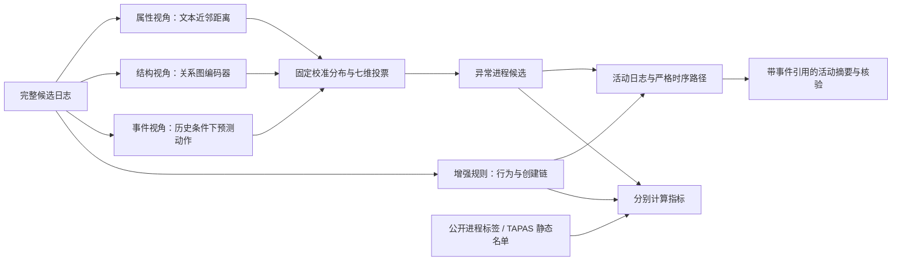

# 三篇溯源图论文对 NODOZE 的适用性与实测

本轮选择“分开学习属性、结构和事件异常，再进行可解释融合”作为学习模型的改进方向；同时把证据引用、活动摘要和报告核验接入现有调查流程。新增模型确实经过训练，但在当前 OPTC 窗口上仍不如增强规则，因此保留为实验选项，没有替换默认检测器。

默认窗口的公开进程标签下，旧神经模型命中 0/8，新多视角模型命中 3/8，增强规则命中 8/8；对应误报为 3、11、1。TAPAS 静态进程清单下，新模型命中 7/44，规则命中 9/44。**这些结果不支持“融合模型已优于规则”，也不支持“TAPAS 召回达到 90%”。**

## 论文及代码核查

| 论文 | 已阅读的重点 | 实现取舍 |
|---|---|---|
| OCR-APT，CCS 2025 | §5 的分类型行为建模、§6 的逐阶段调查和 IOC 校验、§7.6 的评估与泛化限制 | 借鉴行为结构与证据校验；本轮没有复现 OCRGCN 或调用 LLM |
| Slot，CCS 2025 | §4.3 的关系挖掘、§4.4 的 Bandit 邻居选择、§4.5 的半监督训练、§4.6 的链重建 | 关系类型进入图编码器；暂不移植依赖攻击监督的邻居选择策略 |
| PROVFUSION，作者仓库标注 S&P 2026 | §4.2 的三个独立视角、§4.3 的七维投票、§5 的消融和标注修订 | 作为多视角实验的主要设计来源；明确列出与原方法的差异 |

OCR-APT 使用行为特征和关系图建模，并用来源数据校验调查中的实体。值得注意的是，其常规评估与更严格的直接恶意节点评估分别报告；邻近节点不能不加说明地算作攻击命中。NODOZE 因此继续区分攻击候选、上下文节点和资源，不扩大标签分母。[^1]

Slot 的强化学习主要调整不同关系下的邻居保留比例，其相似性与检测训练包含少量攻击监督。它不是把任意图搜索改称强化学习，也不能在同一批攻击节点上训练后继续当作独立测试。本轮没有找到可确认的作者公开实现，未用第三方同名项目冒充复现。[^2]

PROVFUSION 将属性密度、结构表示及边类型预测异常分开，再做分位归一化和七维投票。代码搜索摘要存在滞后：作者仓库的当前提交已经包含训练与融合代码。本轮读取了主训练文件、边预测文件和阈值实验文件。[^3][^4]

作者代码固定于以下提交，未将第三方代码复制进本项目：

| 仓库 | 检查的提交 | 重点文件 |
|---|---|---|
| CoDS-GCS/OCR-APT | `d927daf6057c80a46bdc5e44d7aa373d4a3ad5d3` | `ocrgcn.py`、`detect_anomalous_subgraphs.py`、`ocrapt_llm_investigator.py`、`llm_prompt.py` |
| Joney-Yf/ProvFusion | `9364b16d6915ca7d48555c5405f1d4fb97215e9a` | `ProvFusion.py`、`link_prediction_evaluation.py`、`try_different_threshold.py` |

## 为什么选择这个方案

当前项目有两个不同问题。规则的直接行为条件覆盖较窄，但其进程创建链证据明确；旧学习模型把文本和行为混在一起训练，异常距离的来源不容易解释，而且默认窗口没有命中参考攻击进程。增加独立视角可以检验“文本新颖”和“结构异常”是否提供互补信息，而不是继续叠加一个难解释的总分。

比较过三个方向：第一，完整移植论文系统，需要重建异构图数据、标签协议、数据库和训练管线，不能把当前小窗口适配的结果当作完整复现。第二，直接合并规则与学习模型的所有告警，会把学习模型的误报带入默认结果。第三，保留规则对照，独立实现多视角学习并同时展示证据。当前采用第三种，所有模型使用相同候选日志和两套标签。

强化学习并不是当前最先需要补的部分。现有三个攻击窗口相互重叠，攻击训练与测试难以独立；先解决正常训练覆盖、窗口长度效应、对象类型覆盖和标签范围，才有条件评估邻居策略的真实收益。本轮没有把手工邻居筛选称为 Slot 的强化学习。

## 已实现的算法



图中的规则与多视角是可切换的独立检测器，不是默认取并集。Ground truth 只进入评估，不进入训练、阈值校准或节点推断。

**属性视角**使用每分钟进程映像名和命令文本的字符三元组向量，计算与训练历史的五近邻平均距离。该视角刻意独立于图结构。它不使用 PID、UUID、攻击 IP 清单或载荷文件名查表，但仍可能把合法的新程序当作异常；字符哈希不是语义理解，也不保证抵抗改名。

**结构视角**使用 27 维行为特征：不同方向的动作比例、资源与进程交互数量、持续时间和平均间隔。图编码器包含两层关系感知消息聚合，以随机掩码重建作为训练目标，再在学习到的表示空间中计算近邻距离。进程之间保留创建、访问、终止等关系及其反向类型；文件和网络活动进入行为特征。本轮是进程图适配，资源没有作为完整异构图顶点参与消息传递。结构输入不包含进程名或命令文本。

**事件视角**使用独立 MLP 预测当前动作类型。输入包含该进程在同一分钟内严格更早的动作历史、已观测到的映像名、当前对象类型以及时间间隔。当前动作不进入输入，同一时刻的记录先全部生成输入，再更新历史。用真实动作的负对数预测概率作为事件异常分，按进程取最大值。这是条件事件预测，不是因果效应识别；它与原论文的端点表示、多标签边预测也不同。

**融合视角**先在较早校准进程的分数上计算经验中位秩，得到三个可比较的百分位。七个维度分别是三个单视角、最高两视角求和、最高两视角加权平均、三视角求和、三视角加权平均；加权强度固定为 5。每维阈值取校准数据的 99% 分位，严格超过才投票，至少四票产生候选。校准值没有变化的维度弃权，避免统一分数全部告警。

这里使用 99% 分位与严格比较，是沿用本项目历史校准策略的适配选择，不是论文默认最大值阈值和比较符号的逐字实现。七个维度相互相关，不能当成七份独立证据；百分位和票数都不是恶意概率。长窗口取最大值会增加极端值出现的机会，因此没有宣称 1% 的实际误报率保证。

模型包记录训练、验证和校准日志集合哈希、权重哈希、随机种子及特征代码哈希。加载时校验权重和相关特征代码，代码不兼容时要求重新训练；候选窗口与训练或校准重叠时拒绝评分。

## 数据与实验协议

所有时间均为 2019-09-23、UTC−04，同一台 SysClient0201 主机。

| 用途 | 时间 | 原始事件数 |
|---|---|---:|
| 训练 | 09:10–10:00 | 167,872 |
| 验证、选择训练轮次 | 10:00–10:10 | 60,445 |
| 固定异常阈值 | 10:10–10:40 | 80,399 |
| 背景测试 | 10:50–11:10 | 74,654 |
| 攻击测试一 | 11:20–11:30 | 27,011 |
| 攻击测试二 | 11:20–11:50 | 86,318 |
| 攻击测试三 | 11:20–12:20 | 188,609 |

校准区间包含 208 个进程 UUID。正常性依据是较早的活动时段假设，不等于每条日志都经过人工排除攻击。主实验种子固定为 913，另运行 914、915 检查随机性；没有按测试集挑选最好的种子替换主模型。

三个攻击窗口是已知开发示例，且包含关系明显，不能把它们当作三个独立测试集计算平均泛化性能。更不能把同一进程在三个窗口的命中当作三个独立攻击成功案例。测试阶段才读取公开进程标签和 TAPAS 节点切片，模型参数不会据此改变。

## 实测对照

以下为主种子 913。增强规则在三个攻击窗口均为 8 个命中、1 个误报、0 个漏报。

| 窗口 | 旧神经模型命中 / 误报 | 新多视角命中 / 误报 | 新模型公开进程召回 | 新模型 TAPAS 命中 / 分母 |
|---|---:|---:|---:|---:|
| 10 分钟 | 0 / 3 | 3 / 11 | 37.50% | 7 / 44 |
| 30 分钟 | 2 / 27 | 3 / 20 | 37.50% | 12 / 69 |
| 60 分钟 | 2 / 35 | 3 / 24 | 37.50% | 12 / 70 |
| 背景 20 分钟 | 0 / 5 | 0 / 26 | 无公开攻击正例，召回不定义 | 9 / 50 |

默认窗口新模型的公开进程 Precision 为 21.43%，F1 为 27.27%；增强规则对应 88.89% 和 94.12%。TAPAS 默认窗口新模型召回为 15.91%，增强规则为 20.45%。背景窗口的 TAPAS 名单投影仍只反映 UUID 是否列入静态清单，不能把其命中解释成在背景时段发现了已确认攻击。

### 消融与稳定性

默认窗口只使用属性视角时命中 5 个公开攻击进程，但产生 20 个误报；只用结构视角命中 0 个、误报 1 个；只用事件视角命中 0 个、误报 6 个。融合降低了属性视角的部分误报，也丢失了部分命中。这是当前实验的具体取舍，不能用“互补”一词掩盖实际退步。

种子 914、915 在默认窗口均命中 2/8，误报分别为 10、7；背景误报分别为 20、17。种子变化没有改变“独立学习模型不足以替换规则”的结论。[可下载对照图](figures/multiview-results.png) 与 [图表数据 CSV](multiview-chart-data.csv) 展示默认窗口和背景误报。详细结果见 [主对照](multiview-evaluation.json)、[种子检查](multiview-seed-stability.json) 和 [训练记录](multiview-training.json)。

训练在当前机器上约半分钟完成；推断时间随窗口规模变化，逐次运行时间记录在主对照文件。该计时包括相应检测器推断，不含完整网页剪枝、缓存序列化、绘图和浏览器交互，因此不能当作端到端响应时间。

## 已上线的调查改进

网页增加“多视角学习 · 实验”，保留增强规则、旧规则、旧神经模型对照。点击候选进程可以分别查看属性、结构和事件视角的原始分、历史百分位及最终票数；固定校准线不能通过当前示例上的分位选择器修改。

“从日志看发生了什么”汇总进程活动、文件活动和网络通信，每类显示时间范围、事件数量和原始日志入口。它按观察到的活动类型组织，不是声称识别出了所有 APT 阶段。初始入侵、提权成功、持久化建立、数据外传仍明确标为没有充分证据。

摘要采用本地确定性生成，没有隐式调用远程 LLM，也没有把模板称为大模型推理。这样先建立可以核验的事实层，以后如接入自然语言生成，模型输出仍必须引用并通过同样的事实核验，不能直接写入攻击标签。

模型证据通过共享的分钟上下文索引保存，每个视角引用范围，不再向每个进程重复写入相同日志。60 分钟模型报告由初版约 780 MB 降至约 28 MB；网页响应省略共享索引，完整索引保留在下载报告。模型证据包含评分上下文：结构视角引用所在分钟的图事件，事件视角引用当前目标事件及其严格更早的分钟上下文。引用事件不代表这些上下文事件都恶意。离线核验器检查视角引用、联合证据、投票一致性、摘要事实、活动成员与严格时序路径；**它不重新训练模型，也不证明分数最优、日志来源真实或完整攻击链正确。**

## 结论与适用边界

本轮实现了可复现的学习实验、可阅读的独立视角、完整上下文引用和可核验的活动摘要。学习模型相对旧实验分支在部分窗口有所改善，但总体没有超过现有增强规则。默认保留增强规则，是由当前对照结果决定的。

后续若要验证学习方法的真正收益，应扩充跨日正常日志，覆盖浏览器、系统界面和商店应用等合法行为；增加完整资源节点的异构图建模；按固定时间块校准告警负担；在独立主机或独立攻击阶段验证。对于 TAPAS 静态名单，仍需要建立带时间范围的参考解释，不能先删除难识别节点再报告高召回。以上是后续研究条件，不是本轮已完成的性能承诺。

## 验证

完整 Python 测试通过 420 项；独立代码复核完成。四个示例均检查了检测器切换、三视角分数、日志跳转、报告导出和桌面/移动布局，最大原图为 188,609 条边。模型导出的原始事件引用、严格时序路径及活动摘要通过一致性核验；核验不代表重新计算了神经网络分数，也不证明候选必然恶意。

## 复现

```bash
python webapp/scripts/train_multiview.py
python webapp/scripts/evaluate_multiview.py
python webapp/scripts/plot_multiview.py
python -m pytest -q tests/test_multiview.py tests/test_attack_story.py tests/test_attack_inference.py webapp/tests/test_app.py
NODOZE_TEST_URL=http://127.0.0.1:8000 python webapp/scripts/verify_multiview_view.py
python webapp/scripts/verify_attack_report.py downloaded-attack-report.json
```

浏览器脚本会重新分析示例并在结束时恢复规则检测器。训练脚本要求本机已经准备好 OPTC SQLite 语料；GitHub 中的权重可直接用于已准备的示例，原始数据不随代码重复上传。

## 来源

[^1]: Ahmed Aly, Essam Mansour, Amr Youssef. [OCR-APT: Reconstructing APT Stories from Audit Logs using Subgraph Anomaly Detection and LLMs](https://arxiv.org/abs/2510.15188), CCS 2025，作者扩展版；[出版 DOI](https://doi.org/10.1145/3719027.3765219)。方法 §5–6、限制 §7.6。
[^2]: Wei Qiao et al. [Slot: Provenance-Driven APT Detection through Graph Reinforcement Learning](https://yebof.github.io/assets/pdf/qiao2025ccs.pdf), CCS 2025, pp. 963–977；[出版 DOI](https://doi.org/10.1145/3719027.3744788)。方法 §4、监督比例 §4.5 / §5。
[^3]: Fan Yang, Binyan Xu, Di Tang, Kehuan Zhang. [Beyond Nodes vs. Edges: A Multi-View Fusion Framework for Provenance-Based Intrusion Detection](https://arxiv.org/abs/2604.14685), 2026；方法 §4、评估 §5。
[^4]: 作者代码：[PROVFUSION 固定提交](https://github.com/Joney-Yf/ProvFusion/tree/9364b16d6915ca7d48555c5405f1d4fb97215e9a)、[OCR-APT 固定提交](https://github.com/CoDS-GCS/OCR-APT/tree/d927daf6057c80a46bdc5e44d7aa373d4a3ad5d3)。核查日期：2026-09-13。
