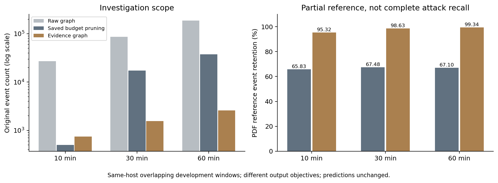

# 从原始 Ground Truth 到可核验的攻击调查

> 数据使用状态：当前 OPTC 窗口已暂停正式攻击识别基准，本文数值保留为历史局部诊断；[新的准入规则与传播研究](social-propagation-study.md#数据集准入与暂停使用)。

当前适合 NODOZE 的方案是：以红队原文为评估依据，保留现有规则检测器，增加独立的证据子图与可逆事件聚合。它改善的是调查范围和证据保留，不把上下文节点升级成攻击节点，也不把不完整标签变成完整正确率。本轮没有找到足以支持替换规则的学习模型，更没有证据证明某种组合在所有数据集上“最优”。

两份输入必须分开。新上传的压缩包包含 DARPA E3/E5 标签，没有 OPTC；当前网页的 OPTC 节点根据四页 `OpTCRedTeamGroundTruth.pdf` 独立整理和解析。TAPAS 节点名单不再进入默认评估或页面标签。旧实验可显式启用历史 TAPAS 对照，但其结果不充当新的 Ground Truth。

## 原始材料与对应范围

压缩包 `ground-truth-012f321f46137650496e639b0ad7e0a66db07a73.zip` 的 SHA256 为 `a967a224c6f02a6045892137e11919eea5fb3bdc8fa2e711ce086fd39b6fa16a`。12 份 CSV 共 482 行、476 个去重的数据集/UUID 对，覆盖 CADETS、THEIA、CLEARSCOPE 的 E3/E5。其 README 说明三列分别为原始 UUID、实体属性及 ORTHRUS 数据库内部索引。匹配使用原始 UUID，大小写不敏感，不使用内部索引。

这 12 份 CSV 与现有本地标签逐字节一致，因此本次是重新核验已有开发数据，不是新增独立测试集。本机可匹配五个 E3 场景的数据库，标签 UUID 共 194/194 个匹配；四个场景具有完整的可比较保存结果。没有找到相应 CLEARSCOPE/E5 数据库，不能为它们给出性能数字。TRACE 虽然存在日志，也不能套用这份压缩包。

OPTC 原文共四页。第 1–2 页是第一天 PowerShell Empire；第 2–3 页是第二天定制 Empire、横向移动与外传；第 3–4 页是第三天恶意软件更新与进程迁移。这些日期、主机和成功/失败描述不能混用。当前四个网页窗口均为第一天 SysClient0201，同主机窗口存在包含关系，不是四个独立攻击实验。

## 根据 PDF 得到的具体节点

原文第 1 页的代理表明确列出如下两项。表中 PID 本身不是日志 UUID，必须继续通过日志解析。

| PDF 代理 | 主机 | PID | 日志中唯一绑定的进程 UUID | 原文时间依据 |
|---|---|---:|---|---|
| VL8B5T3U | Sysclient0201 | 5452 | `96913629-c1c9-4503-9586-4a91de0e7311` | 11:24:54 上线，11:26:56 执行结束代理操作 |
| LUAVR71T | Sysclient0201 | 2952 | `a52f6519-6265-4437-9f6c-3402fb245cc7` | 11:26:38 提权代理上线；第 2 页 14:06:01 结束代理 |

这两个身份由主机、日期、PID、时间范围和向 PDF 记载的 C2 地址通信的 actor UUID 联合绑定。节点没有按 PID 合并；同 PID 若出现两个符合条件的 actor，则标为歧义而不是任选一个。第 1 天的 19 个代理全部登记在 [原文参考清单](../poi/optc-pdf-reference.json)，不属于当前主机或时间的代理明确标为范围外，不计作当前漏报。

原文记录的操作时间不是每条遥测的精确开始/结束时间。解析允许首尾各 60 秒的记录偏差，采用日志的 UTC−04 时区；这是公开的解析约定，不是根据模型得分调出的阈值。原文身份字段、C2、每个时间边界分别引用页码和实际片段。加载时核对 PDF 内容哈希，并验证结构化 PID、主机、代理 ID、IP 和时间是否与引用一致；仅保留一段正确引用却篡改 PID 会被拒绝。

PDF 第 1 页还记载下载 `runme.bat`，对应窗口内文件 UUID 为 `dff7bc51-f576-4b7a-b822-0d6a323d6572`。它作为命名文件参考单列，相关读取者不因此变成攻击进程。C2 的不同网络流 UUID 同样作为通信资源单列，不冒充被控制的进程。

尤其需要保留失败语义：第 1 页 11:38:09 明确写到 LSASS 注入似乎失败，11:41:50 是重试但未给出该次结果，不能把 LSASS 判为已失陷。第三天另有明确成功迁移到 LSASS、lwabeat 的记录，但属于不同主机和日期。第二天/第三天的代理和活动仅作原文范围说明；本轮没有相应网页窗口，不虚构其节点 UUID。

### 标签能支持什么指标

规则和多视角模型均找回上述 2/2 个确认代理，旧神经模型为 0/2。规则的另外 7 个预测、默认窗口多视角的另外 12 个预测在此原文口径下仍未判定。PDF 没有逐个正常进程标签，因此不能计算完整精确率、Accuracy 或 F1。2/2 只能称为“PDF 已确认代理找回率 100%”，不能称为全体攻击召回 100%。排除手动 POI 的进程端点后也单独统计，避免把人工已知起点当作算法的新发现。

PDF 可观测事件参考由代理身份所关联的 C2 通信和指定时段的命名文件活动构成。对命名文件的正常索引、扫描读取也可能在其中，所以它不是逐事件恶意标签。这些参考事件用于检验调查证据是否被保留；完整攻击路径精确率和召回率继续为空。

旧页面的公开标签把 8 个进程作为攻击，并按补集规则把其他进程计正常；新 PDF 只有两个直接确认代理。由 8 改成 2 是来源与范围的改变，不是算法提升。不会因分母变小而宣布完成全面 90% 召回目标。

## 上传压缩包的实际复算

下面使用已经完成的历史 RASP-D 输出重新计算；不是本轮新证据图在 DARPA 上的检测结果。事件集合是指定时段内两个端点都出现在 CSV 的日志事件，称为“CSV 核心派生事件”，不能自动等同于完整真实攻击链。

| 场景 | 保存结果保留的 CSV 节点 | 节点保留率 | CSV 核心派生事件保留 |
|---|---:|---:|---:|
| CADETS E3 · 06 | 8/8 | 100% | 268/268 |
| CADETS E3 · 12 | 35/43 | 81.40% | 4,958/5,000 |
| CADETS E3 · 13 | 14/24 | 58.33% | 419/497 |
| THEIA E3 · Case 3 | 61/61 | 100% | 870/870 |

候选图包含对应场景的全部这些节点和核心事件，剩余损失发生在剪枝阶段。CADETS 12 的事件保留率很高，但仍丢失 8 个标注节点；CADETS 13 丢失 10 个，不能被总事件指标掩盖。CSV 没有给出可靠负例，表格不是分类精确率或正确率。

CADETS 13 的旧报告有 420/498，与这里的 419/497 不同。复核发现多出的记录是 09:16:26.684642175 的 sshd C2 事件，超过 CSV 核心参考的 09:16:00 边界，且目的节点不在 CSV。旧报告使用了额外的红队报告确认事件。两种范围分别保留，不能悄悄混用。

THEIA Case 1 的较新修正运行在 250,000 个候选处停止，没有完成剪枝结果。更早的单 POI 保存结果仅含一条边，覆盖 2/58 个节点、1/25,217 个核心事件；它属于不同、过窄的历史配置，不能替代未完成的修正运行。各数据集缺失状态、输入路径、哈希和独立复算见 [归档评估](uploaded-groundtruth-evaluation.json) 与 [核验说明](uploaded-groundtruth-audit.md)。

## 十五篇论文的阅读结果与取舍

六篇取得全文并阅读了主要方法、评估及相关限制：CONTEXTS、TAPAS、ORTHRUS、ProHunter、ProGQL、Slot。其余九篇只能核查出版社摘要、引言或片段；出版社全文访问受限，定向检索未找到可取得的作者全文。它们不能被称为“已精读全文”。每篇的实际阅读范围、作者、出版信息、链接、可获得 PDF 的哈希及代码检查范围记录在 [来源清单](pdf-groundtruth-paper-sources.json)。

| 论文 | 可确认的方法或目标 | 对当前项目的取舍 |
|---|---|---|
| CONTEXTS，S&P 2025，全文 | 外部告警上下文映射为路标，相关路径、进程层级和条件邻域扩展 | 借鉴共享资源边界和路标；使用检测器已有证据，不用测试 PDF 生成推断路标。[^1] |
| TeRed，TIFS 2025，部分 | 用单元测试学习正常行为以缩减图 | 当前缺少匹配的正常行为测试语料；不把摘要的实验保留结论当成普遍保证。[^2] |
| TAPAS，Security 2025，全文 | 进程骨干、LSTM/GRU 表示、任务分割 | 借鉴分组和活动范围；本轮没有复现其循环网络或照搬标签。[^3] |
| ORTHRUS，Security 2025，全文 | 异构对象属性、严格早于事件的邻域、事件预测与调查重建 | 值得用于后续资源感知表示；区分发现一次攻击和找全全部节点。[^4] |
| PDCleaner，C&S 2025，部分 | 事件删除、实体聚合和相似链合并 | 其压缩带有语义损失；本轮采用可逆分组，保留原始 ID。[^5] |
| MPCA，IST 2025，部分 | 分别评价事件可信度与告警关联 | 保持恶意判断与 POI 相关性分离，不能共用一个概率名义。[^6] |
| FineGCP，C&S 2025，部分 | 任务执行单元分割、社区聚类与标签传播 | 不把社区纯度当节点召回，也不把社区成员全部判攻击。[^7] |
| 多源日志调查，C&S 2025，部分 | 应用/系统日志语义融合、报告模板与图匹配 | 当前只有实际已收集的日志；不能虚构应用日志或用测试真值生成模板。[^8] |
| LinTracer，C&S 2025，部分 | 从告警向后定位入口、向前语义传播 | 双向调查需要分别保留真实时序证据；本轮没有声称复现其打分公式。[^9] |
| ProHunter，C&S 2026，全文 | 语义压缩、时序采样、CTI 查询图匹配 | 高召回涉及带攻击先验的图匹配，不能转称自主节点检测召回。[^10] |
| ProGrasp，KBS 2026，部分 | 结构预测、纠错及属性压缩 | 存储效率与检测能力是两件事；应计入重建成本。[^11] |
| TraceBack，KBS 2026，部分 | 给定相关 POI 后的因果范围与 BERT/VAE 序列排序 | 可以作为后续调查排序方向；全文未取得，不实现猜测的公式。[^12] |
| VGAE4PG，CSCWD 2026，部分 | 根据语义差异指导图缩减 | 缩减比例不证明攻击保留；暂不加入无法核验的破坏性学习剪枝。[^13] |
| ProGQL，ICDE 2026，全文 | 受约束的时序遍历、影响传播、查询组合 | 借鉴精确事件集合组合；其人工调整查询的实验不能当固定检测器结果。[^14] |
| Slot，CCS 2025，全文 | 隐藏关系、邻居保留的 Bandit 策略及半监督学习 | 缺少独立攻击监督划分，暂不直接移植强化学习。[^15] |

CONTEXTS 的原始评估是在自建 Linux 内核漏洞实验中，用同次运行的系统调用参考图验证边级结果；它不是 OPTC 节点分类的现成证明。论文允许没有外部静态路标时使用进程祖先/后代，本轮只采用与现有证据接口相容的局部思想，不宣称完整实现其知识库、Neo4j 查询或 K 最短路。

ORTHRUS 作者仓库还说明原实验没有固定 PYTHONHASHSEED，导致原结果不能精确复现。ProHunter 的查询图来自攻击后报告；ProGQL 的评估允许增加入口 Top-N 直到找回关键边或噪声过大。上述信息决定了复现实验必须说明先验、调参和任务单位，而不能只抄结果表里的最高数字。

## 已实现的算法与可证明边界

新增证据图以固定检测器预测为输入，保留判定证据、已输出路径及预测进程的活动事件。对于多视角模型，也保留完整特征上下文引用。随后允许从候选进程写入的文件追踪严格更晚、120 秒内的读取事件；当文件连接至少 5 个非候选进程时停止此类扩展。只做一次资源扩展，不递归污染读取者，也不把 OPEN 当成写入传播。

分组键为源 UUID、目的 UUID、关系类型和一分钟时间块。每组保留有序事件 ID、条数和起止时间，能够恢复所选子图内的每条事件。资源扩展使用时间排序与二分查询寻找严格更早的写入，避免逐次扫描全部写入历史。分钟分组仅改变展示，不用于证明组内任意两个事件能连成路径。

可以逐例核验三个不变量：判定与路径证据都在所选集合中；每条所选事件恰好属于一个聚合组；组内端点、类型、时间与原始日志一致。它们证明的是实现层面的证据保留和可恢复性，不证明输入检测器正确、所有真实攻击都被保留或日志本身没有被篡改。

离线完整候选重算能够核验扩展选择；下载报告则核验导出事件与聚合分组一致性。由于下载报告不包含被省略的全部背景事件，导出核验不会冒充重新执行了共享资源边界选择，字段 `context_selection_recomputed` 明确为 false。

## 实验解释

| 窗口 | 原始事件 | 当前预算剪枝 / PDF 参考保留 | 新证据图事件 / 聚合组 | 新证据图 PDF 参考保留 |
|---|---:|---:|---:|---:|
| optc-0201 | 27,011 | 498 / 65.83% | 744 / 606 | 265/278 · 95.32% |
| optc-0201-30m | 86,318 | 17,263 / 67.48% | 1,551 / 1,397 | 934/947 · 98.63% |
| optc-0201-60m | 188,609 | 37,721 / 67.10% | 2,584 / 2,430 | 1,966/1,979 · 99.34% |
| optc-0201-background | 74,654 | 14,034 / 不适用 | 0 / 0 | 0/0 · 不适用 |



图表原始数值：[CSV](pdf-context-chart-data.csv)；完整模型对照：[JSON](pdf-groundtruth-evaluation.json)。

默认窗口保存的预算剪枝模式是 evidence，较长两个窗口是 context，因此这里比较的是各示例当前配置与证据图，不是严格相同优化目标、相同输出边数的算法竞赛。证据图独立于预算，它不会偷偷改写原来的保留位或伪造预算审计。原图和原预算结果仍可查看。

本轮规则配置下，边界阈值 2、5、10 及近似取消边界的消融输出相同。这意味着实测收益主要来自完整保留预测进程活动及证据，再做展示聚合，不能宣称共享资源阈值带来了额外性能提升。边界逻辑的作用由针对共享资源的合成测试检验，仍需更广泛真实数据验证。

三个攻击窗口都遗漏相同的 13 条 PDF 参考事件：11 条属于命名文件相关活动，其中有索引/扫描、另一个 cmd UUID 的读取及清理；另两条是代理结束后的 C2 遥测。前者不能仅凭共享文件或相同 PID 提升为攻击进程；后者与进程结束边界存在语义冲突。没有为追求 100% 删除它们的分母，也没有用原文标签反过来补齐推断输出。

三个窗口重叠；数据和已有规则此前已用于开发；PDF 正例仅有两个代理。结论限于这些示例的调查可读性和参考证据保留。后续要比较更强检测器，应补齐独立主机/日期、完整资源节点和跨分钟历史，并先冻结参数，再评估带时间范围的人工标注；不应按测试标签挑选最优 Top-N 或种子。

## 验证

完整 Python 测试通过 439 项。四个网页示例通过桌面/移动布局、完整原图、证据图原始计数、日志过滤、原始事件跳转和报告下载核验；独立代码复核没有剩余的中高风险问题。核验记录见 [浏览器与导出结果](pdf-context-browser-verification.json)。

## 页面与复现

页面主指标现在显示 PDF 确认代理的找回率、命中数、尚待判定预测数和排除 POI 后的找回率。节点表使用 PDF 确认/尚未判定标签，展开“查看 PDF 节点及原文依据”可查看页码、原句与 UUID。右侧图可切换“预算剪枝结果”和“证据聚合图”；日志筛选支持展开证据图的原始事件，调查报告包含完整分组映射。

```bash
python webapp/scripts/evaluate_pdf_groundtruth.py
python -m pytest -q
NODOZE_TEST_URL=http://127.0.0.1:8000 python webapp/scripts/verify_pdf_context_view.py
python webapp/scripts/verify_attack_report.py downloaded-attack-report.json
python webapp/scripts/evaluate_uploaded_groundtruth.py \
  --archive /root/ground-truth-012f321f46137650496e639b0ad7e0a66db07a73.zip \
  --config docs/uploaded-groundtruth-inputs.json \
  --output-dir webapp/runtime/archive-replay
```

原始日志、SQLite 数据库和上传压缩包仍由本地提供，GitHub 保存代码、PDF 参考定义、来源清单、指标和核验产物，不重复上传大体积原始语料。归档输入配置记录本次实际本地路径，迁移机器时需要调整这些路径。

## 来源

[^1]: Mohammadi et al. [CONTEXTS，作者全文](https://azadeht.github.io/papers/CONTEXTS-sp25.pdf)，S&P 2025，§3–4 与参考图附录。
[^2]: Li et al. [TeRed](https://ieeexplore.ieee.org/document/11133429/)，TIFS 2025，出版社摘要，未取得全文。
[^3]: Zhang et al. [TAPAS](https://www.usenix.org/system/files/usenixsecurity25-zhang-bo-tapas.pdf)，USENIX Security 2025，§4–5。
[^4]: Jiang et al. [ORTHRUS](https://www.usenix.org/system/files/usenixsecurity25-jiang-baoxiang.pdf)，USENIX Security 2025，§4–6；[作者仓库](https://github.com/ubc-provenance/orthrus)。
[^5]: [PDCleaner](https://www.sciencedirect.com/science/article/pii/S0167404825000483)，C&S 2025，出版社可访问摘要与片段。
[^6]: [MPCA](https://www.sciencedirect.com/science/article/abs/pii/S0950584925000096)，IST 2025，出版社可访问摘要与片段。
[^7]: [FineGCP](https://www.sciencedirect.com/science/article/pii/S0167404824006175)，C&S 2025，出版社可访问摘要与片段。
[^8]: [A multi-source log semantic analysis-based attack investigation approach](https://www.sciencedirect.com/science/article/pii/S0167404824006096)，C&S 2025，出版社可访问摘要与片段。
[^9]: [LinTracer](https://www.sciencedirect.com/science/article/pii/S0167404825001026)，C&S 2025，出版社可访问摘要与片段。
[^10]: Qiu et al. [ProHunter](https://arxiv.org/abs/2603.19658)，C&S 2026 作者预印本，§3–4；[作者代码](https://github.com/xueboQiu/ProHunter)。
[^11]: [ProGrasp](https://www.sciencedirect.com/science/article/pii/S0950705126007124)，KBS 2026，出版社可访问摘要与片段。
[^12]: [TraceBack](https://www.sciencedirect.com/science/article/abs/pii/S095070512601542X)，KBS 2026，出版社可访问摘要与片段。
[^13]: [VGAE4PG](https://doi.org/10.1109/CSCWD68734.2026.11581538)，CSCWD 2026，IEEE 摘要。
[^14]: [ProGQL，作者发表版](https://xusheng-xiao.github.io/papers/progql_icde2026.pdf)，ICDE 2026；[技术报告](https://arxiv.org/abs/2510.22400)，§IV–V；[作者代码](https://github.com/ProGQL/ProGQL)。
[^15]: Qiao et al. [Slot，CCS 最终作者版](https://yebof.github.io/assets/pdf/qiao2025ccs.pdf)，CCS 2025，§4–5。
