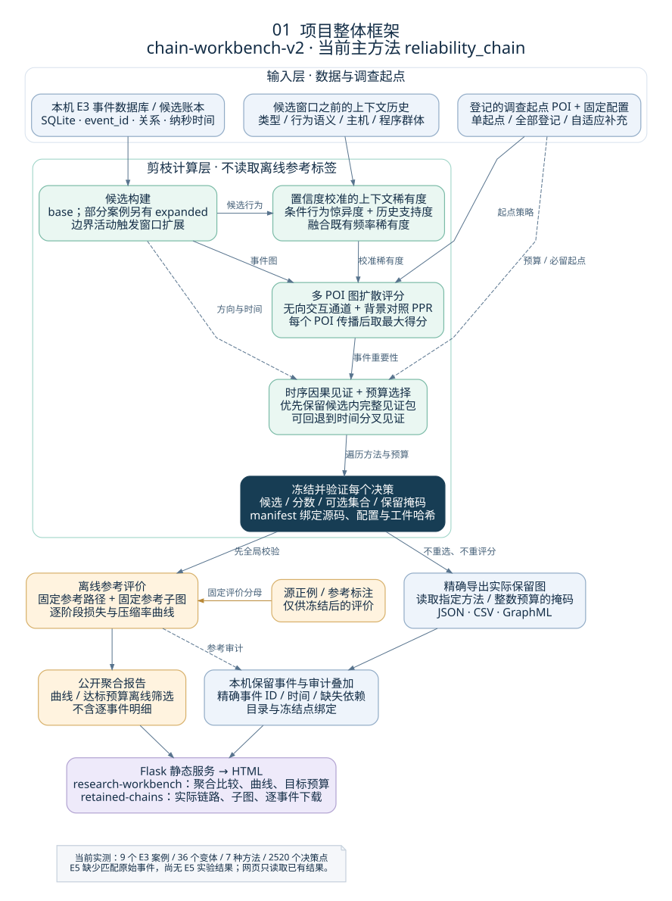
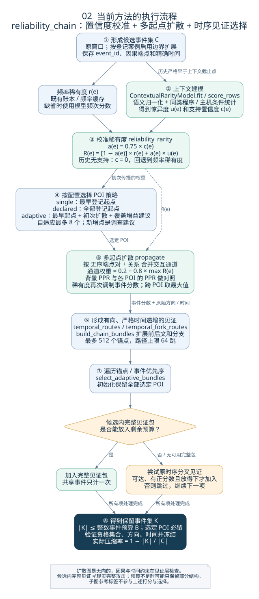
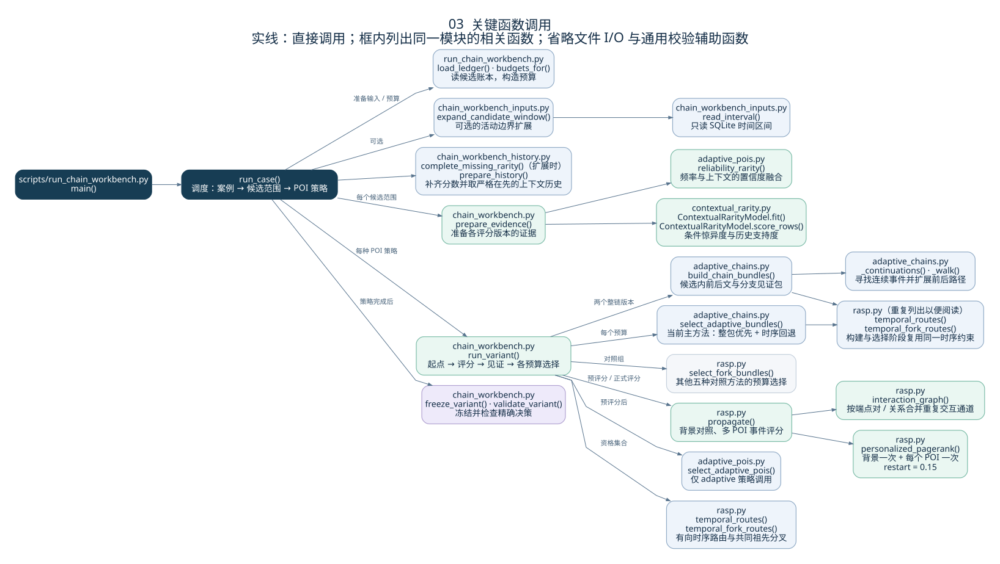
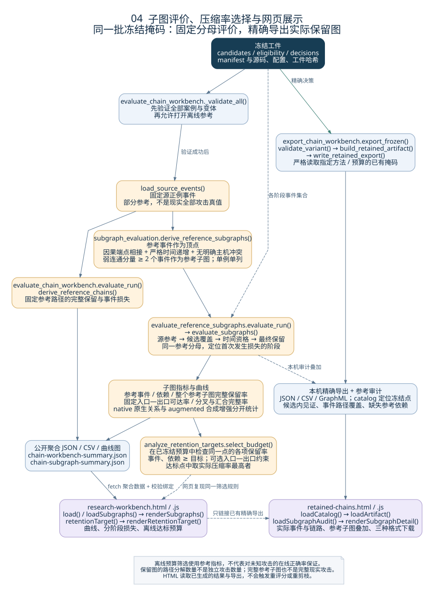

# 当前方法与项目框架图

这组图对应 `chain-workbench-v2`、运行 `20260930-r1` 和主方法 `reliability_chain`，根据代码版本 `8226c249c085ced9e474182b55205aad6efc4313` 核对。它描述当前研究工作线；仓库早期 CLI、RASP-RCVP、V8 等工作线分别保留各自说明，不混入本图的调用流程。

启动现有 Flask 服务后，访问 **http://127.0.0.1:8000/assets/project-architecture.html**。研究工作台顶部也提供“方法与框架图”入口。该页面不依赖实验数据库，能展示全部四张图及公式，提供 SVG 放大和 PNG / PDF 下载。HTML 使用相对资源路径，也可以直接打开本地文件。

| 图 | 回答的问题 | 可下载文件 |
|---|---|---|
| 01 整体框架 | 数据、剪枝、冻结结果、离线评价和网页怎样连接？ | [SVG](../../webapp/frontend/project-architecture/01-framework.svg) · [PNG](../../webapp/frontend/project-architecture/01-framework.png) · [PDF](../../webapp/frontend/project-architecture/01-framework.pdf) |
| 02 方法流程 | 稀有度、多个 POI、扩散、因果见证怎样共同决定保留事件？ | [SVG](../../webapp/frontend/project-architecture/02-method.svg) · [PNG](../../webapp/frontend/project-architecture/02-method.png) · [PDF](../../webapp/frontend/project-architecture/02-method.pdf) |
| 03 函数调用 | 从运行入口到关键实现，应该读哪些函数？ | [SVG](../../webapp/frontend/project-architecture/03-calls.svg) · [PNG](../../webapp/frontend/project-architecture/03-calls.png) · [PDF](../../webapp/frontend/project-architecture/03-calls.pdf) |
| 04 评价与展示 | 子图保留率、阶段损失、压缩目标与链路导出怎样进入 HTML？ | [SVG](../../webapp/frontend/project-architecture/04-evaluation.svg) · [PNG](../../webapp/frontend/project-architecture/04-evaluation.png) · [PDF](../../webapp/frontend/project-architecture/04-evaluation.pdf) |

## 01 · 整体框架



剪枝计算只接收候选事件、历史证据、调查起点和固定参数。登记 POI 属于报告辅助的调查输入；自适应补充 POI 是算法建议。不能将“剪枝不读取离线参考标签”解释为“起点来自独立无监督检测”。

每个决策先被冻结：`candidates.json.gz`、`history.json.gz`、`bundles.json.gz`、`decisions.npz`、`scores.npz`、`eligibility.npz`、`evidence.npz`，以及记录来源和哈希的 `manifest.json`。离线评价和保留图导出使用同一冻结选择。

## 02 · 方法流程



令频率稀有度为 `r(e)`，上下文惊异度为 `u(e)`，历史支持置信度为 `c(e)`。实际融合是：

```text
a(e) = 0.75 × c(e)
R(e) = [1 − a(e)] × r(e) + a(e) × u(e)
```

无上下文历史支持时，`c(e)=0`，退回频率稀有度；这不表示事件正常，也不保证频率偏差已完全消除。新上下文历史严格早于完整候选窗口，旧稀有度账本 / 缓存的统计时间口径另有记录。

传播按“无序端点对 + 关系”合并交互通道，通道权重为 `0.2 + 0.8 × max R(e)`。在这个**无向**图上，分别计算背景 PPR 与每个 POI 的 PPR；用相对背景的正增益衡量 POI 关联性，再乘事件稀有度权重。各 POI 的归一化事件分数取最大值，另有 `10^-6` 的普通 PPR 回退项。它并非简单的“稀有度分数 + 扩散分数”。精确公式在 [HTML 页面](../../webapp/frontend/project-architecture.html) 的第二张图下方。

因果方向和严格递增时间在后续的路由、分叉见证和见证包构建中检查。`select_adaptive_bundles()` 优先尝试候选内完整包；放不下时，可以退回原时序分叉见证。选定 POI 必留，保留事件数不超过预算，但完整现实攻击不因此得到保证。

## 03 · 关键函数调用



图中实线表示直接函数调用，不表示并发或数据流。一个框中的多个函数属于同一模块；右侧重复列出时序路由以减少交叉连线。图中省略通用 I/O 和校验辅助函数。

| 层 | 文件 | 关键入口 |
|---|---|---|
| 实验调度 | [run_chain_workbench.py](../../scripts/run_chain_workbench.py) | `main → run_case`，读取账本、候选范围、历史，枚举起点策略与预算 |
| 候选扩窗 | [chain_workbench_inputs.py](../../scripts/chain_workbench_inputs.py) | `expand_candidate_window → read_interval` |
| 历史准备 | [chain_workbench_history.py](../../scripts/chain_workbench_history.py) | `prepare_history`、`complete_missing_rarity` |
| 算法编排 | [chain_workbench.py](../../tc_pruning/chain_workbench.py) | `prepare_evidence`、`run_variant`、`freeze_variant`、`validate_variant` |
| 条件行为建模 | [contextual_rarity.py](../../tc_pruning/contextual_rarity.py) | `ContextualRarityModel.fit / score_rows` |
| 置信度与起点 | [adaptive_pois.py](../../tc_pruning/adaptive_pois.py) | `reliability_rarity`、`select_adaptive_pois` |
| 传播与时序资格 | [rasp.py](../../tc_pruning/rasp.py) | `propagate → interaction_graph / personalized_pagerank`；`temporal_routes`、`temporal_fork_routes` |
| 见证与选择 | [adaptive_chains.py](../../tc_pruning/adaptive_chains.py) | `build_chain_bundles`、`select_adaptive_bundles` |

当前 runner 同时生成七种方法的比较结果。`reliability_chain` 与 `reliability` 共享置信度校准评分，前者增加完整见证包优先选择；`adaptive_v1` 是另一个使用旧上下文评分的整链版本。其余五种评分版本使用 `select_fork_bundles()` 做预算选择。

## 04 · 子图评价与 HTML 展示



参考子图的顶点是固定源正例事件；满足因果端点相接、严格递增时间和无明确主机冲突时连接依赖。至少含两个事件的弱连通分量作为参考子图，单事件单列。`native` 排除合成 `LINEAGE`，`augmented` 包含合成关系，各自固定分母。

`evaluate_subgraphs()` 在源参考、候选、时间资格、最终保留四个阶段评价事件、依赖、整个参考子图、固定入口—出口可达性，以及分叉 / 汇合完整率。可达性使用完整依赖图；传递约简只用于界定分叉 / 汇合邻域。

| 任务 | 入口 |
|---|---|
| 全局验证后评价固定参考路径 | [evaluate_chain_workbench.py](../../scripts/evaluate_chain_workbench.py)：`_validate_all`、`evaluate_run` |
| 在同一冻结掩码上评价子图 | [evaluate_reference_subgraphs.py](../../scripts/evaluate_reference_subgraphs.py)：`evaluate_run`；[subgraph_evaluation.py](../../tc_pruning/subgraph_evaluation.py)：`derive_reference_subgraphs`、`evaluate_subgraphs` |
| 离线选择达标压缩率 | [analyze_retention_targets.py](../../scripts/analyze_retention_targets.py)：`select_budget`、`analyze_report` |
| 精确导出实际选择 | [export_chain_workbench.py](../../scripts/export_chain_workbench.py)：`export_frozen`；[retained_chains.py](../../tc_pruning/retained_chains.py)：`build_retained_artifact`、`write_retained_export` |
| 展示聚合曲线与达标预算 | [research-workbench.js](../../webapp/frontend/research-workbench.js)：`load`、`loadSubgraphs`、`renderSubgraphs`、`retentionTarget` |
| 展示本机事件和参考叠加 | [retained-chains.js](../../webapp/frontend/retained-chains.js)：`loadCatalog`、`loadArtifact`、`loadSubgraphAudit`、`renderSubgraphDetail` |

离线预算筛选在**同一个已测预算点**检查事件、依赖和可选的入口—出口保留目标，选择实际压缩率最高的达标点，不假定曲线单调，也不插值出未运行的结果。该筛选使用参考指标，是开发集事后分析；不是针对未知攻击的在线正确率保证。

子图完整性当前是评价模块，不是在线训练损失或标签保护选择器。候选内完整见证、完整参考子图、实际路径覆盖都有各自计数，但都不能直接当作独立完整现实攻击的数量。

## 图源与复现

四张图的 Graphviz 源文件在 [sources/](sources/)。安装 Graphviz 并提供 `WenQuanYi Zen Hei` 中文字体后，在仓库根目录运行：

```bash
python scripts/render_project_architecture.py
```

渲染脚本只读取图源，在 `webapp/frontend/project-architecture/` 生成 4 份 SVG、4 份 PNG 和 4 份 PDF，不接触数据集、评分或冻结实验。HTML 和 CSS 是静态文件，不依赖额外 JavaScript 库。

参见 [实验与数据入口](../../research/README.md)、[v2 方法与实验](../chain-workbench-v2/README.md)、[参考子图评价](../reference-subgraphs/README.md) 和 [压缩率目标筛选](../retention-targets/README.md)。
