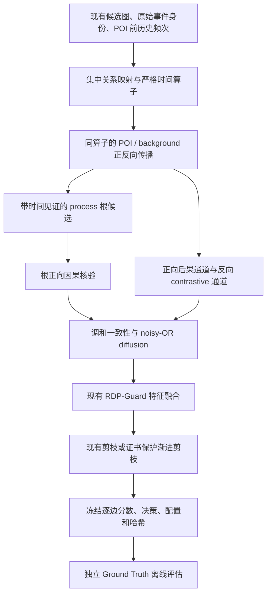

# RASP-RCVP：实现、使用与审计边界

2026-09-13。新功能通过配置显式启用，旧 RASP、RDP-Guard、PS-RDP 与默认配置保留。它计算调查相关性，不输出攻击概率或“真正攻击源”判定。实验结果及负结果见 [评估报告](rasp-rcvp-report.md)，研究来源见 [参考文献](rasp-rcvp-references.md)。

## 数据流



候选构造不读取新传播结果，GT 不进入上述在线参数、搜索、根选择或删除决策。background 是同一候选图上的结构参考种子，不是事后日志训练的历史正常模型。历史频率继续使用已有 POI 截止规则。候选图中 POI 后的合法后果事件可以参加正向调查，不会被称为历史正常样本。

## 数学定义与代码变量

内核是 **exact temporal max-product**，沿用项目时序最大传输支持的思路；它不是 stationary PPR，也不是论文中的学习式 diffusion。五次时间扫描分别计算 POI 正向、POI 反向、background 正向、background 反向和根正向。`iterations=1, converged=true, residual_l1=0` 表示有限时间扫描完成，不能据此声称 PPR 残差证书。兼容的旧 PPR 仅作为 `diffusion_legacy` 诊断保留，有独立收敛诊断。

1. **关系与交互质量。** 输入使用已有 `_causal_endpoints` 信息流方向。特别是 CDM `EVENT_EXECUTE` 仍按现有语义处理；映射 family 不改变原始边方向。`relation_families` 集中配置，未知关系进入 `other`。OPTC FLOW 的方向别名依据已有 `properties.direction`，原始关系和事件身份不变。

   以原始规范化 `(src,dst,relation)` 去重形成 channel `j`，`channel_mass[j] = max_e [rarity_floor + (1-rarity_floor) rarity(e)]`。重复事件不重复增加交互通道质量，但每条原始事件仍独立计入预算。

2. **当前合法邻居归一化。** 对时序状态 `s=(v,t)`，`A_r(s)` 是该方向仍有合法观测的 family 内通道。时间相同的事件先统一读取，再统一发布，禁止用 event ID 制造同时间戳路径。令 `m_j=channel_mass[j]`：

   `P(j|s) = [omega_r / sum_{q:A_q(s)非空} omega_q] × [m_j / sum_{k∈A_r(s)} m_k]`。

   `mixing=uniform` 使用全 1 family 权重；`weighted` 使用 `relation_weights`；`legacy` 在所有合法关系通道之间统一归一化。这里 legacy mixing 只是新时序内核的混合消融，并不与旧 PPR 完全等价。内核通过通道最后合法观测的退休事件维护 `remaining_mass`，避免每个状态遍历全图。逐边 `relation_transition_weight` / `relation_backward_transition_weight` 记录获胜见证的实际归一化值，无支持边记 0。

3. **时间和 fanout。** `T(e,s)=exp(-|t_e-t_s|/tau_r)`，`tau_r` 来自 `temporal_tau_overrides` 或 `temporal_tau_seconds`，`null` 表示关闭。只对本次状态等待时间衰减一次。

   `F(e) = [1/(1+log(1+max(0,local_fanout(e)-1)))]^fanout_gamma`，直接复用 `causal.fanout_priority_score`。高频阈值与 `abs(timestamp-anchor)//partition` 时间片规则来自已有 causal search；计数对象是冻结候选邻接的 raw events，和搜索实际访问 frontier 的范围不同。低度节点使用方向总度数，高度节点使用 POI 相对时间片内度数。F 作用于传播质量而非先乘入同源归一化后抵消。

   沿一个合法步骤，`log_support(e)=max_s[log_support(s)+log(damping)+log(P(e|s))+log(F(e))+log(T(e,s))]`。归一化与时间指数在发布时分解缓存，避免逐路径遍历。POI 与 background 完全共用该算子，仅 timed seed 不同。background 在每个 POI 时刻均匀播种 process-like 节点；没有 process 类型时回退全部节点。

4. **对比和尺度。** `contrast()` 在 log 域计算 `L=max(log p_poi - max(log p_bg,log epsilon),0)`；POI 支持为零时 L 为零。这对应 `log(max(p_poi/max(p_bg,epsilon),1))`，采用分母下限而非 `p_bg+epsilon`，是明确的数值保护选择。`forward_lift`、`backward_lift` 为未缩放 L，`*_normalized = L / max(L)`，空或全零通道取零。原始 `poi_*_score`、`background_*_score` 也保存，极小值可能发生浮点下溢；log 域仍保持传播稳定。

5. **根与核验。** 从反向支持大于 0、具有严格到 POI 见证的上游 process 选择根，每个实体仅保留最优时态，经过 `root_quantile` / `root_min_score` / `max_root_candidates` 限制。根分值先相对峰值缩放再归一化为 `seed_weight`，保留 `timestamp_ns` 与 `witness_event_ids`。根见证不含 POI 原始事件本身，终点是该 POI 的规范化锚点端点之一；这是到 POI 锚点的调查支持，包含 POI 事件的完整有序 certificate 另行核验。根起始状态位于其第一条见证事件出发点，该首步可在同一时刻出发；后续每步必须严格递增，不能先走事件后再同刻续接。

   `U=normalize(exp(backward_log_support))`，`V=root_forward_normalized`，`Q=2UV/(U+V)`；分母为零取 0。`Q=roundtrip_verification_score`。Q 使用原始反向支持的归一化值，反向 contrastive 通道则单独保留；这允许一个背景常见但因果一致的上游见证得到核验支持，也意味着背景抑制不是所有通道的硬门。

6. **融合。** `S_b=backward_normalized`、`S_f=forward_normalized`、`S_v=Q`，`D=1-(1-lambda_b S_b)(1-lambda_f S_f)(1-lambda_v S_v)`，结果为 `diffusion_verified`。POI 边遵从已有保护契约显式设 D=1，账本验证识别该覆盖。纯 downstream 边可通过 S_f 得分，不要求 Q 非零。

   现有 `fuse_rarity_diffusion()` 保持 `score_raw=D_norm × (w_d+w_r R+w_p Path+w_i Impact+w_b Behavior)`，然后按现有规则归一化。Rarity、NODOZE、DEPIMPACT、behavior 的定义不变。CLI 可保留这些分量；OPTC 原网页没有相同 path/impact/behavior 分量，网页仅使用 D 与已有 rarity，且拒绝配置非零不可用分量，避免把它冒充完整 CLI 特征管线。

7. **渐进删除。** 对已有 disjoint atomic group G：

   `removal_priority(G)=[max_G(score)+consistency_weight×max_G(consistency)-redundancy_weight×1{同 redundancy_key 仍有其它组}]/|G|`。

   `consistency` 依次读取显式 consistency、`diffusion_verified`、`roundtrip_verification_score`，默认 0。key 来自重复交互签名；一个原子组包含多个不同签名时，仅使用字典序最小的 key 作为组级近似，其余签名不参与该正则。它属于弱重复惩罚；没有另加 generic diversity 奖励，也不声称已经覆盖所有语义冗余类型。默认权重 0.1/0.02，另做零 redundancy 消融。

   从完整 eligible groups 开始用 lazy heap 删除最低价值组；保护 POI/alerts、既有证书/path-cover/bridge 原子闭包、仍被其它保留组依赖的 witness 和 prefix churn。网页和传播父指针通过稀疏直接链接维护；CLI 仍复用已有 connectivity_paths，向组依赖转换时会遍历完整固定 witness continuation，这部分成本取决于见证长度。固定见证守卫防止删除已声明见证，不会搜索所有替代路径；只有完整、连通、有序的声明和可行预算才能获得对应有效证书，候选不连通或缺失 POI 会继续报告无效。每组代价为其 raw event 数；预算不能容纳最低证据时保留真实证据并报告 `budget_feasible=false` 与 overflow，不事后无限补边。

## 配置与运行

完整可运行 profile：`configs/rcvp_conservative.json`、`configs/rcvp_relation_aware.json`、`configs/rcvp_full.json`。均从已有 POI-alert 实验配置扩展。conservative 使用 legacy relation mixing、关闭时间/fanout/核验，但不是宣称逐值复现旧 PPR；要复现旧模式应继续用原配置。

下面是覆写片段，需合入完整 profile：

```json
{
  "scoring": {"diffusion_mode": "relation_time_contrastive", "fusion_mode": "rdp_guard"},
  "pruning": {"mode": "progressive"},
  "rcvp": {
    "mixing": "weighted", "damping": 0.85,
    "temporal_tau_seconds": 900.0, "temporal_tau_overrides": {},
    "fanout_gamma": 0.5, "root_quantile": 0.5,
    "max_root_candidates": 32, "root_min_score": 0.0,
    "channel_weights": {"backward": 0.35, "forward": 0.35, "verification": 0.75}
  },
  "progressive": {"consistency_weight": 0.1, "redundancy_weight": 0.02}
}
```

省略 `rcvp.damping` 时使用 `scoring.damping`，显式 `rcvp.damping` 优先；resolved config 写入诊断。全部默认来自集中配置，无 GT 参数学习；固定权重、15 分钟 tau 与 32 根上限属于实验假设，并无跨场景最优性保证。

```bash
PYTHONPATH=. python -m tc_pruning.cli experiment \
  --db /path/to/existing.db --poi-events /path/to/poi-events.json \
  --config configs/rcvp_full.json --output output/my-rcvp-run
PYTHONPATH=. python scripts/run_rcvp.py --case E3-CADETS/node_Nginx_Backdoor_13.csv \
  --config configs/rcvp_evaluation.json --output output/my-rcvp-ablation
PYTHONPATH=. python scripts/run_rcvp.py --validate output/my-rcvp-ablation
```

网页在原页面选择“完整 RASP-RCVP”，展开自定义设置选择“渐进式证据剪枝”，再选择预算并重新分析。传播与剪枝独立控制；事件详情显示新通道和删除审计。前后图、事件列表和报告来自同一次缓存更新。后端返回实际预算/证书/算法配置；原有默认仍是 legacy/context。

## 账本与可复现性

保留 `rdp-edge-score-ledger-v3` 主格式，新增显式可选扩展 `rcvp-edge-evidence-v1`。传播和 progressive 可分别启用，每个候选事件完整覆盖，每个预算保存组 ID、尝试/允许删除、轮次、优先级与拒绝理由。启用传播证据时，根元数据与 resolved RCVP config 同在线候选、实现 SHA 一同冻结；仅 progressive 的旧传播账本可以没有根与 RCVP context。实现哈希使用仓库相对文件名，可在相同代码的不同 checkout 验证。

prefix 模式延续不可变 POI-local 分数与 monotone noisy-OR，传播解释按真实 winner POI 保存，全部 POI run 根元数据保留。分组模式记录真实 POI 集合，不把 group ID 当事件 ID。标准 validator 验证扩展版本/覆盖、有限范围、hash 与删除审计；存在传播扩展时另外验证 noisy-OR 与根见证时间/方向。实验 runner 另有冻结审计 validator，包含 raw 预算、POI、原子组及通道重算；二者不是相同文件格式。

## 修改文件与测试索引

| 文件 | 作用 |
|---|---|
| `tc_pruning/rcvp_config.py` | 集中 family、方向别名、权重与 preset 校验 |
| `tc_pruning/rcvp.py` | 严格时间对比、根选择、正向核验与逐边诊断 |
| `tc_pruning/rcvp_adapter.py` | CLI StoredEdge/UUID 与共享数组内核适配 |
| `tc_pruning/causal.py` | 提取已有 fanout 辅助函数，保留旧搜索行为 |
| `tc_pruning/diffusion.py` | opt-in 新模式与 DiffusionResult 扩展 |
| `tc_pruning/config.py` | 解析 RCVP/progressive 配置与有效 damping |
| `tc_pruning/cli.py`, `poi_prefix.py` | 向既有实验入口传递配置 |
| `tc_pruning/evaluation.py`, `rdp_guard.py` | joint/prefix/分组集成、winner 解释与审计传递 |
| `tc_pruning/progressive_pruning.py`, `pruning.py` | lazy group 删除与既有保护/预算集成 |
| `tc_pruning/rcvp_ledger.py`, `score_ledger.py` | 可选扩展及深度验证、旧账本兼容 |
| `tc_pruning/rcvp_web.py`, `rcvp_web_config.py` | 网页数组/证据依赖/融合与配置适配 |
| `tc_pruning/optc_investigation.py` | 原网页 pipeline 中显式启用 |
| `webapp/backend/app.py` | 请求校验、模式传递与结果缓存 |
| `webapp/frontend/index.html`, `app.js` | 原页面控件、状态与逐边解释 |
| `scripts/run_rcvp.py`, `scripts/summarize_rcvp.py`, `configs/rcvp_evaluation.json` | 标签隔离的冻结多方法多预算重放、离线评价与紧凑报告汇总 |
| 三个 `configs/rcvp_*.json` preset | 可选择的完整 CLI profile |
| `tests/test_rcvp.py` | family 不平衡、逆序/同刻、background 同分布、source/false-root、多根、fanout、重复不变性、配置与确定性 |
| `tests/test_progressive_pruning.py` | 噪声先删、certificate/依赖、raw 原子成本、churn、依赖链复杂度 |
| `tests/test_rcvp_integration.py` | CLI 方向、配置、不同 GT 字节一致、prefix/分组解释 |
| `tests/test_rcvp_ledger.py` | 独立扩展组合、篡改检测、根/融合审计、可移植性 |
| `tests/test_rcvp_replay.py` | 冻结后评价、重放确定性、预算及数值篡改 |
| `webapp/tests/test_rcvp_web.py` | 旧默认、新控件/API、证书与逐边通道 |
| `docs/rasp-rcvp-*.md`、README | 设计、执行计划、方法、来源与结果 |

没有实现新的 GNN、Mamba、RL、LLM 恶意边判定或 directed temporal Steiner solver。可选无向谱诊断未作为在线剪枝依据；当前指标不足以把输出简洁度直接解释为完整 Quality of Attribution 提升。
