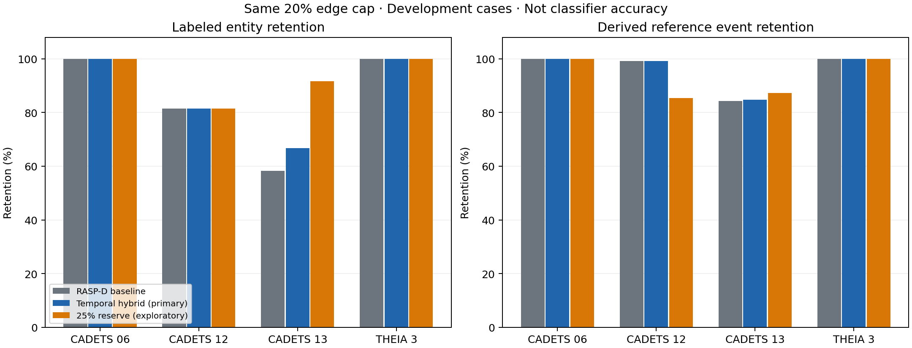

# 社交传播适配实验：节点覆盖提高，但存在证据损失

已在四个准入 DARPA 场景上完成 **7 种方法 × 3 个边预算 × 4 个场景，共 84 组对照**。最大候选图包含 **1,132,218 条事件边**。原 RASP-D 基线的保留事件 ID 与已有结果逐条相同，独立 CSV/数据库核验的参考事件哈希也一致。

在相同 20% 原始边预算上限下，预先指定的融合方案把四场景平均已标注实体保留率从 **84.93% 提高到 87.02%**，参考事件保留从 **95.87% 提高到 95.96%**。后续探索性的 25% 预算分配方案能把实体保留提高到 **93.27%**，但参考事件保留降到 **93.18%**，尤其损失 CADETS 12 的活动细节。因此未替换当前网页或默认算法。

这些数值是**已标注实体在剪枝图中的保留率**，不是模型输出攻击节点的分类正确率；CSV 不包含穷尽负例或独立攻击路径标注，Accuracy、Precision、路径召回继续不报告。不能据此声称已经实现“所有场景攻击识别召回超过 90%”。



[全部逐场景结果 CSV](social-propagation-results.csv) · [汇总 CSV](social-propagation-summary.csv) · [完整结果与输入哈希 JSON](social-propagation-results.json) · [可导出 PDF 图](figures/social-propagation-results.pdf)

## 实验实现

本实验对应 [社交传播研究方案](social-propagation-study.md)，属于小型、可解释的算法适配，不是 GRID、GDFSL、PDSL 的完整复现，也没有训练新的深度学习模型。

先将同一“源 UUID—目标 UUID—事件关系”的重复记录合为一个传播通道，通道权重取历史稀有度权重的最大值。每个节点向不同关系类型均分总权重，在关系内部再按通道权重归一化；出边和入边各自归一化。重复日志不会增加通道的传播质量。通道结构来自完整固定候选窗，属于事后调查；历史稀有度沿用冻结账本，与原算法保持相同输入。

反向扫描从 POI 端点寻找严格更早的有向证据，正向扫描从这些证据向后续分支传播。路径代价为每次转移的 `−log(0.85 × 通道权重)` 之和，采用最小代价路径；相关性分数是 `1/(1+路径代价)`。相同时间戳的事件统一读状态后再写状态，禁止等时刻事件互相提供先后证据。只有既有日志路径参与计算，不生成缺失边。

每个候选保留锚点均附带反向路径和正向分叉。预算选择使用已有 q=0 的交互族递减收益选择器，完整证据组一起进入结果。它是启发式预算选择，未宣称全局最优或继承社交传播论文的近似保证。文件、进程、网络资源仍按实体区分，未把传播覆盖直接转成攻击预测。

| 方法标识 | 设置 | 实验身份 |
|---|---|---|
| `rasp` | 原评分、原最短跳数证据、原选择器 | 冻结基线 |
| `temporal_uniform` | 所有通道乘子为 1，时间约束与每步衰减保留 | 去掉关系/通道权重的消融 |
| `temporal_relation` | 关系归一化的时序传播与最小代价证据 | 新评分及路径 |
| `temporal_relation_old_routes` | 新评分、原证据路径 | 区分评分收益与新路径收益 |
| `hybrid_relation_temporal` | 原评分与新评分取几何平均，使用新证据路径 | **预先指定的主方案** |
| `reserve_0.1` | 总边预算的 10% 给新传播、90% 给原算法，取完整证据并集 | 看到首轮 CADETS 结果后的探索性方案 |
| `reserve_0.25` | 总边预算的 25% 给新传播、75% 给原算法，取完整证据并集 | 同批探索性方案 |

分配比例针对预算，不是数据集本身：在 20% 原图预算下，25% 分配对应最多 5% 原图边给新传播、15% 给原算法。两个子图会共享边，因此并集可能小于预算上限，没有为了填满预算添加未经验证的边。两种比例都完整报告，不能把后续最好的比例冒称预先固定的测试结果。

## 相同 20% 预算上限的结果

下面“宏平均”表示先逐场景计算保留率再等权平均；“微平均”按场景内实体/事件数量加权，实体是场景—UUID 对。两种口径同时保留，避免少量案例或大量重复事件掩盖失败。

| 方法 | 实体宏平均 | 实体微平均 | 参考事件宏平均 | 参考事件微平均 |
|---|---:|---:|---:|---:|
| 原 RASP-D | 84.93% | 118/136 · 86.76% | 95.87% | 98.19% |
| 纯时序、均匀权重 | 94.77% | 127/136 · 93.38% | 15.88% | 8.08% |
| 纯时序、关系权重 | 95.35% | 128/136 · 94.12% | 31.52% | 13.82% |
| 关系时序评分、原路径 | 95.35% | 128/136 · 94.12% | 31.57% | 13.84% |
| **预设融合方案** | **87.02%** | **120/136 · 88.24%** | **95.96%** | **98.21%** |
| 探索性 10% 分配 | 88.06% | 121/136 · 88.97% | 96.01% | 98.21% |
| 探索性 25% 分配 | 93.27% | 126/136 · 92.65% | 93.18% | 88.05% |

纯时序评分确实保住更多节点，却丢失大量参考事件，不能作为全面优于原算法的证据。新路径与原路径的结果非常接近；当前增益主要来自评分和覆盖分配，尚无证据证明更换路径构造本身带来了明显优势。

### 逐场景实体保留

| 场景 | 候选事件 | 原算法 | 预设融合 | 10% 分配 | 25% 分配 |
|---|---:|---:|---:|---:|---:|
| CADETS 06 | 102,232 | 8/8 | 8/8 | 8/8 | 8/8 |
| CADETS 12 | 138,261 | 35/43 | 35/43 | 35/43 | 35/43 |
| CADETS 13 | 35,967 | 14/24 | 16/24 | 17/24 | 22/24 |
| THEIA 3 | 1,132,218 | 61/61 | 61/61 | 61/61 | 61/61 |

### 逐场景参考事件保留

| 场景 | 原算法 | 预设融合 | 10% 分配 | 25% 分配 |
|---|---:|---:|---:|---:|
| CADETS 06 | 268/268 | 268/268 | 268/268 | 268/268 |
| CADETS 12 | 4,958/5,000 | 4,957/5,000 | 4,956/5,000 | 4,270/5,000 |
| CADETS 13 | 419/497 | 421/497 | 422/497 | 434/497 |
| THEIA 3 | 870/870 | 870/870 | 870/870 | 870/870 |

参考事件是两个端点均属于 CSV 正例、且处于原协议范围的日志事件，不等于逐事件取证确认的完整攻击链。CADETS 使用原标注时间范围；THEIA 使用原先明确选定的本地数据库全范围，没有临时缩小分母。

### 进程与手动 POI 的影响

只看 CSV 中的进程实体，原算法保留 **74/89**，融合方案 **76/89**，25% 分配 **82/89**。这仍是进程在剪枝图中的保留，不是独立攻击分类。CADETS 12 只有 **17/24** 个标注进程保留；25% 分配虽然在 CADETS 13 达到 **14/14** 个进程，不能掩盖前者。

排除人工 POI 的端点后，实体宏平均分别为原算法 **80.96%**、融合 **83.59%**、25% 分配 **91.49%**。结果 JSON 保存完整分母。候选图与 POI 来自既有人工调查/历史真值辅助流程，故本轮是条件于这些输入的开发实验，不是全自动发现攻击的独立测试。

### 更紧预算

| 原始边预算上限 | 原算法：实体 / 事件宏平均 | 融合：实体 / 事件宏平均 | 25% 分配：实体 / 事件宏平均 |
|---|---:|---:|---:|
| 5% | 75.15% / 51.65% | 81.67% / 52.41% | 85.97% / 48.18% |
| 10% | 83.53% / 72.27% | 83.99% / 72.11% | 88.06% / 58.48% |
| 20% | 84.93% / 95.87% | 87.02% / 95.96% | 93.27% / 93.18% |

不存在一个在所有预算、所有指标上都获胜的方案；尤其不能只报告 20% 预算下的实体收益。

## CADETS 12 的瓶颈不是评分阈值

对最终仍漏掉的 8 个实体进行了仅用于解释的事后检查：它们确实存在于候选日志，所有关联边在当前 POI、方向与严格时序分叉语义下的传播得分都为零。其中一个实体关联 9,599 条候选事件，仍无有效 POI 见证。这不是日志里没有该节点，也不是降低一个正分阈值就能解决的问题。

因此，在当前证据可达性约束下，只调整评分或预算分配无法覆盖这些实体。后续应研究独立于 POI 连通分支的行为发现、补充可解释路标或缺失依赖核查，随后重新评估；不能把这 8 个实体移出 Ground Truth，也不能把 CADETS 12 因效果差而排除。详见 [漏失诊断](social-propagation-missed-cadets12.json)。本轮没有用这些 UUID 反向修补任何预测。

## 运行开销与核验

| 场景 | 原算法评分、路径及单次 20% 选择 | 预设融合对应开销 | 25% 分配对应开销 | 全部方案进程峰值内存 |
|---|---:|---:|---:|---:|
| CADETS 06 | 1.03 s | 1.61 s | 1.69 s | 151 MiB |
| CADETS 12 | 2.06 s | 2.96 s | 3.12 s | 151 MiB |
| CADETS 13 | 0.35 s | 0.55 s | 0.57 s | 151 MiB |
| THEIA 3 | 13.03 s | 21.86 s | 22.40 s | 694 MiB |

时间是同机开发运行的 wall time，场景曾并发执行，不能视为稳定吞吐基准。上述单方法开销不含账本解析、共享交互族构造、导出和真值核验；混合方法计入两种评分及路径成本。峰值内存属于该场景运行全部变体的进程，不是每种方法独立测得。THEIA 读取账本约 36.68 秒，全套 21 组选择、导出及核验总计约 119.55 秒。

所有选择掩码在读取 CSV 标签和真值时间范围之前写入冻结文件；评估之后再次确认文件哈希未变。独立核验包含原基线逐事件一致、CSV/压缩包哈希、原协议参考事件集合哈希、只读数据库、完整路径/分叉重放、严格时间顺序和硬预算。84 份导出掩码的长度、保留数量及哈希均与报告一致。

开发时修正了两处实验工具问题：核验器最初误要求连接边的备用路径也全部保留；THEIA 的全库范围以空时间窗表示，需要与 CADETS 的显式时间窗区分。修正后使用同一版本完整重跑四场景，未修改评分参数或真值分母。测试覆盖这些问题，以及重复事件、输入排列、关系归一化、非法 POI、缺失连接边和暂停数据集准入。

## 复现与产物

实现：[传播与预算分配](../tc_pruning/social_propagation.py)、[实验入口](../scripts/run_social_propagation.py)、[汇总与绘图](../scripts/summarize_social_propagation.py)。固定配置：[首轮](../configs/social_propagation_experiment.json)、[探索性分配](../configs/social_propagation_reserved.json)。论文对应关系见 [研究文档](social-propagation-study.md)。

```bash
python -m scripts.run_social_propagation \
  --case E3-CADETS/node_Nginx_Backdoor_13.csv \
  --inputs /root/NODOZE-pruning-release/webapp/runtime/research/groundtruth-study/archive/inputs.json \
  --output /tmp/social-cadets13-reproduction --reserved

python -m scripts.summarize_social_propagation \
  --source /root/NODOZE-pruning-release/output/social-propagation-20260913-final \
  --output docs

python -m pytest -q tests/test_social_propagation.py tests/test_rasp.py \
  tests/test_rasp_diverse.py tests/test_rasp_replay.py webapp/tests/test_benchmark_admission.py
```

`--output` 必须为新的目录，避免覆盖已冻结的实验。输入配置是先前已核验数据库与账本的本机映射；完整结果 JSON 记录其实际路径及哈希。暂停的 OPTC、缺失数据库及未完成的 THEIA 1 未加入比较。

冻结分数与选择位：[CADETS 06](artifacts/social-propagation/cadets06.npz)、[CADETS 12](artifacts/social-propagation/cadets12.npz)、[CADETS 13](artifacts/social-propagation/cadets13.npz)、[THEIA 3](artifacts/social-propagation/theia3.npz)。使用 `numpy.load(..., allow_pickle=False)`；`方法@预算` 对应布尔选择位，`score_方法` 对应分数，数组顺序严格沿用报告中指定的候选账本。大型原始日志没有重复上传。

实验支持继续研究“扩大覆盖与保留活动细节的分工”，但尚不足以替换默认实现。低风险融合仅有小幅收益且增加开销；高覆盖分配的事件损失明显。当前最明确的下一步是解决 CADETS 12 的可达性瓶颈，而不是继续在相同四场景上调比例来提高平均数。
