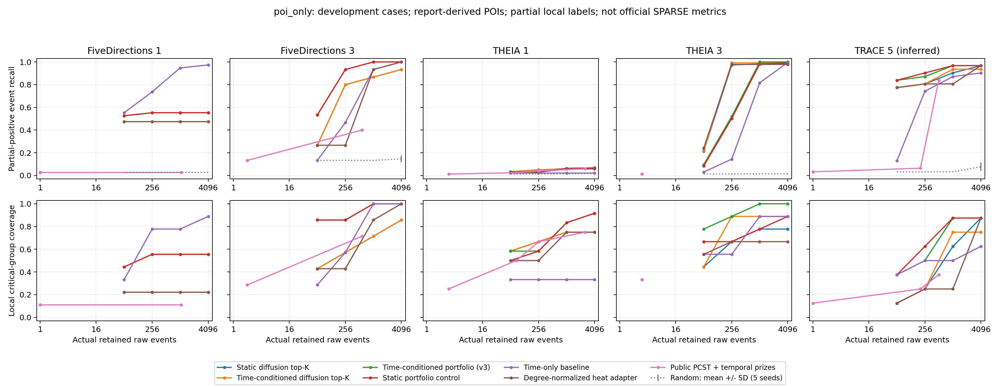
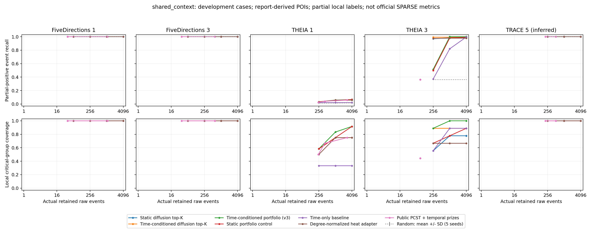
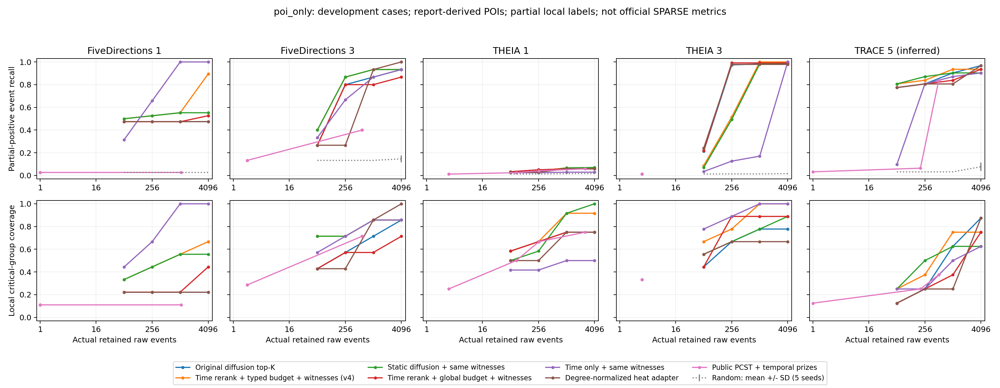
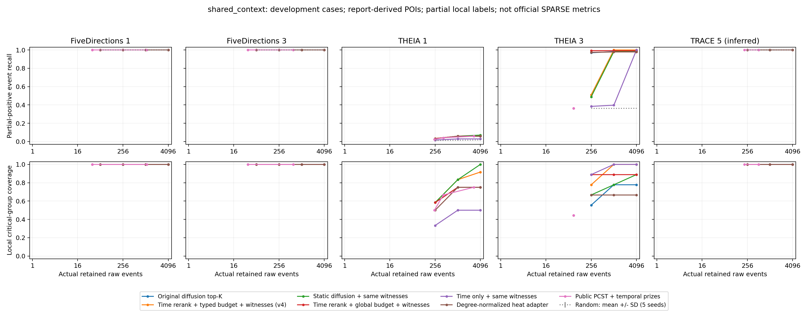

# 时间条件扩散、类型预算分配与更强基线：五案继续优化

## 本轮摘要

最终候选 `witness_rerank` 保留原频率扩散，增加时间重排、类型预算分配和原始事件路径保留。仅报告 POI、1024 原始事件预算下，五案 TP 从 **18/13/14/225/28 → 21/14/16/229/29**，宏平均局部 Recall **65.69% → 69.77%**，所选图的实现级时间 fork 检查均为100%。

同时，THEIA3 在256预算从223退化到118，THEIA1主预算仍只有16/239；纯时间＋路径在FD1更强。因此本轮得到有条件的改进，不替换全局默认，不声称全面超越SPARSE。下文保留v1–v3的开发过程及失败结果，最终比较见“v4”部分。

[最终完整CSV](temporal-diffusion-v4-results.csv) · [审计摘要](temporal-diffusion-v4-audit.json) · [最终曲线PDF](figures/temporal-diffusion-v4-poi_only.pdf)


## 本轮问题与结论口径

用户要求继续优化，尤其与其他方法比较。仍使用原五案、相同候选事件 ledger、报告 POI 和冻结局部正例；核心仍是**频率统计＋图扩散**，没有外接告警，没有添加新的攻击文件/IP/事件 ID 规则。

这是一轮开发迭代，保留每次失败与成功的配置。所有 FP/FN/Precision/Recall/F1/FPR/FNR 为显式局部闭世界 **proxy**；未标注事件在这个代理定义下算负例，不代表它们确为正常。SPARSE 官方事件级等价指标仍不可得。Case5 仍采用推断的 TRACE 映射。

## 先定位漏检，再修改算法

THEIA1 的 239 个局部正例中，旧扩散 top-K 在 1024 预算只命中 14。诊断发现：

- 另 225 个事件都已在候选图中，并通过现有时间 fork 路径检查。
- 一个 CONNECT 和一个 SEND 在约 69500 名；223 个 RECV 在 280311–280533 名。
- 这组事件约在首个 POI 前 234 秒，历史 RECV 稀有度约 0.0518。

因此可以确认这批损失首先发生在**评分排序**，不能归咎于候选数据缺失。时间聚合与低稀有度可能是影响因素；本轮时间条件实验用于检验，不能预先认定它一定解决漏检。诊断标签只用于事后理解失败，选边程序无标签输入。

## 三次冻结的开发改进

### v1：让频率扩散受到 POI 时间条件约束

每个 POI 分别构建时间亲近度：

`h(e, p) = 1 / (1 + |t(e) - t(p)| / tau)`，主参数 `tau=300 秒`。

原有历史稀有度与候选内语义频率产生权重 `c(e)`。现在用 `c(e) * h(e,p)` 构建去重交互图、关系均衡转移；在该图上分别计算 POI 扩散和背景扩散，并将时间亲近度用于最终原始事件分数。保持原来的端点证据组合、弱逃逸通道、多 POI 最大聚合。额外报告 tau=30/3000 秒，统一跨案使用，不按案例挑参数。

同时运行“原分数只乘时间亲近度”的轻量对照。如果这个对照更好，就不能把收益归因于重建扩散图。

### v2：关系类型预算分配与更强图基线

v1 中静态评分的按类型均衡分配对照改善 FD1/FD3/TRACE5，于是测试 `typed_temporal`：类型内按时间条件扩散分数排序，类型之间优先选择当前已保留数最少的类型；强制证据也计入该类型占用。

加入普通与度归一化的 PPR/热核、纯时间排序及纯时间按类型分配。度归一化可以降低普通扩散对高度节点的偏好，避免只拿弱化的图基线作对照。

### v3：固定比例保留高分事件，再补类型覆盖

完全均分类型会压低包含大量接收事件的攻击链。主方法 `temporal_portfolio` 统一采用：

1. 将强制证据纳入预算，先按总分保留到 `max(强制证据数, floor(B/2))`。
2. 剩余预算按类型分配，第一阶段已选的事件继续计入类型占用。

对静态评分、仅时间重排评分使用**同一个**分配器，分别得到 `static_portfolio`、`rerank_portfolio`。另报 1/4、3/4 高分预算比例的敏感性；主比例事先固定为 1/2。这是预算启发式，不声称全局最优或新的理论近似保证。

## 对比方法的来源与公平边界

| 方法类别 | 实際运行来源 | 关键限制 |
| --- | --- | --- |
| 原评分、稀有度、频率扩散、事件组与覆盖选择 | 本仓库实现 | 原评分读取冻结缓存，不当作原版 NODOZE 全系统复现 |
| LocalDegree | NetworKit 11.2.2 公共内核 | 无向简单实体图评分映射回原始事件 |
| PCST | pcst_fast 1.0.10 作者求解器 | 分别使用旧扩散及本轮时间条件奖赏；相同 14 个成本系数，不按标签选解 |
| 普通 PPR、热核 | 按公开公式自行实现完整稀疏迭代 | 同候选去重交互图、同 POI，几何端点分数映射到原始事件 |
| 度归一化 PPR、热核 | 本地实现 `v / degree` 后的端点评分 | 没有实现原论文的 conductance sweep，不能称完整局部聚类系统复现 |
| 时间排序、类型分配、随机 | 透明简单对照 | 随机 5 种子；时间排序用于检查 POI 邻近效应 |

热核采用 `exp(t(P-I))s` 的 Poisson 级数，t=3；PPR restart=0.15。核对了 [Kloster & Gleich，KDD 2014 原文](https://www.cs.purdue.edu/homes/dgleich/publications/Kloster%202014%20-%20hkrelax.pdf) 的扩散定义和度归一化步骤，并查看[作者代码页面](https://www.cs.purdue.edu/homes/dgleich/codes/hkgrow/)。我们的热核是全图稀疏乘法，未使用作者的局部松弛求解器。小图数值验证与矩阵指数/线性方程一致；这仅验证内核正确，不是原任务性能复现。

所有方法共用原始事件预算 64/256/1024/4096；分别测试仅 POI 和所有方法共用既有上下文。PCST 可不填满预算，报告实际 E。参数比较是声明的固定配置及有限敏感性，不是每个外部方法都经过充分搜索后的最优成绩。

旧基线复用上一轮已保存的逐事件选择，验证源码、ledger 和共用配置；同时重算原扩散主预算并核对集合，重新生成共同强制上下文并核对所有复用输出。v1 runner 本身未自动比较旧配置，独立审查核对了全部五案无参数差异；v2/v3 runner 加入自动共用参数检查，保存上一轮配置及报告 hash。复用和新计算的时间记录分开解释，不拿旧缓存选择读取时间当作重新运行耗时。
## v3 中间结果：命中改善，但路径保留退化

v3 累计汇总 **1792** 个不同配置决策，**1672** 个完成评价，**120** 个共同强制证据超过预算。包含 35 个确定性方法／变体与 5 个随机种子；1600 个全 POI 四预算双轨道组合，192 个删 POI 配置。v1/v2/v3 文件有继承关系，不能把它们的行数相加当作独立实验数。

### 仅共享报告 POI，原始事件预算 1024

每格为 **TP / 实际保留原始事件 E**。除 PCST 适配外，下表方法均填满该预算；列头是本地正例总数。

| 方法 | FD1 (38) | FD3 (15) | THEIA1 (239) | THEIA3 (229) | TRACE5* (31) |
| --- | --- | --- | --- | --- | --- |
| 原评分 top-K | 12 / 1024 | 11 / 1024 | 12 / 1024 | 225 / 1024 | 2 / 1024 |
| 原频率扩散 top-K | 18 / 1024 | 13 / 1024 | 14 / 1024 | 225 / 1024 | 28 / 1024 |
| 上一轮覆盖选择 | 18 / 1024 | 12 / 1024 | 14 / 1024 | 223 / 1024 | 28 / 1024 |
| 公开 LocalDegree | 1 / 1024 | 2 / 1024 | 3 / 1024 | 4 / 1024 | 2 / 1024 |
| 公开 PCST＋静态频率扩散奖赏 | 1 / 1 | 6 / 708 | 10 / 940 | 3 / 3 | 27 / 925 |
| 普通 PPR | 18 / 1024 | 13 / 1024 | 7 / 1024 | 3 / 1024 | 27 / 1024 |
| 普通热核 | 18 / 1024 | 13 / 1024 | 5 / 1024 | 3 / 1024 | 28 / 1024 |
| 度归一化 PPR | 18 / 1024 | 13 / 1024 | 14 / 1024 | 224 / 1024 | 25 / 1024 |
| 度归一化热核 | 18 / 1024 | 14 / 1024 | 14 / 1024 | 224 / 1024 | 25 / 1024 |
| 纯时间排序 | 36 / 1024 | 14 / 1024 | 5 / 1024 | 187 / 1024 | 27 / 1024 |
| 静态扩散＋类型分配 | 21 / 1024 | 15 / 1024 | 13 / 1024 | 67 / 1024 | 30 / 1024 |
| 原扩散＋时间重排 | 18 / 1024 | 13 / 1024 | 14 / 1024 | 227 / 1024 | 28 / 1024 |
| 时间条件扩散 top-K | 18 / 1024 | 13 / 1024 | 14 / 1024 | 227 / 1024 | 29 / 1024 |
| 公开 PCST＋时间条件奖赏 | 1 / 1 | 6 / 586 | 10 / 262 | 3 / 3 | 26 / 509 |
| 时间条件扩散＋全类型分配 | 21 / 1024 | 15 / 1024 | 13 / 1024 | 67 / 1024 | 30 / 1024 |
| 静态扩散＋混合预算 | 21 / 1024 | 15 / 1024 | 15 / 1024 | 225 / 1024 | 30 / 1024 |
| 时间条件扩散＋混合预算（v3 主方法） | 21 / 1024 | 15 / 1024 | 15 / 1024 | 229 / 1024 | 30 / 1024 |
| 时间重排＋混合预算（轻量候选） | 21 / 1024 | 15 / 1024 | 15 / 1024 | 229 / 1024 | 31 / 1024 |

### 所有方法共用既有语义上下文，原始事件预算 1024

每格为 **TP / 实际保留原始事件 E**。除 PCST 适配外，下表方法均填满该预算；列头是本地正例总数。

| 方法 | FD1 (38) | FD3 (15) | THEIA1 (239) | THEIA3 (229) | TRACE5* (31) |
| --- | --- | --- | --- | --- | --- |
| 原评分 top-K | 38 / 1024 | 15 / 1024 | 12 / 1024 | 225 / 1024 | 31 / 1024 |
| 原频率扩散 top-K | 38 / 1024 | 15 / 1024 | 14 / 1024 | 225 / 1024 | 31 / 1024 |
| 上一轮覆盖选择 | 38 / 1024 | 15 / 1024 | 14 / 1024 | 223 / 1024 | 31 / 1024 |
| 公开 LocalDegree | 38 / 1024 | 15 / 1024 | 3 / 1024 | 83 / 1024 | 31 / 1024 |
| 公开 PCST＋静态频率扩散奖赏 | 38 / 39 | 15 / 738 | 6 / 275 | 83 / 87 | 31 / 929 |
| 普通 PPR | 38 / 1024 | 15 / 1024 | 7 / 1024 | 83 / 1024 | 31 / 1024 |
| 普通热核 | 38 / 1024 | 15 / 1024 | 5 / 1024 | 83 / 1024 | 31 / 1024 |
| 度归一化 PPR | 38 / 1024 | 15 / 1024 | 14 / 1024 | 224 / 1024 | 31 / 1024 |
| 度归一化热核 | 38 / 1024 | 15 / 1024 | 14 / 1024 | 224 / 1024 | 31 / 1024 |
| 纯时间排序 | 38 / 1024 | 15 / 1024 | 5 / 1024 | 188 / 1024 | 31 / 1024 |
| 静态扩散＋类型分配 | 38 / 1024 | 15 / 1024 | 13 / 1024 | 89 / 1024 | 31 / 1024 |
| 原扩散＋时间重排 | 38 / 1024 | 15 / 1024 | 14 / 1024 | 227 / 1024 | 31 / 1024 |
| 时间条件扩散 top-K | 38 / 1024 | 15 / 1024 | 14 / 1024 | 227 / 1024 | 31 / 1024 |
| 公开 PCST＋时间条件奖赏 | 38 / 39 | 15 / 616 | 10 / 422 | 83 / 87 | 31 / 514 |
| 时间条件扩散＋全类型分配 | 38 / 1024 | 15 / 1024 | 13 / 1024 | 89 / 1024 | 31 / 1024 |
| 静态扩散＋混合预算 | 38 / 1024 | 15 / 1024 | 13 / 1024 | 225 / 1024 | 31 / 1024 |
| 时间条件扩散＋混合预算（v3 主方法） | 38 / 1024 | 15 / 1024 | 14 / 1024 | 229 / 1024 | 31 / 1024 |
| 时间重排＋混合预算（轻量候选） | 38 / 1024 | 15 / 1024 | 13 / 1024 | 229 / 1024 | 31 / 1024 |

### v3 主方法及轻量候选的完整 proxy 指标

仅 POI，预算 1024。FP/FN/P/R/F1 都按冻结局部闭世界参考计算。CSV 中比率是 0–1，本表转为百分数。

| 案例 | 方法 | E | TP | FP* | FN* | P* % | R* % | F1* % | 关键组 | 阶段 | 时间 fork % |
| --- | --- | --- | --- | --- | --- | --- | --- | --- | --- | --- | --- |
| FD1 | 原频率扩散 top-K | 1024 | 18 | 1006 | 20 | 1.76 | 47.37 | 3.39 | 2/9 | 1/3 | 95.80 |
| FD1 | 时间条件扩散＋混合预算（v3 主方法） | 1024 | 21 | 1003 | 17 | 2.05 | 55.26 | 3.95 | 5/9 | 3/3 | 59.67 |
| FD1 | 时间重排＋混合预算（轻量候选） | 1024 | 21 | 1003 | 17 | 2.05 | 55.26 | 3.95 | 5/9 | 3/3 | 59.86 |
| FD3 | 原频率扩散 top-K | 1024 | 13 | 1011 | 2 | 1.27 | 86.67 | 2.50 | 5/7 | 3/3 | 66.31 |
| FD3 | 时间条件扩散＋混合预算（v3 主方法） | 1024 | 15 | 1009 | 0 | 1.46 | 100.00 | 2.89 | 7/7 | 3/3 | 66.31 |
| FD3 | 时间重排＋混合预算（轻量候选） | 1024 | 15 | 1009 | 0 | 1.46 | 100.00 | 2.89 | 7/7 | 3/3 | 67.29 |
| THEIA1 | 原频率扩散 top-K | 1024 | 14 | 1010 | 225 | 1.37 | 5.86 | 2.22 | 9/12 | 5/6 | 81.54 |
| THEIA1 | 时间条件扩散＋混合预算（v3 主方法） | 1024 | 15 | 1009 | 224 | 1.46 | 6.28 | 2.38 | 10/12 | 6/6 | 90.62 |
| THEIA1 | 时间重排＋混合预算（轻量候选） | 1024 | 15 | 1009 | 224 | 1.46 | 6.28 | 2.38 | 10/12 | 6/6 | 89.55 |
| THEIA3 | 原频率扩散 top-K | 1024 | 225 | 799 | 4 | 21.97 | 98.25 | 35.91 | 7/9 | 5/5 | 99.80 |
| THEIA3 | 时间条件扩散＋混合预算（v3 主方法） | 1024 | 229 | 795 | 0 | 22.36 | 100.00 | 36.55 | 9/9 | 5/5 | 72.07 |
| THEIA3 | 时间重排＋混合预算（轻量候选） | 1024 | 229 | 795 | 0 | 22.36 | 100.00 | 36.55 | 9/9 | 5/5 | 70.41 |
| TRACE5* | 原频率扩散 top-K | 1024 | 28 | 996 | 3 | 2.73 | 90.32 | 5.31 | 5/8 | 4/6 | 96.78 |
| TRACE5* | 时间条件扩散＋混合预算（v3 主方法） | 1024 | 30 | 994 | 1 | 2.93 | 96.77 | 5.69 | 7/8 | 6/6 | 75.49 |
| TRACE5* | 时间重排＋混合预算（轻量候选） | 1024 | 31 | 993 | 0 | 3.03 | 100.00 | 5.88 | 8/8 | 6/6 | 74.22 |

### 宏平均与贡献拆分

| 方法 | 五案 TP 合计 | 宏 P* % | 宏 R* % | 宏 F1* % |
| --- | --- | --- | --- | --- |
| 原频率扩散 top-K | 298 | 5.82 | 65.69 | 9.87 |
| 原扩散＋时间重排 | 300 | 5.86 | 65.87 | 9.93 |
| 静态扩散＋混合预算 | 306 | 5.98 | 71.31 | 10.16 |
| 时间条件扩散＋混合预算（v3 主方法） | 310 | 6.05 | 71.66 | 10.29 |
| 时间重排＋混合预算（轻量候选） | 311 | 6.07 | 72.31 | 10.33 |
| 度归一化热核 | 295 | 5.76 | 65.00 | 9.76 |
| 纯时间排序 | 269 | 5.25 | 71.78 | 9.05 |

宏平均给每个案例相同权重；TP 合计会受 THEIA3 的密集接收事件主导。五案全被开发观察过，不给出未见攻击显著性或泛化结论。

### 消融和固定参数敏感性

| 变体（仅 POI，1024） | FD1 | FD3 | THEIA1 | THEIA3 | TRACE5* |
| --- | --- | --- | --- | --- | --- |
| temporal_top | 18 | 13 | 14 | 227 | 29 |
| temporal_nofreq | 18 | 13 | 14 | 229 | 28 |
| temporal_nocontrast | 18 | 13 | 7 | 229 | 28 |
| temporal_short | 18 | 13 | 14 | 229 | 28 |
| temporal_long | 18 | 13 | 14 | 225 | 28 |
| typed_temporal | 21 | 15 | 13 | 67 | 30 |
| typed_nofreq | 21 | 15 | 12 | 67 | 30 |
| typed_nocontrast | 35 | 15 | 8 | 67 | 30 |
| typed_short | 21 | 15 | 12 | 67 | 30 |
| typed_long | 21 | 15 | 13 | 67 | 31 |
| portfolio_quarter | 21 | 15 | 13 | 229 | 30 |
| temporal_portfolio | 21 | 15 | 15 | 229 | 30 |
| portfolio_three_quarters | 21 | 15 | 15 | 229 | 29 |

### 随机对照

| 案例 | 轨道 | proxy R % 均值±SD | proxy F1 % 均值±SD |
| --- | --- | --- | --- |
| FD1 | poi_only | 2.63 ± 0.00 | 0.19 ± 0.00 |
| FD1 | shared_context | 100.00 ± 0.00 | 7.16 ± 0.00 |
| FD3 | poi_only | 13.33 ± 0.00 | 0.38 ± 0.00 |
| FD3 | shared_context | 100.00 ± 0.00 | 2.89 ± 0.00 |
| THEIA1 | poi_only | 1.59 ± 0.35 | 0.60 ± 0.13 |
| THEIA1 | shared_context | 1.42 ± 0.23 | 0.54 ± 0.09 |
| THEIA3 | poi_only | 1.40 ± 0.20 | 0.51 ± 0.07 |
| THEIA3 | shared_context | 36.24 ± 0.00 | 13.25 ± 0.00 |
| TRACE5* | poi_only | 3.23 ± 0.00 | 0.19 ± 0.00 |
| TRACE5* | shared_context | 100.00 ± 0.00 | 5.88 ± 0.00 |

### 缺失 POI 的压力测试

每次移除一个原始 POI，重新评分并生成上下文，仍对原全部参考正例评价。每格列出按 drop-0/drop-1/drop-2 顺序的 TP；单 POI 案例不执行零种子条件。

| 案例 | 轨道 | 原扩散 | 时间条件扩散 | 时间条件混合预算 | 时间重排混合预算 | 纯时间 |
| --- | --- | --- | --- | --- | --- | --- |
| FD3 | poi_only | 3, 10 | 3, 10 | 6, 15 | 6, 15 | 5, 10 |
| FD3 | shared_context | 5, 10 | 5, 10 | 6, 15 | 6, 15 | 5, 10 |
| THEIA1 | poi_only | 14, 14, 14 | 6, 14, 14 | 7, 15, 15 | 8, 15, 15 | 4, 4, 2 |
| THEIA1 | shared_context | 12, 14, 14 | 6, 14, 14 | 7, 15, 15 | 8, 15, 15 | 4, 4, 2 |
| THEIA3 | poi_only | 6, 224, 222 | 8, 226, 222 | 11, 226, 222 | 11, 226, 222 | 9, 196, 222 |
| THEIA3 | shared_context | 6, 224, 222 | 8, 226, 222 | 11, 226, 222 | 11, 226, 222 | 9, 196, 222 |

### 预算曲线

横轴为实际保留事件数；展示完整预算曲线，不能将主预算胜出理解为所有预算均胜出。





## v4：把原始时间路径纳入预算

v3 的命中提升伴随结构退化：在仅 POI、1024 预算下，FD1 的时间 fork 可达比例约 60%，THEIA3 约 70%。因此不把 v3 当作最终图剪枝改进直接替换默认算法。

v4 对每个候选锚点，收集已有 backward/fork 路径中的**原始事件**，去重后与锚点一同准入。所有连接事件都占用预算，并计入实际类型数量。没有可用见证的非强制事件不准入。全局前缀和按类型选择两个阶段都执行同一规则；共享上下文仍为所有方法共同的强制输入，单独检查其结构影响。

最终冻结主方法为 `witness_rerank`：**原频率扩散＋时间重排＋全局/类型混合预算＋原始路径见证**。对照 `witness_static` 仅去掉时间重排；`witness_temporal` 重建时间条件扩散图；`witness_global` 将预算全给总分排序；`witness_time_only` 去掉频率和扩散，只保留时间评分。后两者用于防止把简单邻近效应或路径补全的收益误归因于扩散。

堆中类型计数按实际选入的事件更新，出堆时校正过期计数。独立审查将实现与每次重新计算类型计数的慢速参考对照，1,200 个小型合成条件结果完全一致，预算和见证闭包通过。该检查验证实现，不证明所有真实攻击都能恢复。固定路径、固定总预算下，超预算的集合并集不会因保留集合增大而变得可行；从前缀预算转到总预算时会重新考虑候选。

### v4 最终主预算对比

最终累计 **2072** 个配置决策，**1937** 个完成评价，**135** 个不可行。含已审计的历史基线复用；40 个确定性方法／消融／参数变体加 5 个随机种子，1800 个完整 POI 预算组合和 272 个删 POI 配置。不能把它们当成独立攻击样本。

**poi_only，原始事件上限 1024；每格 TP / 实际 E：**

| 方法 | FD1 | FD3 | THEIA1 | THEIA3 | TRACE5* |
| --- | --- | --- | --- | --- | --- |
| 原频率扩散 top-K | 18 / 1024 | 13 / 1024 | 14 / 1024 | 225 / 1024 | 28 / 1024 |
| 度归一化 PPR | 18 / 1024 | 13 / 1024 | 14 / 1024 | 224 / 1024 | 25 / 1024 |
| 度归一化热核 | 18 / 1024 | 14 / 1024 | 14 / 1024 | 224 / 1024 | 25 / 1024 |
| 公开 LocalDegree | 1 / 1024 | 2 / 1024 | 3 / 1024 | 4 / 1024 | 2 / 1024 |
| 公开 PCST＋静态频率扩散奖赏 | 1 / 1 | 6 / 708 | 10 / 940 | 3 / 3 | 27 / 925 |
| 公开 PCST＋时间条件奖赏 | 1 / 1 | 6 / 586 | 10 / 262 | 3 / 3 | 26 / 509 |
| 静态扩散＋类型预算＋路径 | 21 / 1024 | 14 / 1024 | 16 / 1024 | 225 / 1024 | 28 / 1024 |
| 时间条件扩散＋类型预算＋路径 | 21 / 1024 | 14 / 1024 | 16 / 1024 | 229 / 1024 | 28 / 1024 |
| 时间重排＋类型预算＋路径（v4 主方法） | 21 / 1024 | 14 / 1024 | 16 / 1024 | 229 / 1024 | 29 / 1024 |
| 时间重排＋总分预算＋路径 | 18 / 1024 | 12 / 1024 | 14 / 1024 | 227 / 1024 | 26 / 1024 |
| 纯时间＋类型预算＋路径 | 38 / 1024 | 13 / 1024 | 7 / 1024 | 39 / 1024 | 27 / 1024 |

**shared_context，原始事件上限 1024；每格 TP / 实际 E：**

| 方法 | FD1 | FD3 | THEIA1 | THEIA3 | TRACE5* |
| --- | --- | --- | --- | --- | --- |
| 原频率扩散 top-K | 38 / 1024 | 15 / 1024 | 14 / 1024 | 225 / 1024 | 31 / 1024 |
| 度归一化 PPR | 38 / 1024 | 15 / 1024 | 14 / 1024 | 224 / 1024 | 31 / 1024 |
| 度归一化热核 | 38 / 1024 | 15 / 1024 | 14 / 1024 | 224 / 1024 | 31 / 1024 |
| 公开 LocalDegree | 38 / 1024 | 15 / 1024 | 3 / 1024 | 83 / 1024 | 31 / 1024 |
| 公开 PCST＋静态频率扩散奖赏 | 38 / 39 | 15 / 738 | 6 / 275 | 83 / 87 | 31 / 929 |
| 公开 PCST＋时间条件奖赏 | 38 / 39 | 15 / 616 | 10 / 422 | 83 / 87 | 31 / 514 |
| 静态扩散＋类型预算＋路径 | 38 / 1024 | 15 / 1024 | 14 / 1024 | 225 / 1024 | 31 / 1024 |
| 时间条件扩散＋类型预算＋路径 | 38 / 1024 | 15 / 1024 | 14 / 1024 | 229 / 1024 | 31 / 1024 |
| 时间重排＋类型预算＋路径（v4 主方法） | 38 / 1024 | 15 / 1024 | 14 / 1024 | 229 / 1024 | 31 / 1024 |
| 时间重排＋总分预算＋路径 | 38 / 1024 | 15 / 1024 | 14 / 1024 | 227 / 1024 | 31 / 1024 |
| 纯时间＋类型预算＋路径 | 38 / 1024 | 15 / 1024 | 7 / 1024 | 91 / 1024 | 31 / 1024 |

### v4 主方法的 FP/FN、覆盖和路径检查

| 案例 | E | TP | FP* | FN* | P* % | R* % | F1* % | 关键组 | 阶段 | 时间 fork % |
| --- | --- | --- | --- | --- | --- | --- | --- | --- | --- | --- |
| FD1 | 1024 | 21 | 1003 | 17 | 2.05 | 55.26 | 3.95 | 5/9 | 3/3 | 100.00 |
| FD3 | 1024 | 14 | 1010 | 1 | 1.37 | 93.33 | 2.69 | 6/7 | 3/3 | 100.00 |
| THEIA1 | 1024 | 16 | 1008 | 223 | 1.56 | 6.69 | 2.53 | 11/12 | 6/6 | 100.00 |
| THEIA3 | 1024 | 229 | 795 | 0 | 22.36 | 100.00 | 36.55 | 9/9 | 5/5 | 100.00 |
| TRACE5* | 1024 | 29 | 995 | 2 | 2.83 | 93.55 | 5.50 | 6/8 | 4/6 | 100.00 |

| 方法 | TP 合计 | 宏平均 R* % | 宏平均 F1* % |
| --- | --- | --- | --- |
| 原频率扩散 top-K | 298 | 65.69 | 9.87 |
| 度归一化热核 | 295 | 65.00 | 9.76 |
| 静态扩散＋类型预算＋路径 | 304 | 68.77 | 10.08 |
| 时间条件扩散＋类型预算＋路径 | 308 | 69.12 | 10.21 |
| 时间重排＋类型预算＋路径（v4 主方法） | 309 | 69.77 | 10.25 |
| 时间重排＋总分预算＋路径 | 297 | 63.24 | 9.82 |
| 纯时间＋类型预算＋路径 | 124 | 58.74 | 4.42 |

### v4 跨预算与缺失 POI

| 案例（仅 POI） | 预算64 TP | 256 TP | 1024 TP | 4096 TP |
| --- | --- | --- | --- | --- |
| FD1 | 19 | 20 | 21 | 34 |
| FD3 | 6 | 13 | 14 | 14 |
| THEIA1 | 8 | 10 | 16 | 16 |
| THEIA3 | 20 | 118 | 229 | 229 |
| TRACE5* | 25 | 26 | 29 | 29 |

| 案例 | 轨道 | 原扩散 | v4 时间重排＋路径 | 相同规则但无时间重排 | 纯时间＋路径 |
| --- | --- | --- | --- | --- | --- |
| FD3 | poi_only | 3, 10 | 5, 12 | 5, 13 | 3, 10 |
| FD3 | shared_context | 5, 10 | 6, 12 | 6, 13 | 5, 10 |
| THEIA1 | poi_only | 14, 14, 14 | 8, 16, 16 | 13, 16, 16 | 5, 7, 4 |
| THEIA1 | shared_context | 12, 14, 14 | 8, 16, 16 | 13, 16, 16 | 5, 7, 4 |
| THEIA3 | poi_only | 6, 224, 222 | 11, 226, 222 | 8, 224, 222 | 10, 36, 32 |
| THEIA3 | shared_context | 6, 224, 222 | 11, 226, 222 | 8, 224, 222 | 10, 88, 84 |





### v4 实际候选管线开销

每格为 **加载至选边秒数 / 峰值 RSS MiB**。新进程、单线程、每组合一个样本，不同案例并行；非独占机器，不能据此作统计显著的加速结论。包括完整时间路径计算，排除原始 CDM 导入、历史频率模型构建和评价/导出。

| 方法 | FD1 | FD3 | THEIA1 | THEIA3 | TRACE5* |
| --- | --- | --- | --- | --- | --- |
| witness_static | 14.20 / 234.3 | 13.49 / 214.1 | 32.76 / 442.1 | 39.47 / 496.5 | 5.12 / 143.7 |
| witness_rerank | 14.28 / 234.4 | 13.39 / 214.2 | 32.80 / 441.8 | 39.52 / 496.6 | 5.21 / 143.7 |
| witness_time_only | 13.42 / 230.2 | 13.11 / 203.8 | 30.41 / 388.4 | 36.69 / 479.9 | 4.09 / 123.4 |

15 次新进程选择与 v4 主实验精确一致；v3 另有 40 次新进程核对，共 55 次。机器为 Xeon Gold 6258R @2.70GHz、112 逻辑 CPU、约125 GiB 内存；NumPy1.26.4、SciPy1.14.1、NetworKit11.2.2、pcst_fast1.0.10。

完整指标 CSV 的 `kernel_plus_selection_seconds` **不含** `witness_route_seconds`、ledger 加载和上下文处理；它是窄口径内核＋选择耗时。主实验另保存路径时间；整体性能比较使用上表，避免漏计补路径成本。所有外部 PCST 成本包括生成奖赏和全14系数求解。

## 最终判断与下一步优先级

1. **主预算有实测改善，核心算法仍是我们的频率扩散。** v4 仅 POI、1024 条预算从旧扩散的 18/13/14/225/28 提升到 21/14/16/229/29；TP 合计 298→309，宏平均局部 Recall 65.69%→69.77%，宏 F1 9.87%→10.25%。v4 五案选中图的时间 fork 可达检查均为100%；这不是攻击因果正确率100%。
2. **增益的来源已拆开。** 相同路径和类型分配下，静态评分为 21/14/16/225/28，时间重排为 21/14/16/229/29。由此可见，FD1/FD3/THEIA1 的主预算收益主要来自选择层；THEIA3/TRACE5 的额外收益来自时间信息。重建整个时间条件扩散图没有稳定超过轻量重排，因此最终候选采用较简单版本。频率模块独立增益并未被全部最终选择器消融证明，不能写成已确证的必要贡献。
3. **没有全预算优势。** THEIA3 在256预算，v4命中118，旧扩散命中223；在64预算为20对49，THEIA1在256预算为10对12。新方法此时覆盖7/9组、5/5阶段，旧扩散为6/9组、4/5阶段。阶段摘要与逐事件恢复存在真实冲突。主预算改善不能掩盖低预算退化，所以没有全局替换现有默认算法。
4. **强简单基线必须保留。** 纯时间＋同一路径/分配规则在FD1命中38/38，高于新方法21/38；但在THEIA1/THEIA3为7/239、39/229，低于新方法16/239、229/229。不能声称每个案例都超过所有其他方法。PCST新旧奖赏、度归一化图核及时间基线全部进入对比表。
5. **THEIA1与POI缺失仍是主要失败条件。** v4只恢复16/239，223个密集接收事件的大部分仍低排名；增加到4096预算仍为16。删一个THEIA1 POI时，v4可能从旧扩散14降到8。下一阶段应研究事件时间状态的表示与跨交互分支证据，不应继续仅按这五案挑参数，也不能用阶段6/6掩盖逐事件低召回。

可以把本轮方向表述为“频率扩散下的时间校正、类型预算分配与原始事件路径保留”，但这还是开发中的组合方法；没有完成足够的新颖性排查、独立测试集验证或SPARSE同口径原生复现，不能据此宣布顶会水平或全面胜出。正式论文应冻结本轮配置，在未参与设计的时间/主机/攻击实例上复测，并为各基线提供同量调参资源。

## 验证、版本和复现

- 冻结版本：v1 `5a8b255`，v2 `5b59391`，v3 `b020f19`，v4 `b726e65`。每轮根据前轮结果提出下一轮，全部属于开发迭代。四轮输出保留；没有覆盖失败结果。
- 最终独立审查核对v4两轨主表、宏平均、预算/POI删除表和运行开销，均与JSON一致；修正了PCST奖赏来源的表头名称。
- **616 项仓库测试通过**。另有独立审查的1,200个合成分配检查。热核在小矩阵上与矩阵指数一致，PPR与线性方程一致；不将这些数值检查算作真实攻击实验。
- 复用基线验证源码/ledger及共用配置，原扩散主预算重新计算并比对集合；共同mandatory上下文重新生成核对。独立评价检查候选和参考hash、ID唯一、选择有效、预算、POI删除和保留。全部扩散收敛信息保存。
- v3 portfolio runner 固定使用 .5/.25/.75，与冻结配置一致；改变其配置文件的比例字段不会自动改变旧runner。v4主比例读取配置；历史版本应按冻结参数复现。
- 大规模输出包含被选原始事件ID，存于 `/root/NODOZE-pruning-release/output/tc/temporal-diffusion-v{1,2,3,4}/case{0..4}.json.gz`，不加入Git。
- 完整最终表：[v4 CSV](temporal-diffusion-v4-results.csv)、[v4 JSON](temporal-diffusion-v4-results.json)。历史：[v1](temporal-diffusion-v1-results.csv)、[v2](temporal-diffusion-v2-results.csv)、[v3](temporal-diffusion-v3-results.csv)。
- 开销：[v4 CSV](temporal-diffusion-v4-profiles.csv)、[v4 JSON](temporal-diffusion-v4-profiles.json)，[v3 40次测量](temporal-diffusion-v3-profiles.json)。图：[仅POI PDF](figures/temporal-diffusion-v4-poi_only.pdf)、[共同上下文 PDF](figures/temporal-diffusion-v4-shared_context.pdf)。
- 诊断：[THEIA1漏检排序](temporal-diffusion-theia1-diagnosis.json)。外部内核依赖沿用[来源manifest](cross-domain-source-manifest.json)。

在当前worktree、已有冻结输入与前轮决策文件的条件下，重跑最终一轮到独立目录：

```bash
for i in 0 1 2 3 4; do
  PYTHONPATH=. OPENBLAS_NUM_THREADS=1 OMP_NUM_THREADS=1 \
    /root/NODOZE-pruning-release/.venv-cross-domain/bin/python \
    scripts/run_witness_comparison.py --case "$i" \
    --output "/tmp/nodoze-witness-rerun/case$i.json.gz"
done
PYTHONPATH=. /root/NODOZE-pruning-release/.venv-cross-domain/bin/python \
  scripts/evaluate_cross_domain.py --input /tmp/nodoze-witness-rerun \
  --output /tmp/nodoze-witness-results.json
python scripts/plot_witness_comparison.py --results /tmp/nodoze-witness-results.json \
  --output-dir /tmp/nodoze-witness-figures
```

各runner依赖已冻结的前轮文件，命令复现的是同候选条件下的组件实验，非从原始CDM下载开始的便携全系统复现。禁止将局部proxy指标与SPARSE论文表格直接混算提升百分比。
